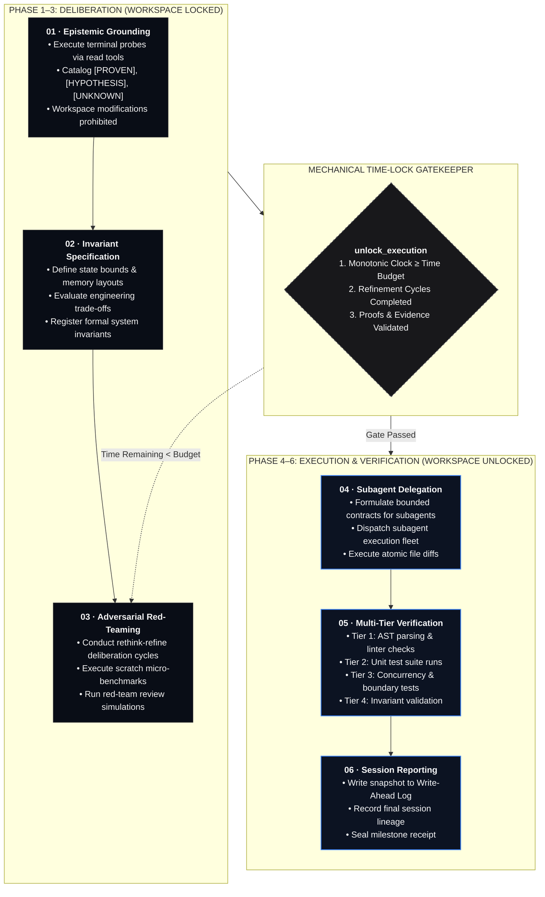

<div align="center">


# FABLE-MODE

*Structured Deliberation and Verification Control Plane for AI Agents*

> **Fable Mode is an open-source control plane and verification runtime for AI coding agents.** It enforces structured deliberation, evidence-backed proof receipts, adversarial red-team review, and persistent engineering memory before agents modify your workspace.
>
> When coding agents rush into premature file edits, Fable Mode provides the missing control framework: time-bounded deliberation, tool execution receipts, closed-loop red-team stress testing, and structured session lineage.

**Best for:** AI agent developers, MCP adopters, and software engineers seeking reliable, verified AI agent workflows.

**Start here:** [Installation & Client Setup](#-installation--client-integration) · [V1 vs V2 Runtime Architecture](#-v1-mcp-server-vs-v2-execution-runtime) · [6-Phase Lifecycle](#-how-it-works-the-6-phase-state-machine) · [Testing & Verification](#-test-verification--quality-assurance)

<br/>

[](https://www.python.org/)
[](./LICENSE)
[](https://github.com/REX-codebase/fable-mode)
[](https://modelcontextprotocol.io/)
[-090d16?style=flat-square)](#-installation--client-integration)
[](https://github.com/REX-codebase/fable-mode/releases/tag/v1.3.0)

<br/>

> **Project status:** Fable Mode is an open-source research and engineering project. The stable core consists of the MCP server (`fable-engine`), time-locked session state machine, proof receipts, red-team code review swarm, and execution broker (`fable-v2-broker`). Advanced System 3 meta-cognitive modules in `fable_v2/system3/` are experimental features.

<br/>

[Overview](#-overview-the-deliberation-challenge) • [V1 vs V2 Architecture](#-v1-mcp-server-vs-v2-execution-runtime) • [Core Components](#-core-fable-components) • [6-Phase State Machine](#-how-it-works-the-6-phase-state-machine) • [MCP Tool Reference](#-mcp-quick-reference-table) • [Installation & Integration](#-installation--client-integration) • [Testing](#-test-verification--quality-assurance)

---

</div>

## 📐 Overview: The Deliberation Challenge

Generative language models often attempt code modifications immediately upon receiving a prompt—bypassing memory hierarchy modeling, edge case analysis, concurrency hazards, or state invariant verification.

Self-prompting and stochastic searches can suffer from hallucinated confidence scores ($Q$-score drift) when intermediate reasoning steps go unverified.

$$\boxed{\text{Agent Request} \xrightarrow{\quad\text{Time-Lock \& Deliberation}\quad} \text{Evidence \& Proof Receipts} \xrightarrow{\quad\text{Adversarial Review}\quad} \text{Gated Workspace Write}}$$

**Fable Mode establishes an evidence-gated workspace control layer:**
1. **Deliberation Gating:** Workspace write execution remains locked until time-budget requirements, refinement cycles, and empirical proof receipts are satisfied.
2. **Evidence Validation:** Claims of testing or verification must be backed by actual tool receipts (`ToolReceipt`), AST coordinate bindings, and file hashes.
3. **Adversarial Review:** Subagent code implementations are evaluated by a 5-vector red-team review swarm before milestone commits.

---

## 🔀 V1 MCP Server vs. V2 Execution Runtime

Fable Mode provides two complementary components designed to support agent harnesses:

```
┌─────────────────────────────────────────────────────────────────────────────┐
│                            AI AGENT HARNESS                                 │
│               (Claude Code, Antigravity, Cursor, Codex, etc.)               │
└──────────────────────┬───────────────────────────────┬──────────────────────┘
                       │                               │
                       ▼                               ▼
┌──────────────────────────────────────────────┐ ┌───────────────────────────┐
│              FABLE V1 MCP SERVER             │ │  FABLE V2 EXECUTION BROKER│
│             (`fable_engine.server`)          │ │ (`fable_v2.execution_brk`)│
├──────────────────────────────────────────────┤ ├───────────────────────────┤
│ • Session State Machine & Time-Locks         │ │ • Out-of-Process Isolation│
│ • Epistemic Ledger ([PROVEN], [HYPOTHESIS])  │ │ • Command & Exec Allowlist│
│ • Red Team Swarm & Cortical Memory           │ │ • Protected Admin Handle  │
│ • Proof Validation & Lineage Logging         │ │ • ToolReceipt & Evidence  │
└──────────────────────────────────────────────┘ └───────────────────────────┘
```

1. **Fable V1 (`fable-engine` MCP Server):**
   - Implements the `fable_session` MCP tool interface using stdio JSON-RPC 2.0.
   - Manages session lifecycle, time-locks, epistemic tracking, refinement logs, red-team review cycles, and cortical memory updates.
   - Backward-compatible entry point that connects directly to MCP-enabled agent hosts.

2. **Fable V2 (`fable-v2-broker` Execution Broker & Portable Runtime):**
   - Provides a separate process execution boundary (`fable-v2-broker`) for workspace operations.
   - Restricts executable commands via strict allowlists, blocks interactive shell bypasses, and enforces path containment.
   - Uses an administrative control pipe (`--admin-fd`) separate from model input to manage workspace write permissions.
   - Implements portable runtime objects (`TaskSpec`, `ToolReceipt`, `Evidence`, `Candidate`, `VerificationResult`) to bind tool outputs directly to candidate verification policies.

---

## 🐝 Core Fable Components

### 1. Adversarial Code Review Swarm (`RedTeamSwarm`)

Subagents often produce code that passes basic happy-path unit tests but fails under boundary conditions, race conditions, or unexpected inputs.

The **`RedTeamSwarm`** conducts automated adversarial stress testing across 5 vectors before code is accepted:

```
                              ┌───────────────────────────┐
                              │      RED TEAM SWARM       │
                              │   5 Attack Personas       │
                              └─────────────┬─────────────┘
                                            │
        ┌───────────────────┬───────────────┼───────────────┬───────────────────┐
        ▼                   ▼               ▼               ▼                   ▼
┌───────────────┐   ┌───────────────┐ ┌───────────┐ ┌───────────────┐   ┌───────────────┐
│     CHAOS     │   │   BYZANTINE   │ │CONCURRENCY│ │   RESOURCE    │   │     STATE     │
│  ENVIRONMENT  │   │    PAYLOAD    │ │   RACE    │ │  EXHAUSTION   │   │   INVARIANT   │
├───────────────┤   ├───────────────┤ ├───────────┤ ├───────────────┤   ├───────────────┤
│• Missing path │   │• Null bytes   │ │• Multi-thrd│ │• Oversized payload│• Non-idempotent│
│• Denied perms │   │• Deep recursion│ │  contention│ │• Rapid churn  │  execution    │
│• Truncated I/O│   │• None/Type-con│ │• TOCTOU   │ │• CPU timeout  │   │• Out-of-order │
│• Corrupt env  │   │• Extreme values│ │• Lock race│ │• Resource leaks│  lifecycle    │
└───────────────┘   └───────────────┘ └───────────┘ └───────────────┘   └───────────────┘
```

- **Chaos Environment (`chaos_environment`):** Tests missing paths, unlinked temporary directories, permission denials, and corrupt environment variables.
- **Byzantine Payload (`byzantine_payload`):** Injects null bytes (`\x00`), deeply nested structures, type mismatches (`None`), and extreme numerical values (`NaN`, `Infinity`).
- **Concurrency Race (`concurrency_race`):** Simulates multithreaded contention, Time-of-Check to Time-of-Use (TOCTOU) mutations, and reentrancy deadlocks.
- **Resource Exhaustion (`resource_exhaustion`):** Evaluates large string payloads, high-frequency churn, resource handle leakage, and CPU timeout bounds.
- **State Invariant (`state_invariant`):** Checks non-idempotent execution ($f(f(x)) \neq f(x)$), out-of-order lifecycle calls, and state corruption.

#### Closed-Loop Remediation Ping-Pong
1. **Subagent Submission:** Coder subagent completes initial task implementation.
2. **Swarm Stress Test:** Main Agent executes `RedTeamSwarm.run_full_review_cycle()`.
3. **Breakage Report:** If issues are found, a `RedTeamBreakageReport` is returned with failure details.
4. **Subagent Remediation:** The subagent fixes identified breakages and resubmits.
5. **Re-Testing:** Swarm runs `verify_remediation()` to verify fixes without introducing regressions.

```python
from fable_v2.coder_fleet import RedTeamSwarm

swarm = RedTeamSwarm()
report = swarm.run_full_review_cycle(target_callable=my_service, target_name="auth_service")

if not report.passed:
    print(f"Swarm identified {report.broken_count} breakages.")
    all_fixed, new_report = swarm.verify_remediation(target_callable=hardened_service, prior_report=report)
    if all_fixed:
        print("All breakages resolved.")
```

---

### 2. Hebbian Cortical Plasticity Engine (`HebbianPlasticityEngine`)

To prevent agents from repeating past errors across sessions, the Hebbian Plasticity Engine provides persistent domain memory (`skills/fable-mode/cortex/<domain>.md`) organized across five specialized domain lobes:

- `rust`: Zero-cost abstractions, Pin/Unpin, Tokio bounds, lifetime management.
- `python`: Asyncio task groups, GIL-free execution, protocols, slot memory optimization.
- `design_3d`: Shader nodes, frame budgets, render loops, smooth interpolation.
- `research`: First-principles analysis, causal DAGs, citation grounding, trade-off matrices.
- `concurrency`: Lock-free CAS, memory barriers, ABA hazards, TOCTOU prevention.

#### How Adaptation Works
1. **Synaptic Weight Updates:** Co-activated tools and concepts involved in successful tasks receive positive weight adjustments:
   $$\Delta W_{ij} = \eta \cdot \text{Score} \cdot (A_i \cdot A_j) \quad (\eta = 0.10)$$
2. **Homeostatic Bounds:** Weights are bounded within $[0.05, 1.00]$ to maintain relative associations without saturation.
3. **Antibody Records:** Breakages identified by `RedTeamSwarm` are formatted into `HeuristicAntibody` records and cataloged in domain cortex files.
4. **Context Recall:** `cortical_recall_context` retrieves relevant antibodies and domain rules to inject into subagent prompts before code generation.

```python
from fable_v2.coder_fleet import CoderFleetDispatcher

fleet = CoderFleetDispatcher()

# 1. Activate domain lobe
fleet.dispatch("cortical_activate_lobe", {"domain": "python", "co_activated_nodes": ["asyncio", "protocols"]})

# 2. Retrieve relevant domain memory for prompt injection
context = fleet.dispatch("cortical_recall_context", {"domain": "python", "max_antibodies": 3})

# 3. Consolidate results after task completion
receipt = fleet.dispatch("cortical_consolidate_task", {
    "domain": "python",
    "task_id": "async_task_fix",
    "final_passed": True,
    "co_activated_nodes": ["asyncio", "protocols"],
})
```

---

### 3. Proof Engine & Evidence Validation (`DeterministicProofValidator`)

Claims made by agents (e.g., "tests pass", "verified code") must be backed by verifiable evidence:

- **Cryptographic File Hashes:** SHA-256 digests track source code state; modifications invalidate prior proofs.
- **AST Coordinate Binding:** Binds claims to exact source coordinates (`path/to/file.py:L10-L35`, function signature, node type).
- **Tool Receipt Attestation:** Validates execution output from tool runs (`ToolReceipt` exit code, test runner output logs).
- **Anti-Circularity Filtering:** Rejects vacuous or circular assertions.

---

### 4. Experimental System 3 Modules (`fable_v2/system3/`)

For advanced meta-cognitive research, `fable_v2/system3/` contains experimental reasoning modules:
- **Causal Simulation (`causal.py`):** Pearl's do-calculus DAG interventions and sensitivity analysis.
- **Modal Model Checking (`kripke.py`):** Kripke multi-world structures and CTL temporal logic checking ($AG$, $EF$, $AF$).
- **Active Inference (`free_energy.py`):** Variational Free Energy minimization and policy selection ($G$).
- **Proof Oracle (`oracle.py`):** Curry-Howard type checker and undecidability boundary detector.
- **Hyperbolic Tree Embeddings (`hyperbolic.py`):** Poincaré ball tree embeddings for hierarchy representations.
- **Dialectical Synthesis (`dialectical.py`):** TRIZ contradiction matrix trade-off resolution.
- **Pareto Evolution (`evolution.py`):** 10-dimensional architectural Pareto frontier search.

---

## 🔄 How It Works: The 6-Phase State Machine

Fable Mode operates through a sequential six-phase lifecycle. Transitioning from deliberation (Phases 1–3) to workspace execution (Phases 4–6) requires satisfying the mechanical time-lock and proof criteria:



---

## ⚡ MCP Quick Reference Table

The `fable-engine` server exposes the unified `fable_session` tool adhering to JSON-RPC 2.0 over stdio:

| Action | Category | Arguments | Behavior |
| :--- | :--- | :--- | :--- |
| `create_session` | Lifecycle | `session_name`, `objective`, `time_budget_minutes` | Initializes session Write-Ahead Log (WAL) and sets initial deliberation time budget ($\ge 2.0\text{ min}$). |
| `set_timer` | Pacing | `session_name`, `time_budget_minutes` | Updates internal sub-timer without reducing the mandatory authority deadline. |
| `get_status` | Telemetry | `session_name` | Returns elapsed time, active phase, gate checklist, and status metrics. |
| `log_epistemic_item` | Epistemics | `session_name`, `tag`, `claim`, `evidence` | Records epistemic items (`[PROVEN]`, `[HYPOTHESIS]`, `[UNKNOWN]`). `[PROVEN]` requires tool output evidence. |
| `record_invariant` | Invariants | `session_name`, `invariant_name`, `formal_statement`, `proof_or_rationale`, `domain?` | Registers formal system constraints and invariant statements. |
| `log_refinement_cycle` | Refinement | `session_name`, `refinement_type`, `focus_area`, `critique_or_bottleneck`, `architectural_refinement` | Records architectural rethink/refine cycles required before unlock. |
| `track_file_change` | Lineage | `session_name`, `file_path`, `change_type`, `diff_summary`, `affected_invariants?` | Tracks mutated, created, deleted, or slated files with SHA-256 digests. |
| `get_session_lineage` | Lineage | `session_name` | Returns complete session provenance, epistemic ledger, and proof receipts. |
| `inspect_plan` | Planning | `session_name` | Retrieves active execution plan, gate checklists, and subagent boundaries. |
| `verify_proof` | Proof Engine | `claim`, `proof_type`, `evidence`, `target_resource?` | Validates AST node references, tool receipts, or SHA-256 file hashes. |
| `unlock_execution` | Gatekeeper | `session_name`, `rationale` | Evaluates time-lock clock and refinement criteria to unlock workspace modifications. |
| `check_auto_update` | Sync | `session_name?` | Probes upstream repository for updates without blocking execution. |
| `apply_auto_update` | Sync | `preserve_cortex?` | Updates skills and configuration while preserving local cortical learning. |
| `scrape_web` | Research | `target`, `auto_log_epistemic?` | Scrapes web page URL or performs free DuckDuckGo web search returning Markdown. |
| `scrape_youtube` | Research | `target`, `auto_log_epistemic?` | Scrapes YouTube video metadata and public caption/transcript tracks returning Markdown. |
| `scrape_reddit` | Research | `target`, `auto_log_epistemic?` | Scrapes Reddit threads, comments, or subreddits via free JSON API returning Markdown. |
| `scrape_x` | Research | `target`, `auto_log_epistemic?` | Scrapes individual Tweet URLs via Twitter syndication API and best-effort handle lookups returning Markdown. |
| `scrape_github` | Research | `target`, `auto_log_epistemic?` | Scrapes GitHub repository metadata, READMEs, or repository search returning Markdown. |
| `scrape_arxiv` | Research | `target`, `auto_log_epistemic?` | Scrapes arXiv academic papers, abstracts, and PDF links returning Markdown. |

---

## 📦 Installation & Client Integration

Fable Mode requires **zero third-party dependencies** for core operations, using the Python standard library (Python 3.10+).

### 1. Installation via Agent Prompt

To configure Fable Mode within an AI agent environment (Antigravity, Cursor, Claude Code, Windsurf, Codex, Cline, Roo Code, etc.), run the following setup steps:

1. **Clone the repository:**
   ```bash
   git clone https://github.com/REX-codebase/fable-mode.git
   cd fable-mode
   ```

2. **Install Skill Files:**
   Copy `skills/fable-mode` into your host agent's skill directory:
   - **Antigravity / Gemini:** `~/.gemini/config/skills/fable-mode/`
   - **Claude Code:** `~/.claude/skills/fable-mode/`
   - **Cursor:** `.cursor/skills/fable-mode/`
   - **Generic / Codex / Roo / Cline:** `./skills/fable-mode/`

3. **Register MCP Server:**
   Configure `fable-engine` in your agent harness's MCP configuration (`mcp_config.json`, `.cursor/mcp.json`, or host settings):
   ```json
   {
     "mcpServers": {
       "fable-engine": {
         "command": "python",
         "args": ["-m", "fable_engine.server"],
         "cwd": "/path/to/fable-mode"
       }
     }
   }
   ```

4. **Install Python Package (Optional for V2 Execution Broker):**
   ```bash
   pip install -e .
   ```

---

### 2. Manual Installer Scripts

Optionally run the provided platform installer scripts to set up aliases and host configurations:

#### Windows (PowerShell)
```powershell
powershell -ExecutionPolicy Bypass -File .\install.ps1 -Yes -RegisterHosts -Aliases
```

#### macOS / Linux (Bash)
```bash
chmod +x ./install.sh && ./install.sh --yes
```

---

### 3. MCP Host Configuration Examples

#### Claude Code CLI
```bash
claude mcp add --transport stdio fable-engine -- python -m fable_engine.server
```

#### Cursor
Navigate to **Cursor Settings** $\rightarrow$ **Features** $\rightarrow$ **MCP Servers** $\rightarrow$ **Add New MCP Server**:
- **Name:** `fable-engine`
- **Type:** `command`
- **Command:** `python -m fable_engine.server`

#### Antigravity / Gemini
In `.agents/mcp_config.json` or `~/.gemini/antigravity/mcp/`:
```json
{
  "mcpServers": {
    "fable-engine": {
      "command": "python",
      "args": ["-m", "fable_engine.server"],
      "cwd": "${workspaceFolder}"
    }
  }
}
```

---

## 🧪 Test Verification & Quality Assurance

Fable Mode includes a test suite verifying the MCP server, session state WAL, token compressor, execution broker, and System 3 modules using Python's standard `unittest` framework.

### Running Tests Locally

1. **Test MCP Server Integration:**
   ```bash
   python fable_engine/test_server.py
   ```

2. **Run All Unit Tests:**
   ```bash
   python -m unittest discover -s tests -p "test_*.py" -v
   ```

All core tests run in standard-library isolation without requiring external network connectivity or third-party Python packages.

---

## 📄 Repository Structure

```
fable-mode/
├── fable_engine/                  # MCP Server & Tool Engine (V1)
│   ├── server.py                 # Pure Python stdlib JSON-RPC 2.0 MCP server
│   ├── fable_session.json        # Unified MCP tool declaration schema
│   └── test_server.py            # Integration test suite for MCP server
├── fable_v2/                      # Deliberative & Verification Architecture (V2)
│   ├── execution_broker.py       # Isolated execution boundary process
│   ├── runtime.py                # Verification-guided runtime state machine
│   ├── protocol.py               # TaskSpec, ToolReceipt, Evidence, Candidate objects
│   ├── verifiers.py              # Verifier policy implementations
│   ├── coder_fleet/              # Red Team Swarm & Coder Fleet Dispatcher
│   │   ├── red_team_swarm.py     # Adversarial review swarm (5 personas)
│   │   ├── fleet_dispatcher.py   # Fleet route manager
│   │   └── test_harness.py       # Sandboxed scratch test runner
│   ├── cortical/                 # Hebbian Cortical Plasticity Engine
│   │   └── plasticity_engine.py  # Hebbian learning & antibody memory
│   └── system3/                  # Experimental Meta-Cognitive Modules
│       ├── causal.py             # Pearl Causal DAGs & do-calculus simulation
│       ├── kripke.py             # Kripke modal model checker (CTL)
│       ├── free_energy.py        # Friston Active Inference
│       ├── oracle.py             # Curry-Howard proof checker
│       ├── hyperbolic.py         # Poincaré disk hyperbolic tree embeddings
│       ├── dialectical.py        # TRIZ contradiction resolution
│       └── evolution.py          # 10D Pareto frontier search
├── fable_compressor.py           # Content-Addressed Storage & compression
├── skills/                       # Deliberative Agent Protocols & Cortex Lobes
│   └── fable-mode/
│       ├── SKILL.md              # Core cognitive instructions
│       └── cortex/               # Domain cortex files (rust, python, design, research, concurrency)
├── docs/                         # Architecture & Migration Documentation
│   ├── fable-v1-v2-migration.md  # V1 to V2 migration guide
│   ├── fable-v2-architecture.md  # V2 portable verifier runtime design
│   └── system3-architecture.md   # System 3 meta-cognitive architecture
├── tests/                        # Unit test suite
└── LICENSE                       # MIT License
```

---

<div align="center">

**Built by REX-codebase.**
*Structured Deliberation • Evidence Validation • Verified AI Workflows*

[](./LICENSE)

</div>
