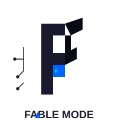
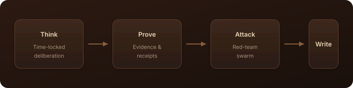

<div align="center">

<br/>



# Fable Mode

<!-- mcp-name: io.github.REX-codebase/fable-mode -->

**Agents that think before they write.**

<br/>

<a href="https://github.com/REX-codebase/fable-mode"></a>
&nbsp;
<a href="./LICENSE"></a>
&nbsp;
<a href="https://modelcontextprotocol.io"></a>
&nbsp;

&nbsp;


<br/><br/>

</div>

---

<br/>

Fable Mode is an open-source control plane for AI coding agents.

It makes an agent deliberate, produce evidence, and survive adversarial review
**before** it earns permission to write to your workspace. The gates are
mechanical, not prompt advice: no timer, no proof, no write access.

<br/>

<div align="center">
  
</div>

https://github.com/user-attachments/assets/27f4f8a2-b1bb-4398-a08c-bc9fd93d69d7

<br/>

### See it work

A session starts locked. Confidence does not unlock it.

```text
>>> session = create_session('demo-refactor', budget='2 min')
    state=INIT  execution_locked=True  can_execute_code=False

>>> session.unlock_execution('the plan looks fine, let me write code now')
    PermissionError: HARD TIME-LOCK VIOLATION: Execution unlock rejected!
    The immutable 2.0m authority budget has not elapsed yet
    (Remaining: 1m 59s / 120.0s).
```

The same gates guard every phase: evidence receipts for claims, a five-vector
red-team swarm for code, and a sealed record of what was verified.

<br/>

### Install

```bash
pip install fable-engine
```

Or install the MCP server in your editor:

[](vscode:mcp/install?%7B%22name%22%3A%22fable-engine%22%2C%22command%22%3A%22uvx%22%2C%22args%22%3A%5B%22--from%22%2C%22fable-engine%3D%3D1.3.2%22%2C%22fable-engine%22%5D%7D)
[](cursor://anysphere.cursor-deeplink/mcp/install?name=fable-engine&config=eyJjb21tYW5kIjoidXZ4IiwiYXJncyI6WyItLWZyb20iLCJmYWJsZS1lbmdpbmU9PTEuMy4xIiwiZmFibGUtZW5naW5lIl19)

These links configure Fable Engine for AI agents in VS Code Chat or Cursor. They do not install a standalone editor extension. Both use `uvx`, which downloads and runs the pinned PyPI release in an isolated environment.

Point your agent at the MCP server manually:

```jsonc
// Claude Code: claude mcp add fable-engine -- uvx --from fable-engine==1.3.2 fable-engine
// Cursor: ~/.cursor/mcp.json
{
  "mcpServers": {
    "fable-engine": {
      "command": "uvx",
      "args": ["--from", "fable-engine==1.3.2", "fable-engine"]
    }
  }
}
```

Python 3.10+, zero runtime dependencies. Published on [PyPI as `fable-engine`](https://pypi.org/project/fable-engine/).

<br/>

### How it works

1. **Think** — Time-locked deliberation. The agent cannot write until the timer ends.
2. **Prove** — Claims need real evidence (tool receipts, hashes, invariants).
3. **Attack** — A red-team swarm tries to break the code.
4. **Write** — Only then is the workspace unlocked.

<br/>

### What it is not

- Not a claim of flawless code. It is a checkable workflow, not a guarantee.
- Not a bigger prompt. The locks are enforced by the engine, not by wording.
- Not a framework lock-in. It speaks MCP and runs beside your current agent.

<br/>

### Docs

- [V1 → V2 migration](./docs/fable-v1-v2-migration.md)
- [V2 architecture](./docs/fable-v2-architecture.md)
- [System 3 (experimental)](./docs/system3-architecture.md)
- [Stop AI coding agents from writing too early](./docs/stop-ai-agents-writing-too-early.md)

<br/>

### Contributing

Issues and pull requests are welcome. See [CONTRIBUTING.md](./CONTRIBUTING.md).

<br/>

---

<div align="center">

<sub>MIT License · Built by REX</sub>

</div>
