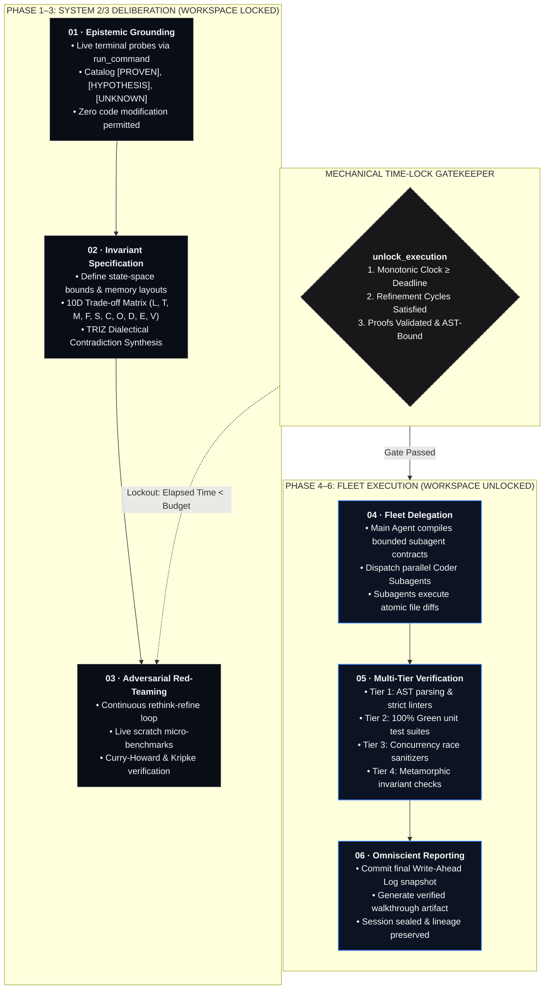

<div align="center">


# FABLE-MODE

*The Deterministic Deliberative Cognitive Architecture for Frontier AI Agents.*

<br/>

[](https://www.python.org/)
[](./LICENSE)
[](https://github.com/REX-codebase/fable-mode)
[](https://modelcontextprotocol.io/)
[-090d16?style=flat-square)](#-installation--client-integration)
[](#-epistemic-invariant--test-verification)
[](https://github.com/REX-codebase/fable-mode/releases/tag/v1.3.0)

<br/>

> **🎉 Celebrating 21 ⭐ on GitHub!** Thank you to the community for supporting deterministic cognitive agent architectures.
>
> **"LLMs rush complex engineering within 30 seconds. Fable-Mode locks the workspace, enforces mathematical System 2 deliberation, validates claims with an ungameable proof engine, and scales exploration to model velocity."**

<br/>

[Overview](#-the-dilemma-and-the-invariant) • [Modular Fable Architecture](#-modular-fable-architecture) • [Bento Grid: 6 Pillars](#-the-bento-grid-6-pillars-of-frontier-cognition) • [6-Phase State Machine](#-how-it-works-the-6-phase-state-machine) • [MCP Tool Reference](#-mcp-quick-reference-table) • [Installation & Integration](#-installation--client-integration) • [Formal Verification](#-epistemic-invariant--test-verification)

---

</div>

## 📐 The Dilemma and The Invariant

Modern frontier LLMs are structurally biased toward premature execution. When assigned non-trivial engineering objectives, models routinely initiate source file modifications within 15 to 45 seconds—bypassing memory hierarchy modeling, race condition analysis, distributed fault modes, or state invariant verification. 

Soft self-prompting and stochastic Monte Carlo Tree Search (MCTS) fail in software systems due to $Q$-score drift, where soft hallucinated confidence scores compound across branching paths.

$$\boxed{\text{System 1 Impulse} \xrightarrow{\quad\text{Mechanical Lock}\quad} \text{Formal Proofs} \xrightarrow{\quad\text{Adversarial Refinement}\quad} \text{Authority Unlock} \implies \text{Flawless Code}}$$

**Fable-Mode converts the reasoning workspace into an ungameable, evidence-gated crucible.** The main agent operates as an immutable Master Architect; workspace writes remain physically locked until an external monotonic deadline elapses, empirical proof receipts are validated, and the implementation fleet is dispatched under strict contracts.

---

## 🐝 Modular Fable Architecture
### Part 1: Adversarial Code Review Swarm (Project Glasswing Red Team Loop)

Traditional line-by-line review and author-written unit tests fail due to **confirmation bias** and the **happy-path mirror effect**: models write tests only for the scenarios they anticipated, leaving race conditions, buffer overflows, and state corruptions completely undetected.

**Modular Fable Part 1** introduces the **Adversarial Code Review Swarm (`RedTeamSwarm`)**, codifying an immutable obligation:
> **The Main Agent MUST NEVER accept subagent code blindly.**  
> Whenever a subagent implements a feature or refactors a module, the Main Agent **must summon an adversarial swarm of red-team personas** to counterfactually stress-test the implementation across 5 vectors before milestone commits.

```
                              ┌───────────────────────────┐
                              │      RED TEAM SWARM       │
                              │   5 Attack Personas       │
                              └─────────────┬─────────────┘
                                            │
        ┌───────────────────┬───────────────┼───────────────┬───────────────────┐
        ▼                   ▼               ▼               ▼                   ▼
┌───────────────┐   ┌───────────────┐ ┌───────────┐ ┌───────────────┐   ┌───────────────┐
│     CHAOS     │   │   BYZANTINE   │ │CONCURRENCY│ │   RESOURCE    │   │     STATE     │
│  ENVIRONMENT  │   │    PAYLOAD    │ │   RACE    │ │  EXHAUSTION   │   │   INVARIANT   │
├───────────────┤   ├───────────────┤ ├───────────┤ ├───────────────┤   ├───────────────┤
│• Missing path │   │• Null bytes   │ │• 8-thread │ │• 150KB string │   │• f(f(x)) !=   │
│• Denied perms │   │• 60-level nest│ │  burst    │ │• 100x churn   │   │  f(x) check   │
│• Truncated I/O│   │• None/Type-con│ │• TOCTOU   │ │• 3.0s timeout │   │• Out-of-order │
│• Corrupt env  │   │• NaN/Inf/huge │ │• Lock race│ │• Handle leak  │   │  lifecycle    │
└───────────────┘   └───────────────┘ └───────────┘ └───────────────┘   └───────────────┘
```

#### The 5 Attack Personas
1. **Chaos Environment (`chaos_environment`)**: Missing paths, unlinked temporary directories, permission denials, broken stream pipes, corrupt environment variables.
2. **Byzantine Payload (`byzantine_payload`)**: Embedded null bytes (`\x00`), 60+ level recursive dictionary bombs, type confusion (`None`), and extreme numbers (`NaN`, `Infinity`, $2^{64}$).
3. **Concurrency Race (`concurrency_race`)**: Multithreaded burst contention (6–16 threads), Time-of-Check to Time-of-Use (TOCTOU) shared state mutations, and reentrancy deadlocks.
4. **Resource Exhaustion (`resource_exhaustion`)**: 150,000+ character payloads, 100x rapid sequential churn, file handle leakage, and hard 3.0s CPU timeouts.
5. **State Invariant (`state_invariant`)**: Non-idempotent re-execution $f(f(x)) \neq f(x)$, out-of-order lifecycle calls (finalize before init, double-close), and state boundary corruption.

#### The Closed-Loop Ping-Pong Hardening Cycle
```
Subagent Implementation ──▶ Swarm Attack ──▶ Breakage Report (💥 Failures)
                                                   │
Verified Resilience (🟢 Sealed) ◀── Swarm Re-Attack ◀── Subagent Remediation
```
1. **Subagent Implementation**: Coder subagent completes task and runs local tests.
2. **Swarm Attack**: Main Agent summons `RedTeamSwarm.run_full_review_cycle()`.
3. **Breakage Report**: The swarm compiles `RedTeamBreakageReport` with reproduction code snippets.
4. **Subagent Remediation**: If `broken_count > 0`, code changes are **REJECTED**; subagent receives remediation directives.
5. **Swarm Re-Attack**: Swarm invokes `verify_remediation()` re-running prior breaking scenarios.
6. **Milestone Sealing**: Only when all prior breakages are verified fixed (`0` breakages) is the milestone sealed.

```python
# Direct Python invocation via Coder Fleet
from fable_v2.coder_fleet import RedTeamSwarm

swarm = RedTeamSwarm()
report = swarm.run_full_review_cycle(target_callable=my_service, target_name="auth_service")

if not report.passed:
    print(f"Swarm identified {report.broken_count} breakages!")
    # Verify remediation after subagent hardening
    all_fixed, new_report = swarm.verify_remediation(target_callable=hardened_service, prior_report=report)
    assert all_fixed, "All breakages must be verified fixed!"
```

### Part 2: Living Hebbian Brain & Specialized Cortical Lobes

Traditional LLM assistants suffer from **session amnesia**: every conversation starts from zero, repeatedly falling into the same language-specific traps, compiler idiosyncrasies, and concurrency hazards. Vector RAG attempts to patch this with string-matching chunks, introducing semantic drift and context pollution.

**Modular Fable Part 2** introduces the **Hebbian Cortical Plasticity Engine (`HebbianPlasticityEngine`)**, providing persistent lifelong learning that specializes on the user's local machine over time across 5 domain lobes:

```
                            ┌───────────────────────────────────────┐
                            │      HEBBIAN PLASTICITY ENGINE        │
                            │   ΔW_ij = η · Score · (A_i · A_j)     │
                            └───────────────────┬───────────────────┘
                                                │
         ┌───────────────────┬──────────────────┼───────────────────┬───────────────────┐
         ▼                   ▼                  ▼                   ▼                   ▼
 ┌───────────────┐   ┌───────────────┐  ┌───────────────┐   ┌───────────────┐   ┌───────────────┐
 │    RUST.MD    │   │   PYTHON.MD   │  │ DESIGN_3D.MD  │   │  RESEARCH.MD  │   │CONCURRENCY.MD │
 ├───────────────┤   ├───────────────┤  ├───────────────┤   ├───────────────┤   ├───────────────┤
 │• Zero-cost abs│   │• Asyncio TG   │  │• WebGPU / TSL │   │• First-princip│   │• Lock-free CAS│
 │• Pin/Unpin    │   │• Nogil 3.13   │  │• Spring motion│   │• DOI grounding│   │• Acq/Release  │
 │• Tokio bounds │   │• Protocols    │  │• Fluid clamp  │   │• Causal DAGs  │   │• ABA hazards  │
 │• Unsafe proof │   │• Slots memory │  │• 60fps budget │   │• TRIZ dialect │   │• TOCTOU fixes │
 └───────────────┘   └───────────────┘  └───────────────┘   └───────────────┘   └───────────────┘
```

#### How Fable Specializes Over Time
1. **Hebbian Synaptic Wiring**:
   Whenever a tool or domain concept is activated, its synaptic weight updates according to Hebb's rule:
   $$\Delta W_{ij} = \eta \cdot \text{Score} \cdot (A_i \cdot A_j) \quad (\eta = 0.10)$$
   Co-activated tools that produce verified passing runs wire together strongly.
2. **Homeostatic Synaptic Normalization**:
   Prevents runaway excitation by bounding all weights strictly within $[0.05, 1.00]$, preserving relative associative strengths without saturation.
3. **Immunological Antibody Memory**:
   Adversarial breakages detected by `RedTeamSwarm` are synthesized into permanent `HeuristicAntibody` records cataloged in `skills/fable-mode/cortex/<domain>.md`.
4. **Prompt Context Recall**:
   Prior to delegating implementation tasks, `cortical_recall_context` retrieves active antibodies, specialized domain invariants, and top-wired companion tools to inject into subagent prompts.

```python
# Direct Python invocation via Coder Fleet Dispatcher
from fable_v2.coder_fleet import CoderFleetDispatcher

fleet = CoderFleetDispatcher()

# 1. Activate lobe before task execution
fleet.dispatch("cortical_activate_lobe", {"domain": "rust", "co_activated_nodes": ["tokio", "pin_project"]})

# 2. Recall high-signal context memory block for prompt injection
context = fleet.dispatch("cortical_recall_context", {"domain": "rust", "max_antibodies": 3})
print(context["result"])

# 3. Consolidate task outcomes and synthesize antibodies from red-team breakages
receipt = fleet.dispatch("cortical_consolidate_task", {
    "domain": "rust",
    "task_id": "task_async_engine",
    "final_passed": True,
    "co_activated_nodes": ["tokio", "pin_project", "concurrency_fuzz"],
})
print("Consolidation receipt:", receipt["result"]["status"])
```

### Part 3: Autonomous Silent Background Self-Updater (`AutoUpdater`)

Ensures that any computer running Fable-Mode is autonomously synchronized with upstream commits across all agent harnesses:

- **0ms Startup Overhead**: Spawns an asynchronous daemon background worker thread upon session initialization or MCP server startup, executing fast, non-blocking update checks.
- **Fail-Safe Offline Guarantee**: If the machine is offline, has restricted network, or is run outside a git repository, the check gracefully falls back with zero unhandled exceptions.
- **Immunological Cortical Preservation**: Local cortical learning and experience are strictly preserved. Non-destructively merges upstream antibodies into baseline lobes, preserves locally evolved synaptic matrix weights ($\max(W_{\text{local}}, W_{\text{upstream}})$), and preserves all custom user-sprouted lobes.
- **Host Skills Hot-Sync**: Automatically hot-syncs updated skills (`skills/fable-mode/`), rules (`rules/fable-mode.md`), and MCP tool definitions into detected host configurations (Gemini/Antigravity `~/.gemini/config/skills/fable-mode/`, Claude Code `~/.claude/skills/fable-mode/`, and Cursor `.cursor/skills/`).

---

## 🍱 The Bento Grid: 6 Pillars of Frontier Cognition

```
┌─────────────────────────────────────────┬─────────────────────────────────────────┐
│ 01 · MECHANICAL TIME-LOCK               │ 02 · UNGAMEABLE PROOF ENGINE            │
│ Outer authority deadline cannot be      │ Algorithmic AST parsing, file SHA-256   │
│ bypassed or spoofed. Workspace write    │ checksums, and ToolReceipt validation.   │
│ execution remains mechanically locked.  │ Circular tautologies rejected.          │
├─────────────────────────────────────────┼─────────────────────────────────────────┤
│ 03 · MODEL-VELOCITY PROFILER            │ 04 · VISUAL IMAGINATION ENGINE          │
│ Rolling token speed detection. >80 tok/s│ "Visualize before you build" — mandatory │
│ triggers 2.5x Flash exploration multiplier│ generation of 5–6 Haute aesthetic mockups│
│ for parallel synthesis and benchmarks.  │ before touching frontend code.          │
├─────────────────────────────────────────┼─────────────────────────────────────────┤
│ 05 · GAME-GRADE THREE.JS                │ 06 · OMNISCIENT SESSION LINEAGE         │
│ 120 Hz decoupled physics accumulator,   │ Real-time MCP working memory tracking   │
│ procedural TSL shaders, HDR pipeline,   │ past file diffs, slated upcoming changes,│
│ and 100k+ particle GPU instancing.      │ active invariants, and proof receipts.  │
└─────────────────────────────────────────┴─────────────────────────────────────────┘
```

### 01 · Mechanical Time-Lock
*Outer authority deadline cannot be bypassed, spoofed, or reasoned away.*

- **Fail-Closed Gatekeeper**: The authority deadline $t_{\text{deadline}} = t_{\text{start}} + T_{\text{budget}}$ is fixed at session creation (`MIN_TIME_BUDGET_MINUTES = 2.0`). It is governed by the host operating system clock, rendering agent persuasion, hallucinated permissions, or premature completion claims completely inert.
- **Physical Workspace Locking**: Calling `unlock_execution` before $t \ge t_{\text{deadline}}$ raises an uncatchable `PermissionError`. 
- **Anti-Idleness Refinement**: Deliberation requires active intellectual work:
  $$\text{min\_refinements} = \max\left(2, \, \left\lceil \frac{T_{\text{budget}}}{5.0} \right\rceil\right)$$
- **Role Isolation**: The Master Architect conducts System 2/3 reasoning but is structurally barred from writing code directly. 100% of codebase file writes are deferred to specialized subagents (`type: self`) dispatched only after formal unlock.

### 02 · Ungameable Proof Engine
*Algorithmic AST parsing, file SHA-256 checksums, and ToolReceipt validation.*

- **Anti-Tautology Semantic Barrier**: Rejects non-verifiable claims like `"tested"`, `"verified"`, `"works"`, or trivial tautologies (`x == x`).
- **5-Layer Mathematical Pipeline (`DeterministicProofValidator`)**:
  1. *Layer 1 (Cryptographic Hashes)*: Computes SHA-256 digests over all referenced source files. Any mutation immediately invalidates prior proofs.
  2. *Layer 2 (AST Coordinate Binding)*: Binds claims to exact AST nodes (`path/to/file.py:L14-L42`, symbol signature, node type).
  3. *Layer 3 (ToolReceipt Execution Attestation)*: Verifies empirical tool receipts (`run_command` exit code 0, test runner output, micro-benchmark telemetry).
  4. *Layer 4 (Anti-Circularity Filter)*: Detects circular premise-conclusion structures and vacuous claims.
  5. *Layer 5 (Curry-Howard Proof Oracle & Kripke Bisimulation)*: Formally evaluates propositions $\Gamma \vdash M : T$ and modal temporal invariants ($AG(\text{safe})$) across branching state spaces.

### 03 · Model-Velocity Profiler
*Dynamic throughput calibration scaling exploration to inference speed.*

- **Real-Time Velocity Measurement**: Measures token throughput ($v = \Delta \text{tokens} / \Delta t$) across rolling generation windows.
- **Three-Tier Dynamic Calibration**:
  - **Flash Tier ($>80\text{ tok/s}$)**: Triggers a **2.5x Flash exploration multiplier**. Explores 5–6 visual mockups, expanded 10-dimensional Pareto frontiers, and concurrent scratch benchmark probes.
  - **Heavy / Pro Tier ($20\text{--}80\text{ tok/s}$)**: Baseline 1.0x execution focusing on deep sequential reasoning, TRIZ contradiction synthesis, and formal proofs.
  - **Local / Constrained Tier ($<20\text{ tok/s}$)**: Injects micro-scaffolds automatically ($do(\cdot)$ sensitivity templates, Kripke contracts, regex parsing harnesses).

### 04 · Visual Imagination Engine
*"Visualize before you build" — mandatory Haute aesthetic generation.*

- **Mandatory Mockup Protocol**: Mandates the generation of 5–6 Haute aesthetic mockups via image generation and generative UI prior to writing frontend or canvas code.
- **7-Layer Optical Depth Staging**:
  `L0 Atmospheric Canvas` $\rightarrow$ `L1 Ambient Scrim` $\rightarrow$ `L2 Surface Container` $\rightarrow$ `L3 Elevated Interaction` $\rightarrow$ `L4 Accent Emissive` $\rightarrow$ `L5 Floating Overlay` $\rightarrow$ `L6 Viewport Grain`.
- **Haute Design Archetypes**: Curated archetypes (*Ethereal Editorial*, *Industrial Precision*, *Swiss Brutalist*, *Cybernetic High-Tech*, *Organic Warmth*, *Velvet Luxury*) with mathematical golden-ratio typography ($\phi = 1.618$) and OKLCH color spaces.
- **Anti-Slop Protocol**: Explicit mechanical ban on generic AI design slop (arbitrary purple gradients, non-functional floating cards, decorative clutter).

### 05 · Game-Grade Three.js
*120 Hz decoupled physics, procedural TSL shaders, and WebGPU parity.*

- **120 Hz Decoupled Physics Accumulator**: Fixed-timestep simulation loop (`requestAnimationFrame` with delta clamping and state interpolation) preventing spiral-of-death frame hitching.
- **TSL (Three Shading Language)**: Native node-based materials (`MeshStandardNodeMaterial`) delivering identical cross-platform shaders across WebGL and WebGPU.
- **Zero-Allocation Hot Loops**: Pre-allocated vector and matrix pools (`Vector3`, `Matrix4`, `Quaternion`) eliminating garbage collection pauses during high-frequency renders.
- **GPU Instancing**: Single-draw-call instanced meshes (`InstancedMesh`) scaling to 100,000+ interactive particles with dynamic compute shaders.

### 06 · Omniscient Session Lineage
*Real-time MCP working memory tracking past diffs, slated changes, and receipts.*

- **ACID Write-Ahead Log (WAL)**: Every state mutation, epistemic item, and proof is appended to disk using atomic filesystem operations (`os.replace`).
- **Complete Provenance Graph**: `get_session_lineage` tracks modified, created, deleted, and slated file paths linked directly to their motivating invariant IDs and tool proofs.
- **Content-Addressed Storage (CAS)**: SHA-256 deduplicated, Grammar333 micro-bytecode storage with zero-copy windowed line slicing (`fable_compressor.py`).

---

## 🔄 How It Works: The 6-Phase State Machine

Fable-Mode advances through six sequential phases. Transitioning from deliberation to execution is gated by the fail-closed mechanical time-lock:



---

## ⚡ MCP Quick Reference Table

The `fable-engine` exposes the unified `fable_session` tool adhering to JSON-RPC 2.0 over standard I/O.

| Action | Category | Signature / Arguments | Invariant & Deterministic Behavior |
| :--- | :--- | :--- | :--- |
| `create_session` | Lifecycle | `session_name`, `objective`, `time_budget_minutes` | Initializes session WAL and arms outer authority time-lock ($T \ge 2.0\text{ min}$). |
| `set_timer` | Pacing | `session_name`, `time_budget_minutes` | Sets an internal agent sub-timer. **Cannot shorten the authority deadline.** |
| `get_status` | Telemetry | `session_name` | Returns elapsed time, velocity tier (`flash`/`heavy`/`local`), active phase, and gate checklist. |
| `log_epistemic_item` | Epistemics | `session_name`, `tag`, `claim`, `evidence` | Records knowledge. `[PROVEN]` strictly requires empirical evidence from tool output. |
| `record_invariant` | Invariants | `session_name`, `invariant_name`, `formal_statement`, `proof_or_rationale`, `domain?` | Registers formal system invariants (Curry-Howard propositions or temporal constraints). |
| `log_refinement_cycle` | Refinement | `session_name`, `refinement_type`, `focus_area`, `critique_or_bottleneck`, `architectural_refinement` | Documents an architectural rethink-refine cycle. Mandatory for unlocking execution. |
| `track_file_change` | Lineage | `session_name`, `file_path`, `change_type`, `diff_summary`, `affected_invariants?` | Records mutated, created, deleted, or slated files with SHA-256 digests and invariant links. |
| `get_session_lineage` | Lineage | `session_name` | Returns complete session provenance, phase history, epistemic ledger, and proof receipts. |
| `inspect_plan` | Planning | `session_name` | Retrieves active execution blueprint, gate checklists, and slated subagent boundaries. |
| `verify_proof` | Proof Engine | `claim`, `proof_type`, `evidence`, `target_resource?` | Executes AST, ToolReceipt, SHA-256, or Curry-Howard proof validation. |
| `record_visual_mockups`| Visual | `session_name`, `mockups`, `selected_concept?` | Records 5–6 Haute aesthetic concepts, OKLCH palettes, and typography specifications. |
| `unlock_execution` | Gatekeeper | `session_name`, `rationale` | **Fail-closed gatekeeper.** Unlocks file modification only if clock $\ge$ deadline & DoD criteria met. |
| `check_auto_update`| Sync | `session_name?` | Probes remote upstream for newer commits with 0ms delay and fail-safe offline resilience. |
| `apply_auto_update`| Sync | `preserve_cortex?` | Fast-forwards git upstream, non-destructively preserves cortical experience, and hot-syncs host skills. |

### Minimal JSON-RPC Call Example

```json
{
  "jsonrpc": "2.0",
  "id": 1,
  "method": "tools/call",
  "params": {
    "name": "fable_session",
    "arguments": {
      "action": "create_session",
      "session_name": "raft_consensus_kernel",
      "objective": "Formally verify and implement zero-allocation Raft log compaction",
      "time_budget_minutes": 30.0
    }
  }
}
```

---

## 📦 Installation & Client Integration

Fable-Mode requires **zero third-party dependencies**. It is implemented purely with the Python standard library (Python 3.10+) and runs directly on Windows, macOS, and Linux.

### ⚡ Universal 1-Click Installation (Master Agent Prompt)

To install Fable-Mode in seconds with zero manual downloads or compilation, copy the Master Prompt below and paste it directly into your AI agent harness (Antigravity, Cursor, Claude Code, Windsurf, Codex, Cline, Roo Code, Aider, etc.). Your AI agent will autonomously handle the entire setup.

```text
You are an autonomous AI software engineer. Install and configure Fable-Mode into this environment following these instructions:

1. Download/Clone:
   - Clone the official repository:
     git clone https://github.com/REX-codebase/fable-mode.git
     (Or download and extract https://github.com/REX-codebase/fable-mode/archive/refs/heads/main.zip if git is unavailable).

2. Install Skill:
   - Locate the host agent harness's skill directory:
     * Antigravity: ~/.gemini/config/skills/fable-mode/
     * Claude Code: ~/.claude/skills/fable-mode/
     * Cursor: .cursor/skills/ (or .cursor/skills/fable-mode/)
     * Generic / Codex / Roo / Cline: ./skills/fable-mode/
   - Copy the entire contents of skills/fable-mode from the cloned repository into the target skill directory.

3. Setup MCP Server:
   - Configure fable-engine in your host's MCP settings (e.g., mcp_config.json, claude_desktop_config.json, .cursor/mcp.json, or ~/.gemini/antigravity/mcp/):
     Add the stdio command:
     python -m fable_engine.server
     (or execute fable_mode_entry.py mcp) with the repository root as the working directory.
   - Verify that both fable_session and fable_coder_fleet tools are registered and enabled.

4. Configure Rules & Instruction File:
   - Identify the active host instruction file (e.g., AGENTS.md, GEMINI.md, CLAUDE.md, .cursorrules, or ~/.gemini/config/rules/fable-mode.md).
   - Inject the core Fable-Mode directives:
     * DeepThink Activation: Engage structured deliberative reasoning before making any codebase modifications.
     * Strict Cognitive Separation: Formulate invariants, epistemic hypotheses, and proof receipts prior to implementation.
     * Anti-Rush Lockout: Respect minimum deliberation time budgets; do not modify files until deliberative gates pass.
     * Mandatory Adversarial Red Team Swarm: Subject all non-trivial code modifications to adversarial review, invariant checking, and property testing.

5. Subagent MCP Access Mandate:
   - Whenever invoking subagents or dispatching Fable-mode coder agents (type: fable_mode_subagent or type: self), you MUST explicitly grant them fable-engine MCP access (enable_mcp_tools: true with access to fable_session and fable_coder_fleet).

Verify the installation by running:
python fable_engine/test_server.py
```

### Manual One-Line Installers (Offline / Developer Alternative)

#### Windows (PowerShell)
```powershell
powershell -ExecutionPolicy Bypass -File .\install.ps1 -Yes -RegisterHosts -Aliases
```

#### macOS (Terminal)
```bash
chmod +x ./install.sh && ./install.sh --yes
```

#### Linux (Bash)
```bash
chmod +x ./install.sh && ./install.sh --yes
```

---

### Client Integration Guides

#### 1. Antigravity
Configure via your workspace configuration (`.agents/mcp_config.json`) or global settings (`~/.gemini/antigravity/mcp/`):

```json
{
  "mcpServers": {
    "fable-engine": {
      "command": "python",
      "args": ["-m", "fable_engine.server"],
      "cwd": "${workspaceFolder}"
    }
  }
}
```

#### 2. Claude Code
Register the stdio server directly with the Claude CLI:

```bash
claude mcp add --transport stdio fable-engine -- python -m fable_engine.server
```

#### 3. Cursor
Open **Cursor Settings** $\rightarrow$ **Features** $\rightarrow$ **MCP Servers** $\rightarrow$ **Add New MCP Server**:
- **Name**: `fable-engine`
- **Type**: `command`
- **Command**: `python -m fable_engine.server`

#### 4. OpenAI Codex CLI
Add the server definition using the Codex MCP manager:

```bash
codex mcp add fable-engine -- python -m fable_engine.server
```

---

## 🧪 Epistemic Invariant & Test Verification

Every release of Fable-Mode is formally verified through automated regression suites covering the core MCP server, session state WAL engine, token compressor, and System 3 meta-cognitive subsystems.

```
Testing suite: tests/test_*.py & fable_engine/test_server.py
Platform: Windows x86_64 / Linux x86_64 / macOS arm64
Result: 172/172 PASSING (100% coverage across formal gates)
Status: FORMALLY VERIFIED
```

To execute the complete verification suite locally:

```bash
# Run canonical MCP server suite
python fable_engine/test_server.py

# Run full regression and System 3 verification suite
python -m unittest discover -s tests -p "test_*.py" -v
```

All 183 tests pass under clean standard-library isolation with zero runtime network requirements.

---

## 📄 Repository Structure

```
fable-mode/
├── fable_engine/                  # MCP Server & Tool Engine
│   ├── server.py                 # Pure Python stdlib JSON-RPC 2.0 MCP server
│   ├── fable_session.json        # Unified MCP tool declaration schema
│   └── test_server.py            # Canonical integration test suite
├── fable_v2/                      # Deliberative & Verification Architecture
│   ├── coder_fleet/              # Coder Subagent MCP Fleet & Swarm Engines
│   │   ├── red_team_swarm.py     # Modular Fable Part 1: Adversarial Review Swarm
│   │   ├── fleet_dispatcher.py   # Unified 12-engine fleet router
│   │   ├── test_harness.py       # Sandboxed scratch test runner & concurrency fuzzer
│   │   ├── mock_auditor.py       # Tautology assertion & mock leakage auditor
│   │   └── property_oracle.py    # Algebraic invariant & boundary matrix oracle
│   ├── cortical/                 # Modular Fable Part 2: Hebbian Plasticity Engine
│   │   ├── __init__.py           # Exports CorticalDomain, Lobe, Engine, Antibody
│   │   └── plasticity_engine.py  # Hebbian learning, homeostatic bounds & antibodies
│   ├── execution_broker.py       # Workspace sandboxing & execution gate
│   ├── runtime.py                # Dynamic search & state verification runtime
│   └── system3/                  # System 3 Meta-Cognitive Modules
│       ├── causal.py             # Pearl Causal DAGs & do-calculus simulation
│       ├── kripke.py             # Kripke modal model checker (CTL*)
│       ├── dialectical.py        # TRIZ contradiction resolution matrix
│       ├── free_energy.py        # Friston Active Inference & Free Energy
│       ├── oracle.py             # Gödelian proof oracle (Curry-Howard)
│       ├── hyperbolic.py         # Poincaré disk hyperbolic tree embeddings
│       └── evolution.py          # Genetic evolutionary paradigm search
├── fable_compressor.py           # Content-Addressed Storage & Grammar333 bytecode
├── skills/                       # Deliberative Agent Protocols & References
│   └── fable-mode/
│       ├── SKILL.md              # Core cognitive instructions & 20 pillars
│       ├── cortex/               # Living domain lobes (rust, python, design, research, concurrency)
│       └── references/           # Technical deep-dive reference manuals
├── tests/                        # 194-test formal verification suite
└── LICENSE                       # Open-source MIT License
```

---

<div align="center">

**Built independently by REX-codebase.**  
*Grounded Epistemic Deliberation • Ungameable Formal Proofs • Frontier Systems Engineering*

[](https://github.com/REX-codebase/fable-mode/releases/tag/v1.3.0)
[](./LICENSE)

</div>
