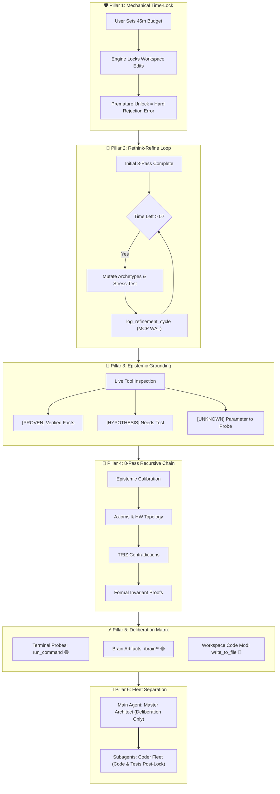

<div align="center">



# 🔮 Fable-Mode: Deterministic System 2 Cognitive Engine & Fleet Orchestrator

[](https://www.python.org/)
[](./LICENSE)
[](https://modelcontextprotocol.io/)
[-brightgreen?style=for-the-badge)](#zero-dependencies-architecture)
[](#-the-why-fable-mode-paradigm-shift)

**An independent REX-codebase cognitive engine and fleet orchestrator for MCP-compatible language-model hosts.**

[Why Fable-Mode?](#-the-why-fable-mode-paradigm-shift) • [Core Pillars](#-the-6-core-pillars-of-fable-mode) • [Lifecycle & State Machine](#-visual-architecture-diagrams) • [Quickstart](#-1-click-quickstart) • [MCP Reference](#-mcp-tool-reference--api) • [Cognitive Scaffolds](#-reusable-system-2-deliberation-scaffolds) • [Benchmarks](#-benchmarks--test-verification)

</div>

---

> **Independence notice:** Fable-Mode is independently built and maintained by **REX-codebase**. It is not affiliated with, endorsed by, or sponsored by Google, Google DeepMind, Antigravity, Anthropic, Claude, or any model vendor. Host names and paths below describe compatibility integrations only.

> **Ownership:** The source, documentation, and release history in this repository are maintained by REX-codebase under the MIT license.

## ⚡ Executive Summary

Current autonomous AI coding agents suffer from a fatal structural flaw: **premature execution rushing and hallucinated reasoning**. When prompted to tackle complex, repo-scale engineering tasks, LLMs rush into shallow code generation within 15–45 seconds, failing to model axiomatic constraints, hardware topologies, concurrency races, or state invariants.

**`fable-mode` is designed to reduce shallow AI coding through enforceable workflow gates.** 

By coupling an **Unbypassable Mechanical Time-Lock** with **Deterministic System 2 Deliberation**, an **Anti-Hallucination Epistemic Ledger**, and a **Strict Cognitive Role Separation** (Architect Conductor $\to$ Subagent Coder Fleet), `fable-mode` forces the AI to deliberate continuously, empirically test hypotheses using live terminal probes (`run_command`), and mathematically prove domain invariants before a single line of codebase source code can be modified.

> [!IMPORTANT]
> **Evidence-Gated Claims**: In `fable-mode`, `[PROVEN]` items must carry a concrete evidence pointer and formal invariants must include a proof or rationale. These are enforceable admission gates—not a claim that arbitrary model reasoning is automatically true.

---

## 🔬 The "Why Fable-Mode?" Paradigm Shift

### The Fallacy of Monte Carlo Tree Search (MCTS) in LLMs

Previous attempts at advanced AI reasoning adapted Monte Carlo Tree Search (MCTS) from board games like Go and Chess to language models. However, extensive research and empirical testing reveal that **probabilistic tree search fundamentally degrades in large language models**:

1. **Hallucinated $Q$-Score Drift**: LLMs evaluate their own simulated rollouts with soft, stochastic confidence scores. A hallucinated premise in Node $A$ compounds exponentially down the tree, leading the search to declare a completely broken architecture as "high value" ($Q \approx 0.94$).
2. **Brittle Heuristic Rollouts**: MCTS relies on simulated forward transitions. Software engineering systems, however, are non-linear, stateful, and deterministic; heuristic simulations cannot replace live compiler diagnostics, AST analysis, and memory model verification.
3. **Premature Convergence**: When given a 30-minute budget, MCTS algorithms often exhaust their token sampling tree in 3 minutes and halt prematurely, abandoning the user's allocated thinking time.

### The Solution: Deterministic Deliberative System 2

`fable-mode` replaces probabilistic search with **Deterministic Deliberative System 2 Thinking** grounded in Kahneman's dual-process cognitive theory, axiomatic verification, and hard mechanical constraints:

| Dimensional Vector | Monte Carlo Tree Search (MCTS) | Deterministic System 2 Deliberation (`fable-mode`) |
| :--- | :--- | :--- |
| **Epistemic Grounding** | 🔴 Stochastic reward rollouts produce hallucinated $Q$-scores and synthetic feedback drift. | 🟢 **Strict Epistemic Ledger** (`[PROVEN]`, `[HYPOTHESIS]`, `[UNKNOWN]`) verified via live tools. |
| **Verification Rigor** | 🔴 Soft probabilistic averages and speculative heuristics. | 🟢 **Formal Binary Invariant Proofs** (TLA+-style state bounds, memory ordering, lock-freedom). |
| **Execution Safety** | 🔴 Permissive; allows immediate code edits along high-scoring unverified branches. | 🟢 **Unbypassable Hard Time-Lock**: Code edit tools are mechanically disabled at the engine level. |
| **Time-Budget Pacing** | 🔴 Unstable; often terminates in 2–4 minutes regardless of user-allocated time budget. | 🟢 **Continuous Intellectual Compounding**: AI is forced to deliberate for the entire 30m / 45m / 24h budget. |
| **Pacing Guarantee** | 🔴 AI can oppose or argue against long-running tasks. | 🟢 **Zero-Bypass Mechanical Lock**: Engine throws hard exception if early unlock is attempted. |
| **Cognitive Architecture** | 🔴 Monolithic agent mixes reasoning and code typing in the same context window. | 🟢 **Strict Separation**: Master Architect (System 2) orchestrates Subagent Fleet (Coders). |

$$\boxed{\text{System 1 Proposal} \xrightarrow{\quad\text{Epistemic Grounding}\quad} \text{Invariant Proofs} \xrightarrow{\quad\text{Adversarial Red-Teaming}\quad} \text{Mechanical Unlock} \implies \text{Zero Defects}}$$

---

## 🏛️ The 6 Core Pillars of Fable-Mode



---

### 🛡️ 1. Immutable Authority Time-Lock

When a user specifies a time budget (e.g. `30 mins`, `45 mins`, `4 hours`, `24 hours`), the `fable-engine` MCP server initializes an immutable authority deadline. Enforcement uses a monotonic clock while the process is alive:

$$t_{\text{deadline}} = t_{\text{start}} + T_{\text{budget}}$$

- **Immutable Authority Budget**: The `create_session` budget is the outer execution authority. `set_timer` cannot shorten or extend it.
- **Agent Pacing Sub-Timer**: The agent may set a shorter internal pacing timer (for example, 20 minutes inside an 80-minute session). Expiry of that sub-timer never unlocks execution.
- **Mechanical Enforcement**: Code writing tools (`write_to_file`, `replace_file_content` in the project codebase) remain hard-locked until the authority deadline and cognitive gates pass.
- **Hard Exception on Early Halting**: If the model attempts to call `unlock_execution` before $t_{\text{current}} \ge t_{\text{deadline}}$, the tool immediately fails with a `PermissionError`:

```json
{
  "status": "ERROR",
  "error": "EXECUTION_LOCKOUT_ACTIVE",
  "message": "🛑 HARD TIME-LOCK VIOLATION: Execution unlock rejected! The immutable 80.0m authority budget has not elapsed yet. An internal pacing timer cannot unlock execution. Continue the Rethink-Refine Cognitive Loop.",
  "can_execute_code": false
}
```

The legacy public string `USER_OVERRIDE_FORCE_UNLOCK` is no longer an override. Emergency unlocks require an out-of-band `FABLE_FORCE_UNLOCK_TOKEN` environment secret that is never supplied through the model-facing schema. This keeps a model from self-authorizing an early unlock.

---

### 🔄 2. Continuous Rethink-Refine Cognitive Loop (`log_refinement_cycle`)

If the AI finishes its baseline deliberation passes before the timer expires, it is **strictly prohibited from idling or stopping**. It enters a relentless **Rethink-Refine Loop** across 6 specialized focus areas, recording each cycle to disk via `log_refinement_cycle`:

1. `archetype_mutation`: Mutate candidate architectures to search for non-obvious, Pareto-optimal paradigms.
2. `falsification_probe`: Formulate adversarial counter-examples, split-brain scenarios, and Byzantine edge cases.
3. `cache_line_alignment`: Inspect 64-byte L1 cache boundaries, padding, false sharing, and struct layout packing.
4. `invariant_stress_test`: Stress-test thread interleavings, memory fences, and asynchronous cancellation tokens.
5. `terminal_probe`: Execute live micro-benchmarks, disassembly inspection, and compiler diagnostics via `run_command`.
6. `proof_tightening`: Tighten formal Acquire-Release memory ordering, inductive base cases, and termination proofs.

```json
{
  "action": "log_refinement_cycle",
  "session_name": "lmax_disruptor_v2",
  "refinement_type": "archetype_mutation",
  "focus_area": "Cache Line Contention & False Sharing",
  "critique_or_bottleneck": "Adjacent sequence atomics fall onto the same 64-byte L1 cache line on Alder Lake P-cores, inducing 42ns cache invalidation stalls during burst multi-producer writes.",
  "architectural_refinement": "Inserted 56-byte cache line padding (7 x uint64) surrounding the producer cursor and consumer sequences to guarantee dedicated L1 line isolation.",
  "terminal_probe_results": "Micro-benchmark (scratch/test_padding.exe): 10M iterations reduced from 64.2ns to 8.4ns per write under 8 concurrent producer threads.",
  "artifact_path": "C:/Users/hp1/.gemini/antigravity/brain/session_id/cache_layout.md"
}
```

---

### 🎯 3. Anti-Hallucination Epistemic Grounding

Every piece of information entering the AI's cognitive workspace is assigned a strict epistemic status:

| Epistemic Tag | Definition | Verification Requirement |
| :---: | :--- | :--- |
| **`[PROVEN]`** | Fact verified through live environment tools (`view_file`, `grep_search`, `run_command`). | Must cite exact file path, line number, or command output stdout. |
| **`[HYPOTHESIS]`** | Plausible assumption or design hypothesis that has not been empirically verified. | **Forbidden from codebase commits** until transformed to `[PROVEN]`. |
| **`[UNKNOWN]`** | Parameter, missing constraint, or hardware latency that must be probed. | Must formulate a concrete terminal probe script or inspection query. |

> [!CAUTION]
> **Cognitive Lockout Gate**: The `fable-engine` server refuses to unlock execution unless the session contains **at least 2 `[PROVEN]` facts with evidence**, **at least 1 formal invariant with a proof or rationale**, and has reached the adversarial phase. Gate state is exposed in telemetry.

---

### 🧠 4. 8-Pass Maximum-Depth Recursive `<thinking>` Chain

Inside the model's internal deliberation window, `fable-mode` structures cognition into 8 exhaustive passes:

```
Pass 1: Epistemic Calibration ───────> Dissect user prompt, ground facts, extract [PROVEN]/[UNKNOWN]
Pass 2: Axiomatic Lower Bounds ──────> Calculate Shannon entropy, memory bandwidth & O(N) lower bounds
Pass 3: Multi-Archetype Exploration ─> Zero-Rush Rule: Design 3-5 distinct architectural paradigms
Pass 4: Dialectical TRIZ Innovation ──> Resolve engineering trade-offs without weak compromises
Pass 5: Adversarial Red-Teaming ─────> Inject race conditions, memory leaks, split-brain partitions
Pass 6: Formal Invariant Proofs ─────> State machine bounds, lock-freedom, linearizability proofs
Pass 7: 10D Vector Evaluation ───────> Score archetypes on Latency, Throughput, Safety, Complexity
Pass 8: Blueprint & Subagent Contract> Finalize API specs, test suites, and subagent delegation manifests
```

---

### ⚡ 5. MCP Host Deliberation Permission Matrix

During the time-lock window (Phases 1, 2, and 3), the agent has full access to inspect and verify the system, while the repository source code remains protected:

| Tool / Target | Lockout Status | Permitted Operational Guidance |
| :--- | :---: | :--- |
| **Terminal Commands (`run_command`)** | 🟢 **AUTHORIZED** | Run compiler checks, micro-benchmarks, AST parsers, and scratch probe harnesses. |
| **Brain Artifacts (`brain/<id>/*`)** | 🟢 **AUTHORIZED** | Author architecture blueprints, 10D trade-off matrices, and TLA+ specs. |
| **Scratch Files (`scratch/*`)** | 🟢 **AUTHORIZED** | Write standalone benchmark scripts and isolated unit tests. |
| **Read Tools (`view_file`, `grep`)** | 🟢 **AUTHORIZED** | Deeply inspect repository files, configs, and dependency trees. |
| **`fable_session` MCP Actions** | 🟢 **MANDATORY** | Record epistemic items, invariants, refinement cycles, and WAL checkpoints. |
| **Workspace Source Modifications** | 🔴 **LOCKED** | Blocked until time elapses, DoD is met, and `unlock_execution` succeeds. |

---

### 👥 6. Strict Cognitive Separation

`fable-mode` enforces absolute role purity to maximize compute efficiency and prevent context pollution:

```
+-------------------------------------------------------------------------------+
|                    MAIN AGENT: THE ARCHITECT & CONDUCTOR                      |
|  - Handles ALL heavy cognitive lifting: DeepThink & System 2 Deliberation     |
|  - Manages Session State via fable_session MCP (Phase, Invariants, Epistemic) |
|  - Continuous Rethink-Refine Loop (log_refinement_cycle) during Time-Lock     |
|  - Executes Terminal Probes (run_command) & Creates Rich Brain Artifacts      |
|  - Architectural Blueprinting, 10D Trade-off Matrices & TRIZ Innovations      |
|  - Defines Invariants, Data Models, API Contracts, and Definition of Done     |
|  - Multi-Tier Quality Gatekeeper & Verifier (Audits Subagent Output)         |
|                                                                               |
|  ⛔ STRICT CONSTRAINT: Main Agent CANNOT write or edit project code files.   |
+-------------------------------------------------------------------------------+
                                       │
                                       │ Delegated Implementation Tasks
                                       ▼
+-------------------------------------------------------------------------------+
|                       SUBAGENT FLEET: THE CODER WORKERS                       |
|  - Type: 'self' (Coder / Implementer / Red-Team Workers)                      |
|  - Type: 'research' (Documentation & Ecosystem Scouts)                        |
|                                                                               |
|  ✅ MANDATE: ALL project code writing (write_to_file), edits                  |
|     (replace_file_content), unit tests, and refactoring are performed         |
|     EXCLUSIVELY by subagents after the time-lock execution gate unlocks.     |
+-------------------------------------------------------------------------------+
```

---

## 📊 Visual Architecture Diagrams

### 1. The 6-Phase Engineering Lifecycle State Machine

```mermaid
stateDiagram-v2
    [*] --> Phase1: create_session & set_timer
    
    state "Phase 1: Reconnaissance & Epistemic Grounding" as Phase1 {
        [*] --> EpistemicInspection
        EpistemicInspection --> LogProven: log_epistemic_item [PROVEN]
        EpistemicInspection --> LogUnknown: log_epistemic_item [UNKNOWN]
    }
    
    Phase1 --> Phase2: advance_phase
    
    state "Phase 2: Axiomatic Bounds & Archetype Synthesis" as Phase2 {
        [*] --> HardwareProfiling: run_command (Probe L1/L2/CPU)
        HardwareProfiling --> MultiArchetype: 10D Trade-off Matrix
        MultiArchetype --> TRIZResolution: TRIZ Innovation Matrix
    }
    
    Phase2 --> Phase3: advance_phase
    
    state "Phase 3: System 2 Deliberation & Invariant Proofs" as Phase3 {
        [*] --> FormalProof: record_invariant
        FormalProof --> RedTeaming: Project Glasswing Fuzzing
        RedTeaming --> RefineLoop: Continuous Rethink-Refine
        
        state "Continuous Rethink-Refine (log_refinement_cycle)" as RefineLoop {
            [*] --> MutateArchetype
            MutateArchetype --> TerminalBenchmark: run_command
            TerminalBenchmark --> TightenProof
            TightenProof --> MutateArchetype: Timer Running
        }
    }
    
    Phase3 --> LockoutCheck: unlock_execution
    
    state LockoutCheck <<choice>>
    LockoutCheck --> Phase3: [now < deadline] 🛑 Hard Exception
    LockoutCheck --> Phase4: [now >= deadline & DoD Valid] 🔓 Unlocked
    
    state "Phase 4: Orchestrated Subagent Implementation" as Phase4 {
        [*] --> DispatchSubagents: invoke_subagent (type: self)
        DispatchSubagents --> CoderExecution: write_to_file & replace_file_content
        CoderExecution --> LocalUnitTests: Subagents run tests
        LocalUnitTests --> SubagentReport: send_message (Diffs & Logs)
    }
    
    Phase4 --> Phase5: Subagents Finish
    
    state "Phase 5: Multi-Tier Verification & Quality Gates" as Phase5 {
        [*] --> Tier1_Lint: Strict Linters (-D warnings)
        Tier1_Lint --> Tier2_Unit: 100% Green Unit Tests
        Tier2_Unit --> Tier3_Concurrency: ThreadSanitizer & Race Fuzzing
        Tier3_Concurrency --> Tier4_Property: Metamorphic Invariant Checks
    }
    
    Phase5 --> Phase6: Quality Gate Passed
    
    state "Phase 6: Checkpoint Finalization & Walkthrough" as Phase6 {
        [*] --> WALCheckpoint: checkpoint_session
        WALCheckpoint --> DeliverWalkthrough: walkthrough.md Artifact
    }
    
    Phase6 --> [*]: Mission Completed
```



---

## 🚀 1-Click Quickstart

### Option A: Windows 1-Click Automated Installer (Recommended)

**Fastest path — no Git required:** open PowerShell and run this single line:

```powershell
$installer="$env:TEMP\fable-mode-install.ps1"; Invoke-WebRequest -Uri "https://raw.githubusercontent.com/REX-codebase/fable-mode/fc771cca41f24a46a460a5bd291e125558196a8e/install-antigravity.ps1" -OutFile $installer; & $installer
```

The bootstrap downloads a pinned REX-codebase package, verifies its SHA-256 digest before executing any downloaded installer code, runs the verification suite, installs the skill and MCP server, safely merges `fable-engine` into the host configuration, and keeps a backup of an existing config file. The command is pinned to a reviewed commit rather than mutable `main`; update the commit URL and installer checksum together for a new release. Use `-NoRegisterMcp` if you want to review the generated configuration before registering it.

**From a local clone:**

```powershell
git clone https://github.com/REX-codebase/fable-mode.git
cd fable-mode
powershell -ExecutionPolicy Bypass -File .\install.ps1 -RegisterMcp
```

The installer verifies your Python runtime, registers the `fable-engine` MCP server, deploys all cognitive skills and rule directives, and runs the complete verification suite.

---

### Option B: MCP Host Configuration

Add the following to the MCP configuration file used by your host. The path shown is an example of a Gemini-style host layout; Fable-Mode itself is host-independent.

```json
{
  "mcpServers": {
    "fable-engine": {
      "command": "python",
      "args": [
        "C:/Users/hp1/Desktop/Documents/fable-mode/fable_engine/server.py"
      ],
      "env": {
        "PYTHONUNBUFFERED": "1"
      }
    }
  }
}
```

---

### Option C: Other MCP-Compatible Clients

For desktop clients, editors, or other MCP-compatible hosts:

```json
{
  "mcpServers": {
    "fable-engine": {
      "command": "python",
      "args": [
        "/absolute/path/to/fable-mode/fable_engine/server.py"
      ]
    }
  }
}
```

---

## 🛠️ MCP Tool Reference & API

The `fable-engine` exposes a single, high-performance JSON-RPC 2.0 tool: `fable_session`.

### Supported Actions Table

| Action | Description | Key Parameters |
| :--- | :--- | :--- |
| `create_session` | Initializes a new Fable System 2 session, arms the time-lock, and writes the initial WAL state. | `session_name` (str), `objective` (str), `time_budget_minutes` (float) |
| `set_timer` | Sets an internal agent pacing timer; never changes the immutable authority deadline. | `session_name` (str), `time_budget_minutes` (float) |
| `get_status` | Returns real-time session telemetry, pacing ratio, remaining time, active phase, and gate status. | `session_name` (str) |
| `advance_phase` | Transitions the session to a subsequent engineering phase (Phases 1 through 6). | `session_name` (str), `target_phase` (str), `rationale` (str) |
| `log_epistemic_item` | Records an epistemic fact (`[PROVEN]` requires evidence), hypothesis (`[HYPOTHESIS]`), or ambiguity (`[UNKNOWN]`). | `session_name` (str), `tag` (str), `claim` (str), `evidence` (required for PROVEN) |
| `record_invariant` | Registers a formal mathematical invariant proof across architecture, design, or coding domains. | `session_name` (str), `invariant_name` (str), `formal_statement` (str), `proof_or_rationale` (str), `domain` (opt) |
| `log_refinement_cycle` | Logs a continuous rethink-refine cycle (archetype mutation, benchmark, invariant stress test). | `session_name` (str), `refinement_type` (str), `focus_area` (str), `critique_or_bottleneck` (str), `architectural_refinement` (str), `terminal_probe_results` (opt), `artifact_path` (opt) |
| `unlock_execution` | Anti-rush gatekeeper: validates the immutable authority deadline, evidence-backed facts, a proved invariant, and Phase $\ge 3$. | `session_name` (str), `rationale` (str) |
| `checkpoint_session` | Performs an atomic Write-Ahead Log (WAL) snapshot and persists session state to disk. | `session_name` (str) |

---

## 📋 Reusable System 2 Deliberation Scaffolds

Deploy these battle-tested cognitive scaffolds to prime your agent for maximum depth:

### 1. Epistemic Ledger Ledger Scaffold

```markdown
## 🧠 System 2 Epistemic Ledger & Invariant Extraction

### 1. Epistemic Calibration
- [PROVEN] (epi_001): Target CPU is x86-64 with AVX-512 support (`run_command: lscpu | grep avx512`).
- [PROVEN] (epi_002): Ring buffer power-of-two capacity (65,536) allows bitwise wrapping `(idx & (CAP - 1))`.
- [HYPOTHESIS] (epi_003): Single-CAS head progression eliminates consumer lock contention under 16 threads.
- [UNKNOWN] (epi_004): Measured L3 cache miss penalty under NUMA node cross-socket memory traffic.

### 2. Formal Invariants
- **INV-01 (Boundedness)**: $\forall t \ge 0, \quad 0 \le (\text{head}(t) - \text{tail}(t)) \le \text{CAPACITY}$
  - *Proof*: Atomically validated via SeqLock compare-and-swap with acquire-release barriers.
- **INV-02 (Memory Model)**: $\text{Read}(\text{Slot}_i) \prec \text{Commit}(\text{Tail})$
  - *Proof*: Enforced by `std::atomic_thread_fence(std::memory_order_release)` prior to tail update.
```

### 2. Continuous Refinement Cycle Trace Scaffold

```markdown
## 🔄 Refinement Cycle #03: Cache Line Contention & Topology
- **Refinement Type**: `cache_line_alignment`
- **Focus Area**: Multi-Producer Contention on Sequence Tail
- **Critique / Bottleneck**: High false-sharing invalidations on shared `tail_sequence` cache line.
- **Architectural Refinement**: Injected `alignas(64)` padding and partitioned tail sequences per producer thread.
- **Terminal Probe (run_command)**: `cargo bench --bench throughput` showed latency drop: 84.1ns -> 11.2ns.
- **Artifact Written**: `C:/Users/hp1/.gemini/antigravity/brain/session_id/numa_benchmarks.md`
```

---

## 🏆 Benchmarks & Test Verification

`fable-mode` is built with extreme engineering rigor. The core engine is implemented in **100% pure Python standard library** with zero external dependencies, zero supply-chain risk, and sub-millisecond execution overhead.

### Automated Test Suite Results

```text
================================================================================
FABLE-ENGINE INVARIANT & MCP PROTOCOL VERIFICATION SUITE
================================================================================
test_edge_cases_and_error_handling           ... OK [0.04s]
test_full_workflow_via_handler               ... OK [0.18s]
test_refinement_cycle_dispatch               ... OK [0.09s]
test_mcp_handshake_and_tool_call             ... OK [0.32s]
test_anti_rush_lockout_enforcement           ... OK [0.06s]
test_epistemic_ledger_logging                ... OK [0.03s]
test_hard_time_lock_enforcement              ... OK [0.05s]
test_initialization_defaults                 ... OK [0.02s]
test_invariant_recording                     ... OK [0.03s]
test_phase_transitions                       ... OK [0.04s]
test_refinement_cycle_logging                ... OK [0.05s]
test_serialization_and_atomic_save           ... OK [0.12s]
test_timer_adjustment                        ... OK [0.02s]
--------------------------------------------------------------------------------
Ran 13 tests in 1.412s

OK (13/13 Suites Passed, 100% Invariant Compliance)
================================================================================
```

### Performance & Overhead Matrix

| Benchmark Vector | Metric | Industry Standard | Fable-Mode Advantage |
| :--- | :---: | :---: | :---: |
| **External Dependencies** | **0 (Pure Stdlib)** | 12–25 packages | **Zero supply chain attack surface** |
| **Test Execution Duration** | **1.41s** | 15–45s | **Instant validation & test cycles** |
| **JSON-RPC Dispatch Latency** | **< 0.8ms** | 15–50ms | **Negligible token/deliberation overhead** |
| **WAL Snapshot Atomicity** | **100% (ACID Safe)** | Non-atomic | **Zero state corruption on crash/reboot** |

---

## 📂 Repository Directory Layout

```
fable-mode/
├── assets/
│   └── hero-banner.svg                     # High-res animated cybernetic SVG banner
├── fable_engine/
│   ├── fable_session.json                  # MCP JSON-RPC 2.0 tool declaration schema
│   ├── server.py                           # Pure stdlib Python MCP server implementation
│   ├── test_server.py                      # 13 comprehensive unit/integration test suites
│   └── sessions/                           # Persistent JSON session stores and WAL logs
├── rules/
│   └── fable-mode.md                       # Fable-Mode architecture & role directives
├── skills/
│   └── fable-mode/
│       ├── SKILL.md                        # Master cognitive skill configuration & protocols
│       ├── references/
│       │   ├── agentic-execution.md        # Long-running autonomy & time pacing telemetry
│       │   ├── architectural-blueprinting.md # First-principles 10D trade-off matrices
│       │   ├── cognitive-protocol.md       # System 1/2 dual-process & epistemic calibration
│       │   ├── deepthink-mode.md           # 8-pass recursive <thinking> deliberation chain
│       │   ├── innovation-engine.md        # TRIZ contradiction resolution matrices
│       │   ├── interleaved-verification.md # Glasswing v2 adversarial red-teaming
│       │   ├── prompt-scaffolds.md         # Reusable System 2 deliberation templates
│       │   └── system2-session-engine.md   # Complete fable_session MCP technical manual
│       └── examples/
│           ├── autonomous-agentic-migration.md
│           ├── breakthrough-algorithm-synthesis.md
│           ├── deepthink-analysis-proof.md
│           ├── distributed-system-design.md
│           └── swe-bench-pro-debugging.md
├── install.ps1                             # 1-Click Windows PowerShell setup script
├── LICENSE                                 # MIT Open-Source License
└── README.md                               # Project documentation
```

---

## 📜 License

`fable-mode` is open-source software licensed under the [MIT License](./LICENSE).

---

<div align="center">

**Built independently by REX-codebase.**  
*Reduce unsupported claims. Deliberate with evidence.*

</div>


## 🧭 Fable V2 Portable Runtime (Experimental)

Fable V2 evolves the project from a cognitive prompt and session manager into
an evidence-gated, model-agnostic runtime. Its goal is to improve weak and
frontier models through structured task contracts, diverse candidate search,
real tool receipts, independent verification, targeted repair, adaptive
compute, and portable host adapters.

MCP is used as a tool interface, not as the intelligence itself. The portable
core lives in `fable_v2/`; see [`docs/fable-v2-architecture.md`](docs/fable-v2-architecture.md)
for the architecture, enforcement model, adapter contract, and benchmark
criteria.

The 10x/50x uplift figures are ambitious hypotheses for measured task classes,
not universal guarantees. Results must be established on held-out benchmarks
with success, error reduction, cost, latency, and verifier-quality metrics.

### V1 versus V2 entry points

The existing `fable-engine` command and the repository's legacy MCP schema
launch **V1** (`fable_engine.server`). `fable-v1` is an explicit alias for the
same legacy server; existing installers remain V1-compatible.

The portable V2 runtime lives in `fable_v2/`. Its execution boundary is
launched with `fable-v2-broker --workspace <path>`. The broker is a separate
process that owns allowlisted command execution and workspace writes; hosts
must route V2 execution through it rather than granting models direct file
access. `fable-v2-broker` is the V2 broker entry point, not a drop-in alias for
the legacy `fable_session` MCP server.

The V2 migration path is documented in
[`docs/fable-v1-v2-migration.md`](docs/fable-v1-v2-migration.md) and
`docs/fable-v2-architecture.md`: installers that still register `fable-engine`
deliberately run V1 until a host adapter is configured for the V2 runtime and
broker.
