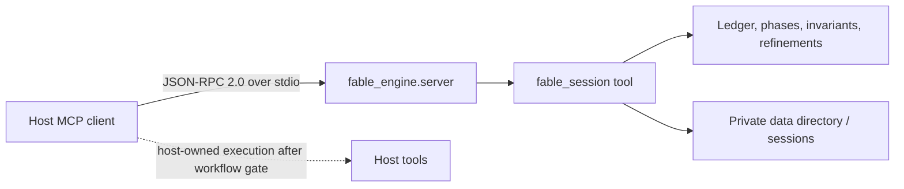
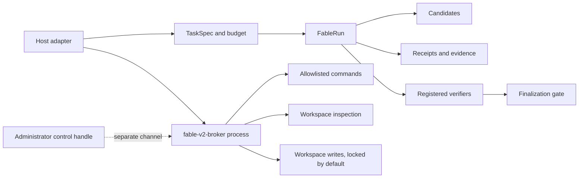

# Fable Mode

Fable Mode is a small, independent Python project for giving an AI host a more
structured way to plan, inspect, test, and review work. It records a session,
separates observations from hypotheses, and can require evidence and checks
before a session is marked ready for execution.

It is not a model, a proof system, or a security sandbox. A successful tool
call does not make a model's conclusion correct. The V1 time lock is a workflow
control implemented by the server process; it is not an operating-system
permission boundary. V2 is an experimental runtime and broker, not a finished
replacement for V1. Measure outcomes in the host and workload where you intend
to use it.

**Package version:** 1.2.0  
<!-- package-version: 1.2.0 -->

Fable Mode is maintained independently by REX-codebase under the MIT license.
It is not affiliated with any model vendor or host named in this repository.

## Choose your path

| You want to... | Start here | Status | Important boundary |
|---|---|---|---|
| Add the existing MCP session tool to a compatible host | [V1 quickstart](#v1-quickstart) and [`docs/mcp-reference.md`](docs/mcp-reference.md) | Documented; source CI-tested on the listed runners | V1 is the legacy `fable_engine.server` stdio server |
| Understand what is installed by the source helpers | [`install.sh`](install.sh) or [`install.ps1`](install.ps1) | Documented; wrapper syntax is CI-tested on its respective OS | They register V1; the installed runtime also contains the experimental V2 package and broker |
| Try the portable evidence-gated runtime | [`docs/fable-v2-architecture.md`](docs/fable-v2-architecture.md) | Experimental | V2 has a Python runtime and a separate broker, but no drop-in V2 MCP server |
| Move from V1 to V2 | [`docs/fable-v1-v2-migration.md`](docs/fable-v1-v2-migration.md) | Experimental migration | Keep V1 until a host adapter and broker deployment are conformance-tested |
| Check host and platform support | [`docs/host-compatibility.md`](docs/host-compatibility.md) | Documented status matrix | A profile is an expectation until a live probe attests it |
| Inspect security, files, or releases | [`docs/security-and-trust.md`](docs/security-and-trust.md), [`docs/data-and-artifacts.md`](docs/data-and-artifacts.md), and [`docs/release-policy.md`](docs/release-policy.md) | Documented | Release archives are currently unsigned; verify checksums and provenance |

## V1 and V2 are different things

### V1: `fable-engine` session MCP server

V1 is the current, backward-compatible product surface. It exposes one MCP
tool, `fable_session`, over JSON-RPC 2.0 on stdin/stdout. The tool manages a
named session, a wall-clock authority budget, six phases, an epistemic ledger,
invariants, refinement entries, checkpoints, and optional CAS payload helpers.
CAS references provide content addressing and integrity verification for normal
reads; they are not encryption, access control, authenticity, or a guaranteed
compression/token ratio. Any token counts, ratios, and the optional `<= 0.003
tokens/character` check shown by the payload helper are rough character-based
estimates for diagnostics, not measured model-token usage or guarantees.
Existing installation helpers deliberately register this server.

V1's `unlock_execution` action checks that the authority deadline has elapsed,
that two `PROVEN` entries have evidence, that one invariant has a proof or
rationale, and that the session has reached Phase 3 or later. The check helps a
host coordinate work; it does not prove the work is correct and does not grant
filesystem permissions. An internal `set_timer` pacing timer cannot unlock the
session. Any silent-deliberation or “zero-chat” convention during the time lock
is advisory host behavior, not a server-enforced guarantee; the MCP transport
still returns protocol responses. An emergency token, when configured by an
administrator out of band, is not part of the model-facing MCP schema. See the
[V1 theory notes](docs/fable-v1-theory.md) for the design rationale and
limitations.



V1 does **not** automatically control the host's tools, shell, files, model,
subagents, or operating-system permissions. The diagram's dashed relationship
is intentional.

### V2: portable runtime and execution broker

V2 is an experimental, model-agnostic foundation in `fable_v2/`. It defines
typed task contracts, candidate artifacts, host-produced tool receipts,
integrity-bound evidence, verifier policies, and a run state machine. The
`fable-v2-broker` command is a separate JSON-lines process for bounded command
execution, inspection, and workspace writes. It is not a V1 MCP server and is
not an alias for `fable-engine`.



V2 currently requires an adapter to connect a host to these contracts. Its
in-process verifier foundation is not a security boundary; hostile workloads
need OS-level isolation. The broker is a policy boundary, not a complete
sandbox. Read the [V2 architecture](docs/fable-v2-architecture.md) before
using it.

## V1 quickstart

The source checkout requires Python 3.10 or newer and has no declared runtime
dependencies. The commands below run the source implementation directly. The
server speaks MCP over stdio, so normally a host launches it rather than a
human waiting for terminal output.

### macOS, Linux, and WSL2

```sh
python3 --version                 # must be Python 3.10+
python3 -m venv .venv
. .venv/bin/activate
python -m pip install -e .
fable-mode --version               # should print 1.2.0

# Run the V1 MCP server directly (keep stdin/stdout connected to the host):
python -m fable_mode serve
```

WSL2 uses the Linux commands when the checkout and Python environment are
inside WSL. A Windows-hosted editor may need a WSL-aware MCP configuration and
an absolute path visible inside WSL; that integration is documented but is not
covered by the Windows CI job or a dedicated WSL runner.

Optional source helper (installs a private copy and can register discovered
host CLIs):

```sh
./install.sh --dry-run --yes
./install.sh --yes                 # install V1 without host registration
./install.sh --yes --register-hosts --workspace "$PWD"
```

`--register-hosts` only changes hosts that the helper can safely discover.
For Antigravity, registration updates its global
`~/.gemini/config/mcp_config.json`; when `--workspace` is supplied it also
creates or updates `<workspace>/.agents/mcp_config.json`. Unrelated keys are
preserved, but these are real configuration side effects (and are normalized
to owner-only permissions where supported). Review both resulting files
before use. The helper records ownership so uninstall can restore the prior
entries.

To verify a source-helper install, invoke the copy that was installed rather
than assuming a `fable-mode` command is on PATH:

```sh
python3 /absolute/path/to/install/runtime/fable_mode_entry.py verify \
  --install-dir /absolute/path/to/install
```

### Windows PowerShell

```powershell
py -3 --version                    # must be Python 3.10+
py -3 -m venv .venv
.\.venv\Scripts\Activate.ps1
python -m pip install -e .
fable-mode --version                # should print 1.2.0

# Run the V1 MCP server directly:
python -m fable_mode serve
```

The source helper is:

```powershell
.\install.ps1 -DryRun -Yes
.\install.ps1 -Yes                 # install V1 without registration
.\install.ps1 -Yes -RegisterHosts -Workspace (Get-Location)
```

PowerShell execution policy may require the user or administrator to permit a
local script. The helper uses `py -3` when available and otherwise accepts a
`python` command only after it reports Python 3. With `-RegisterHosts
-Workspace`, Antigravity also writes `<workspace>/.agents/mcp_config.json` in
addition to its global `.gemini\config\mcp_config.json`; inspect both files
because registration is a real configuration side effect.

Verify a source-helper install with its installed runtime copy:

```powershell
py -3 C:\path\to\install\runtime\fable_mode_entry.py verify `
  --install-dir C:\path\to\install
```

### Installed commands

The package metadata provides these entry points:

| Command | Meaning |
|---|---|
| `fable-mode` | Package-aware installer, verifier, uninstaller, or V1 `serve` command |
| `fable-engine` | Direct V1 MCP server |
| `fable-v1` | Explicit alias for the direct V1 server |
| `fable-v2-broker` | Experimental V2 broker; requires `--workspace` |

V2 availability is intentionally explicit across distribution paths:

| Distribution path | V2 library and broker |
|---|---|
| `pip install` / editable source checkout | Available as `fable_v2` and `fable-v2-broker` |
| `install.sh` / `install.ps1` source helper | Copied into `runtime/fable_v2` (including `system3`); invoke `PYTHONPATH=/path/to/install/runtime python3 -m fable_v2.execution_broker --workspace /path/to/workspace` (use `py -3` on Windows) |
| Frozen release archive | V2 modules are bundled for embedding, but the frozen `fable-mode` executable exposes the V1 launcher only; use a pip/source install for the standalone V2 broker |

For a packaged release, use the archive for the matching OS and architecture;
see [release policy](docs/release-policy.md). Do not place a downloaded binary
on a PATH and trust it merely because its filename is familiar.

## MCP quick reference

V1 uses newline-delimited JSON-RPC 2.0. The complete action and parameter
schema is generated in `fable_engine/fable_session.json` and mirrored by the
server's `TOOL_SCHEMA`. Examples for `initialize`, `tools/list`, `tools/call`,
and session creation are in [`docs/mcp-reference.md`](docs/mcp-reference.md).
The V2 broker uses a different JSON-lines request/response envelope; it is not
MCP. Its examples are in the same reference document.

## Host and platform compatibility

The repository's source CI matrix runs Ubuntu, macOS, and Windows runners for
Python 3.10, 3.11, and 3.12. That is test coverage for the source suite, not a
claim that every host integration works there. Release CI builds separate
Linux x86_64, macOS x86_64, and Windows x86_64 archives. See the full matrix
in [`docs/host-compatibility.md`](docs/host-compatibility.md), which separates
**tested**, **documented**, **experimental**, and **not supported**.

## Verification and development checks

Runtime tests (from the repository root):

```sh
python -m unittest discover -s tests -p 'test_server*.py' -v
python -m unittest discover -s tests -p 'test_*.py' -v
```

Documentation and drift checks:

```sh
python docs/check_docs.py
python -m unittest discover -s tests -p 'test_documentation.py' -v
```

The documentation checker validates local Markdown links and fragments,
control/replacement characters, meaningful V1 schema semantics and output
fields against the runtime, V2 broker actions and probe output, the complete
source manifest, package metadata/entry points, release naming/runner details,
and package-version/README consistency. It does not fetch external URLs and
cannot prove that an external host's API remains unchanged.

## Repository map

```text
fable_mode/                  installer, launcher, adapters, safety
fable_engine/                V1 MCP server and canonical schema
fable_v2/                    experimental V2 protocol, runtime, broker, adapters, System 3
build_scripts/               release build and version validation
packaging/                   PyInstaller specification
docs/                        product, architecture, API, security, and checks
tests/                       runtime, packaging, security, and documentation tests
rules/                       host instruction resources
install.sh / install.ps1     source-mode V1 installation helpers
```

## License

Fable Mode is released under the [MIT License](LICENSE).
