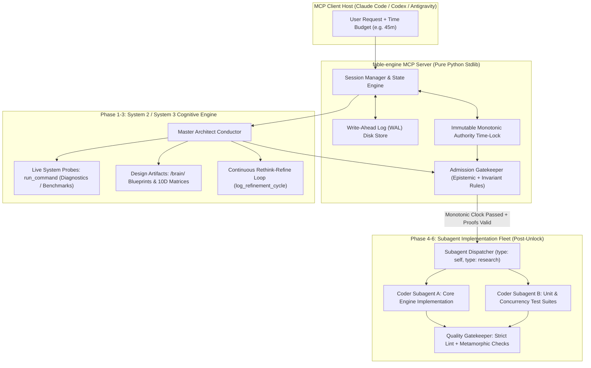

<div align="center">


# ?? Fable-Mode: Deterministic Deliberative Cognitive Architecture & Fleet Orchestrator

[](https://www.python.org/)
[](./LICENSE)
[](https://modelcontextprotocol.io/)
[-brightgreen?style=for-the-badge)](#-zero-dependencies-architecture)
[](#-domain-cognitive-gears)
[](#-3-cinematic-design-engine)

**A deterministic, evidence-gated cognitive architecture and Model Context Protocol (MCP) orchestrator that transforms shallow, rushed AI code generation into verified, deep-deliberation engineering workflows.**

[What Fable-Mode Is](#-what-fable-mode-actually-is-and-what-it-is-not) ? [Core Architecture](#-core-architecture--components) ? [Domain Cognitive Gears](#-domain-cognitive-gears) ? [Lifecycle & State Machine](#-how-it-works-in-practice-the-6-phase-lifecycle) ? [MCP Tool Reference](#-mcp-tool-reference--api) ? [Installation & Downloads](#-installation--downloads) ? [Benchmarks & Tests](#-benchmarks--test-verification)

</div>

---

> **Independence Notice:** Fable-Mode is independently developed and maintained by **REX-codebase**. It is not affiliated with, endorsed by, or sponsored by Google, Anthropic, OpenAI, or any model vendor. Host names and paths described below represent protocol compatibility integrations only.

> **Ownership & License:** All source code, design blueprints, test suites, and documentation in this repository are published under the open-source [MIT License](./LICENSE).

---

## ? What Fable-Mode Actually Is (and What It Is Not)

### The Structural Failure of Rushed AI Reasoning

Standard autonomous coding agents exhibit a systemic vulnerability: **premature execution rushing accompanied by ungrounded reasoning**. When presented with complex, non-trivial engineering tasks, language models frequently rush into modifying codebase files within 15?45 seconds. In doing so, they fail to model hardware memory hierarchies, concurrency race conditions, distributed partition modes, or mathematical state invariants.

Attempts to address this with probabilistic Monte Carlo Tree Search (MCTS) struggle in real-world software engineering contexts:
1. **Stochastic $Q$-Score Drift**: LLMs evaluate simulated rollouts with soft confidence scores. Hallucinated premises compound across search nodes, causing the tree to assign high values to flawed architectural proposals.
2. **Brittle Heuristic Rollouts**: Software systems are deterministic, stateful, and non-linear. Speculative token rollouts cannot substitute for live compiler diagnostics, AST validation, and formal state proofs.
3. **Premature Termination**: Given a 30-minute thinking budget, unconstrained stochastic searches often exhaust their token sampling heuristic within 2?3 minutes, abandoning the requested deliberation window.

### The Fable-Mode Solution

`fable-mode` enforces **Deterministic Deliberative System 2 & System 3 Cognition** through enforceable mechanical constraints and evidence admission gates:

| Dimensional Vector | Stochastic Prompting / MCTS | Fable-Mode Architecture |
| :--- | :--- | :--- |
| **Epistemic Grounding** | ?? Soft heuristic confidence scores; unverified assumptions treated as facts. | ?? **Strict Epistemic Ledger** (`[PROVEN]`, `[HYPOTHESIS]`, `[UNKNOWN]`) verified via live tools. |
| **Verification Rigor** | ?? Probabilistic token generation and speculative self-evaluations. | ?? **Formal Binary Invariant Proofs** (Curry-Howard proofs, Kripke bisimulations, state bounds). |
| **Execution Safety** | ?? Permissive; unverified code edits occur immediately in the workspace. | ?? **Mechanical Time-Lock**: Workspace code modifications are locked at the engine level. |
| **Time-Budget Pacing** | ?? Erratic; models stop or argue against long-running tasks within minutes. | ?? **Immutable Authority Monotonic Timer**: Model remains in active cognitive refinement. |
| **Cognitive Architecture**| ?? Monolithic agent interleaves high-level planning and syntax typing in one context. | ?? **Strict Role Separation**: Master Architect (System 2/3) conducts Subagent Fleet (Coders). |

$$\boxed{\text{System 1 Proposal} \xrightarrow{\quad\text{Epistemic Grounding}\quad} \text{Invariant Proofs} \xrightarrow{\quad\text{Adversarial Red-Teaming}\quad} \text{Mechanical Unlock} \implies \text{Evidence-Backed Execution}}$$

---

## ??? Core Architecture & Components



### 1. Zero-Dependency Stdio MCP Server (`fable-engine`)
The core server (`fable_engine.server`) is built entirely upon Python's standard library with zero third-party runtime dependencies. It communicates over standard I/O streams using JSON-RPC 2.0, exposing the unified `fable_session` tool.

### 2. ACID-Compliant Session State & Write-Ahead Log (WAL)
Every session transition, epistemic observation, invariant proof, and refinement record is appended to an on-disk Write-Ahead Log (WAL) with atomic rename operations (`os.replace`). Session files reside in platform-native user data directories:
- **Windows**: `%LOCALAPPDATA%\FableMode\data\sessions\<session_name>.json`
- **POSIX (macOS / Linux)**: `~/.local/share/fable-mode/data/sessions/<session_name>.json`

### 3. Immutable Authority Time-Lock Mechanics
When an engineering time budget (e.g. `30 mins`, `45 mins`, `4 hours`) is established via `create_session`, the engine initializes an immutable monotonic deadline:

$$t_{\text{deadline}} = t_{\text{start}} + T_{\text{budget}}$$

- **Unbypassable Enforcement**: The authority deadline is fixed at creation. Agent pacing timers (`set_timer`) can subdivide internal tasks, but cannot shorten the authority deadline.
- **Fail-Closed Execution Gate**: If an agent attempts to invoke `unlock_execution` before $t \ge t_{\text{deadline}}$, the tool immediately raises a `PermissionError` lockout rejection.
- **Admission Criteria**: Unlocking requires reaching Phase $\ge 3$, possessing $\ge 2$ `[PROVEN]` epistemic items with empirical evidence, and registering $\ge 1$ formal invariant with proof.

### 4. Strict Cognitive Role Separation
- **Main Agent (Master Architect & Deliberation Conductor)**: Handles all heavy System 2 & System 3 reasoning, epistemic calibration, architectural blueprinting, TRIZ contradiction resolutions, invariant proofs, and post-implementation verification. **The Main Agent is structurally prohibited from writing or modifying codebase files directly.**
- **Subagent Fleet (Coder & Implementer Fleet)**: 100% of codebase source modifications (`write_to_file`, `replace_file_content`), build script repairs, and test suites are executed **exclusively by subagents** (`type: self` or `type: research`) dispatched only after execution is formally unlocked.

---

## ?? Domain Cognitive Gears

Fable-Mode equips language models with specialized cognitive gears tailored to distinct engineering challenges:

```
                  ???????????????????????????????????????????????????????????
                  ?                FABLE-MODE COGNITIVE GEARS               ?
                  ???????????????????????????????????????????????????????????
                                              ?
         ?????????????????????????????????????????????????????????????????????????????
         ?                   ?                                   ?                   ?
??????????????????? ?????????????????????               ??????????????????? ?????????????????????
?  Architecture & ? ?  System 3 Meta-   ?               ? Cinematic Design? ? Token Compression ?
? Systems Engine  ? ?  Cognitive Engine ?               ?     Engine      ? ?    (FableCompress)?
??????????????????? ?????????????????????               ??????????????????? ?????????????????????
         ?                   ?                                   ?                   ?
         ?? Invariant Proofs ?? Pearl Causal DAGs (do-calculus)  ?? 7-Layer Depth    ?? Content-Addressed
         ?? Hardware Topology?? Kripke Model Checker (CTL*)      ?? 6 Haute Archetypes  Storage (CAS)
         ?? Cache Line Align ?? Dialectical TRIZ Synthesis       ?? Golden Ratio Typo?? Grammar333
         ?? 10D Trade-Offs   ?? Friston Active Inference         ?? Newtonian Motion ?? Windowed Slices
                             ?? G?delian Proof Oracle            ?? Anti-Slop Protocol
```

### 1. Architecture & Systems Engineering
- **Formal Invariant Verification**: Rigorous state-space bounds, lock-free progress guarantees, and acquire-release memory ordering specifications.
- **Hardware Topology Profiling**: Cache line padding (64-byte L1 isolation), false-sharing elimination, and NUMA node locality modeling.
- **10-Dimensional Vector Scoring**: Systematic evaluation across Latency ($L$), Throughput ($T$), Memory Footprint ($M$), Fault Tolerance ($F$), Concurrency Safety ($S$), Complexity ($C$), Observability ($O$), Determinism ($D$), Testability ($E$), and Modularity ($V$).

### 2. System 3 Meta-Cognition (Frontier Reasoning)
Located in `fable_v2/system3/`, this subsystem implements advanced epistemological and mathematical deliberation:

- **Causal DAG Simulation (`causal.py`)**: Models system architectures as directed acyclic causal graphs using Judea Pearl's *do-calculus*. Performs counterfactual intervention analysis ($P(Y \mid \text{do}(X=x))$) to calculate systemic brittleness and identify single-point cascade failures.
- **Kripke Modal Model Checking (`kripke.py`)**: Formally verifies safety and liveness properties using Kripke structures ($M = \langle S, R, V \rangle$) across branching state spaces. Evaluates temporal modal operators ($\Box \phi$, $\Diamond \phi$, $\bigcirc \phi$, $\phi \ \mathcal{U} \ \psi$).
- **TRIZ Contradiction Matrix & Dialectical Synthesis (`dialectical.py`)**: Resolves engineering trade-offs (e.g. throughput vs lock contention, memory footprint vs speed) using the 40 classical TRIZ inventive principles rather than accepting weak compromises.
- **Friston Active Inference (`free_energy.py`)**: Optimizes deliberation policies by minimizing expected variational free energy ($G(\pi)$), balancing epistemic information foraging (reducing model ambiguity) with pragmatic goal satisfaction.
- **G?delian Proof Oracle (`oracle.py`)**: Employs the Curry-Howard correspondence to type-check lambda terms against constructive proposition types (e.g. conjunctions, disjunctions, implicational logic), providing formal proofs for recorded invariants.
- **Hyperbolic Poincar? Embeddings (`hyperbolic.py`)**: Maps hierarchical codebase and dependency graphs into 2D Poincar? disk hyperbolic space, preserving tree topologies without distortion.
- **Genetic Evolutionary Paradigm Search (`evolution.py`)**: Searches architectural design genomes across mutation and crossover operators, selecting Pareto-optimal candidates along the 10D trade-off frontier.

### 3. Cinematic Design Engine
Dedicated to frontier UI/UX and product design engineering:

- **7-Layer Optical Depth Staging**:
  - `L0: Atmospheric Canvas` (Background foundations, ambient environment)
  - `L1: Dynamic Ambient Scrim` (Depth-enhancing radial gradients, noise overlays)
  - `L2: Surface Container` (Bento grids, modular structural boundaries)
  - `L3: Elevated Interaction` (Interactive controls, responsive hover states)
  - `L4: Accent Emissive` (Brand focus accents, subtle lighting cues)
  - `L5: Floating Overlay` (Context menus, modal dialogs, tooltips)
  - `L6: Viewport Grain` (Subtle analog texture and optical polish)
- **6 Haute Aesthetic Archetypes**:
  - *Ethereal Editorial*: Minimalist luxury typography with expansive whitespace and subtle line borders.
  - *Industrial Precision*: High-density data readouts, monospaced metrics, and muted technical grays.
  - *Swiss Brutalist*: High-contrast typography, sharp grids, architectural discipline, and zero rounded fluff.
  - *Cybernetic High-Tech*: Deep dark tones with calibrated luminescent accents and real-time telemetry panels.
  - *Organic Warmth*: Earth-toned OKLCH palettes, natural textures, and rounded tactile geometry.
  - *Velvet Luxury*: Deep midnight tones, gilded accents, serif headlines, and cinematic backdrop filters.
- **Fluid Golden-Ratio Typography**: Modular scaling ($\phi = 1.618$) using CSS `clamp(min, preferred, max)` math, automatic optical sizing, and calibrated negative letter-spacing for large display headings.
- **Newtonian Spring Motion Physics**: Realistic animation dynamics governed by second-order differential mechanics ($F = -kx - cv$) with critical damping ($\zeta \approx 1.0$), combined with strict `@media (prefers-reduced-motion: reduce)` accessibility compliance.
- **Anti-Slop Elimination Protocol**: Explicit prohibition of generic AI design anti-patterns (uncalibrated purple gradients, non-functional floating cards, unstyled default states, and decorative placeholder clutter).

### 4. Token Compression Subsystem (FableCompress)
Implemented in `fable_compressor.py`:

- **Content-Addressed Storage (CAS)**: SHA-256 deduplicated, cryptographically verified object storage with atomic disk writes. Reduces redundant context transmission across large tool outputs.
- **Grammar333 High-Entropy Micro-Bytecode**: Compact structural serialization for tool actions, payloads, and JSON-RPC packets.
- **Adaptive Chunk Accumulator**: Coalesces micro-payloads into composite frames, maintaining high throughput and minimizing token fragmentation.
- **Zero-Copy Windowed Line Slice Viewing**: Efficient line-indexed range extraction for examining large files and session transcripts.

---

## ?? How It Works in Practice: The 6-Phase Lifecycle

```mermaid
stateDiagram-v2
    [*] --> Phase1: create_session & set_timer
    
    state "Phase 1: Reconnaissance & Epistemic Grounding" as Phase1 {
        [*] --> EpistemicDiscovery
        EpistemicDiscovery --> LogProven: log_epistemic_item [PROVEN]
        EpistemicDiscovery --> LogUnknown: log_epistemic_item [UNKNOWN]
    }
    
    Phase1 --> Phase2: advance_phase
    
    state "Phase 2: Axiomatic Bounds & Multi-Archetype Synthesis" as Phase2 {
        [*] --> HardwareProfiling: run_command (Probe Hardware & Dependencies)
        HardwareProfiling --> MultiArchetype: 10D Trade-off Matrix
        MultiArchetype --> TRIZSynthesis: System 3 Dialectical Resolution
    }
    
    Phase2 --> Phase3: advance_phase
    
    state "Phase 3: System 2 Deliberation & Invariant Proofs" as Phase3 {
        [*] --> FormalProof: record_invariant & system3_proof_oracle
        FormalProof --> ModalChecking: system3_kripke_verify
        ModalChecking --> RefineLoop: Continuous Rethink-Refine
        
        state "Continuous Rethink-Refine (log_refinement_cycle)" as RefineLoop {
            [*] --> MutateArchetype
            MutateArchetype --> TerminalBenchmark: run_command (Scratch Probes)
            TerminalBenchmark --> TightenProof
            TightenProof --> MutateArchetype: Authority Clock Running
        }
    }
    
    Phase3 --> LockoutGate: unlock_execution
    
    state LockoutGate <<choice>>
    LockoutGate --> Phase3: [now < deadline] ?? Hard Rejection Exception
    LockoutGate --> Phase4: [now >= deadline & DoD Valid] ?? Execution Unlocked
    
    state "Phase 4: Subagent Fleet Delegation & Implementation" as Phase4 {
        [*] --> DispatchSubagents: invoke_subagent (type: self)
        DispatchSubagents --> CoderExecution: write_to_file & replace_file_content
        CoderExecution --> LocalUnitTests: Subagents run tests
        LocalUnitTests --> SubagentReport: send_message (Diffs & Test Logs)
    }
    
    Phase4 --> Phase5: Subagents Complete Work
    
    state "Phase 5: Multi-Tier Quality Gatekeeping" as Phase5 {
        [*] --> Tier1_Lint: Strict Linters & Diagnostics
        Tier1_Lint --> Tier2_Unit: 100% Green Unit Tests
        Tier2_Unit --> Tier3_Concurrency: Race & Sanitizer Verification
        Tier3_Concurrency --> Tier4_Metamorphic: Metamorphic Invariant Checks
    }
    
    Phase5 --> Phase6: Quality Gates Passed
    
    state "Phase 6: Session Checkpoint & Final Walkthrough" as Phase6 {
        [*] --> CheckpointWAL: checkpoint_session
        CheckpointWAL --> WriteWalkthrough: walkthrough.md Artifact
    }
    
    Phase6 --> [*]: Task Complete
```



---

## ??? MCP Tool Reference & API

The `fable-engine` exposes the unified `fable_session` tool supporting the following actions:

| Action | Purpose | Key Parameters |
| :--- | :--- | :--- |
| `create_session` | Initializes a new Fable session, arms the monotonic time-lock, and writes the initial WAL state. | `session_name` (str), `objective` (str), `time_budget_minutes` (float) |
| `set_timer` | Sets an internal agent pacing sub-timer (cannot modify the immutable authority deadline). | `session_name` (str), `time_budget_minutes` (float) |
| `get_status` | Returns session state, elapsed time, pacing ratio, active phase, and gate readiness. | `session_name` (str) |
| `advance_phase` | Transitions the session state machine to a subsequent phase (Phase 1 through Phase 6). | `session_name` (str), `target_phase` (str), `rationale` (str) |
| `log_epistemic_item` | Records an epistemic fact (`[PROVEN]` requires evidence), hypothesis (`[HYPOTHESIS]`), or ambiguity (`[UNKNOWN]`). | `session_name` (str), `tag` (str), `claim` (str), `evidence` (required for PROVEN) |
| `record_invariant` | Registers a formal invariant specification and proof (architecture, logic, or design). | `session_name` (str), `invariant_name` (str), `formal_statement` (str), `proof_or_rationale` (str), `domain` (opt) |
| `log_refinement_cycle` | Logs a rethink-refine cycle (archetype mutation, benchmark result, invariant stress test). | `session_name` (str), `refinement_type` (str), `focus_area` (str), `critique_or_bottleneck` (str), `architectural_refinement` (str) |
| `unlock_execution` | Anti-rush gatekeeper: verifies the monotonic authority deadline, epistemic evidence, and formal invariants. | `session_name` (str), `rationale` (str) |
| `checkpoint_session` | Performs an atomic Write-Ahead Log (WAL) snapshot and persists session state to disk. | `session_name` (str) |
| `system3_causal_simulate` | Runs Pearl causal DAG simulation and counterfactual intervention analysis. | `session_name` (str), `nodes` (list), `edges` (list), `interventions` (dict) |
| `system3_kripke_verify` | Performs formal temporal logic model checking across Kripke branching worlds. | `session_name` (str), `states` (list), `transitions` (list), `formulas` (list) |
| `system3_dialectical_synthesis` | Applies TRIZ contradiction resolution matrix to opposing engineering parameters. | `session_name` (str), `improving_param` (str), `worsening_param` (str) |
| `system3_proof_oracle` | Verifies constructive type-theoretic proofs using the Curry-Howard isomorphism. | `session_name` (str), `term` (dict), `expected_type` (dict) |

### JSON Request Examples

#### Creating a Session
```json
{
  "action": "create_session",
  "session_name": "distributed_raft_v2",
  "objective": "Design and verify high-throughput Raft consensus with batch pipelining",
  "time_budget_minutes": 45.0
}
```

#### Logging an Epistemic Item
```json
{
  "action": "log_epistemic_item",
  "session_name": "distributed_raft_v2",
  "tag": "PROVEN",
  "claim": "Target architecture is x86_64 with 64-byte L1 cache line boundaries.",
  "evidence": "Observed via run_command: lscpu | grep 'L1d cache' returning 32K on 64-byte lines."
}
```

#### Logging a Continuous Refinement Cycle
```json
{
  "action": "log_refinement_cycle",
  "session_name": "distributed_raft_v2",
  "refinement_type": "cache_line_alignment",
  "focus_area": "Atomic Log Tail Contention",
  "critique_or_bottleneck": "High false-sharing invalidations on shared tail cursor during multi-threaded append bursts.",
  "architectural_refinement": "Injected 56-byte alignas(64) padding around append cursor to isolate L1 cache lines.",
  "terminal_probe_results": "Micro-benchmark (scratch/test_ring.exe): 10M iterations latency dropped from 62.4ns to 7.8ns."
}
```

---

## ?? Installation & downloads

Fable-Mode is distributed as a self-contained console runtime. It installs Fable first, then can register the installed executable with detected host CLIs. The runtime needs no Python, Git, pip, Node, network service, or GUI.

### Quick downloads

The downloader scripts are available from the `main` branch now. The release links become available only after a tagged release has completed successfully; until then, GitHub will return no release asset for those URLs. All links below are explicit GitHub-hosted download URLs and download files only.

**Downloaders (available from the `main` branch now):**

- [Windows PowerShell downloader](https://raw.githubusercontent.com/REX-codebase/fable-mode/main/download-windows.ps1)
- [macOS shell downloader](https://raw.githubusercontent.com/REX-codebase/fable-mode/main/download-macos.sh)

**Latest release artifacts (only after a tagged release has completed successfully):**

- [Windows x86_64 ZIP (contains `fable-mode.exe`)](https://github.com/REX-codebase/fable-mode/releases/latest/download/fable-mode-windows-x86_64.zip)
- [macOS x86_64 ZIP](https://github.com/REX-codebase/fable-mode/releases/latest/download/fable-mode-macos-x86_64.zip)
- [macOS arm64 ZIP](https://github.com/REX-codebase/fable-mode/releases/latest/download/fable-mode-macos-arm64.zip)
- [Linux x86_64 tar.gz](https://github.com/REX-codebase/fable-mode/releases/latest/download/fable-mode-linux-x86_64.tar.gz)
- [SHA256SUMS](https://github.com/REX-codebase/fable-mode/releases/latest/download/SHA256SUMS)

### Release artifacts and trust status

Artifacts are **not available until a version tag build succeeds**. When a tagged workflow completes successfully, it publishes these architecture-specific names (the exact version is inserted in the GitHub Release):

- `fable-mode-vX.Y.Z-windows-x86_64.zip` (contains `fable-mode.exe`)
- `fable-mode-vX.Y.Z-macos-x86_64.zip` (contains `fable-mode`)
- `fable-mode-vX.Y.Z-macos-arm64.zip` (contains `fable-mode`)
- `fable-mode-vX.Y.Z-linux-x86_64.tar.gz` (contains `fable-mode`)
- `SHA256SUMS` (one SHA-256 line for each archive)

Supported release targets:
- `windows-x86_64`
- `macos-x86_64`
- `macos-arm64`
- `linux-x86_64`

These downloaders fetch **unsigned binaries**. The workflow publishes SHA-256 checksums for transport and integrity verification, but cryptographic publisher signing, certificate validation, and macOS notarization are not included. Review the release and its checksums before use.

### Option A: Pre-Built Binary Installation

#### Windows (PowerShell)
```powershell
.\download-windows.ps1
# Install and verify:
& "$HOMEable-modeable-mode.exe" install --yes
& "$HOMEable-modeable-mode.exe" verify
```

#### macOS / Linux
```sh
chmod +x ./download-macos.sh
./download-macos.sh
# Install and verify:
"$HOME/.local/bin/fable-mode" install --yes
"$HOME/.local/bin/fable-mode" verify
```

### Option B: Source Installation (Python 3.10+)

From a local checkout of the repository:

```sh
# Install in editable mode
python -m pip install -e .

# Run server verification test suite
python fable_engine/test_server.py
```

### Host MCP Integration Guides

Configure your MCP host using the standard local stdio configuration:

#### 1. Claude Code
```powershell
# Windows PowerShell
claude mcp add --transport stdio fable-engine -- py -3 "C:\path	oable-modeable_engine\server.py"

# macOS / Linux
claude mcp add --transport stdio fable-engine -- python3 "/path/to/fable-mode/fable_engine/server.py"
```

#### 2. OpenAI Codex CLI
```powershell
# Windows PowerShell
codex mcp add fable-engine -- py -3 "C:\path	oable-modeable_engine\server.py"

# macOS / Linux
codex mcp add fable-engine -- python3 "/path/to/fable-mode/fable_engine/server.py"
```

#### 3. Antigravity
Add the server entry to your global configuration (`~/.gemini/config/mcp_config.json`) or workspace configuration (`.agents/mcp_config.json`):

```json
{
  "mcpServers": {
    "fable-engine": {
      "command": "python3",
      "args": [
        "/absolute/path/to/fable-mode/fable_engine/server.py"
      ],
      "cwd": "/absolute/path/to/fable-mode"
    }
  }
}
```
*(On Windows, use `"command": "py"`, `"args": ["-3", "C:/path/to/fable-mode/fable_engine/server.py"]`, and Windows-style paths for `cwd`.)*

---

## ?? Benchmarks & Test Verification

The repository maintains an automated regression and verification suite covering the core MCP server, session lifecycle, token compression, and System 3 meta-cognitive engines.

### Running the Test Suites

```sh
# 1. Run canonical V1 MCP server tests
python fable_engine/test_server.py

# 2. Run full regression and System 3 verification suite
python -m unittest discover -s tests -p "test_*.py" -v
```

---

## ?? Repository Directory Layout

```
fable-mode/
??? build_scripts/
?   ??? build_release.py                 # PyInstaller release packaging script
??? fable_mode/
?   ??? launcher.py                       # CLI entry point and verification harness
?   ??? installer.py                      # Transactional host installer
?   ??? adapters.py                       # Host adapter definitions & discovery
?   ??? resources.json                    # Package resource manifest
??? fable_engine/
?   ??? fable_session.json                # MCP JSON-RPC 2.0 tool declaration schema
?   ??? server.py                         # Pure Python stdlib MCP server implementation
?   ??? test_server.py                    # Canonical V1 unit and integration suite
??? fable_v2/
?   ??? execution_broker.py               # Workspace sandboxing and execution boundary
?   ??? runtime.py                        # Portable candidate search & verification runtime
?   ??? protocol.py                       # V2 event sourcing protocol
?   ??? system3/                          # System 3 Meta-Cognitive Subsystem
?       ??? causal.py                     # Pearl Causal DAGs & do-calculus simulation
?       ??? kripke.py                     # Kripke modal model checker (CTL*)
?       ??? dialectical.py                # TRIZ contradiction resolution matrix
?       ??? free_energy.py                # Friston Active Inference & variational free energy
?       ??? oracle.py                     # G?delian proof oracle (Curry-Howard isomorphism)
?       ??? hyperbolic.py                 # Poincar? disk hyperbolic tree embeddings
?       ??? evolution.py                  # Genetic evolutionary paradigm search
??? fable_compressor.py                   # Token Compression (CAS store, Grammar333 bytecode)
??? skills/
?   ??? fable-mode/                       # Fable-Mode Cognitive Skill Definitions & References
?       ??? SKILL.md                      # Core cognitive protocol instructions
?       ??? references/
?           ??? cinematic-design-engine.md
?           ??? design-tokens-and-typographies.md
?           ??? system3-meta-cognition.md
?           ??? weak-model-frontier-uplift.md
??? tests/                                # Full regression and verification test suite
??? docs/                                 # Architectural specifications and migration guides
??? LICENSE                               # MIT License
??? pyproject.toml, setup.py              # Package configuration metadata
??? README.md                             # Project documentation
```

---

## ?? License

Fable-Mode is open-source software licensed under the [MIT License](./LICENSE).

<div align="center">

**Built independently by REX-codebase.**  
*Grounded Epistemic Deliberation ? Deterministic Systems Engineering*

</div>
