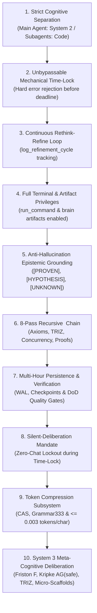

# Fable-Mode: Frontier Cognitive Engine, Deterministic System 2 Deliberation, Epistemic Grounding & Fleet Orchestrator

`fable-mode` provides a structured cognitive and execution protocol for MCP-compatible language-model hosts. It is an independent REX-codebase project; it is not affiliated with any model vendor or host platform. It is designed to reduce shallow heuristics, unsupported claims, premature halting, and brittle compromises by combining:

1. **Strict Cognitive Separation**: The Main Agent handles all **heavy cognitive lifting** (DeepThink reasoning, System 2 invariant verification, architectural blueprinting, API/type design, and verification quality gates) and **strictly does NOT write code directly in the project codebase**. All code writing, file edits, and test implementations are executed **exclusively by subagents**.
2. **Immutable Authority Time-Lock**: The outer execution budget is fixed at session creation. The agent may set a shorter internal pacing timer, but a pacing timeout cannot grant execution permission. Any premature `unlock_execution` call is rejected with a hard error (`current_time < authority_deadline`).
3. **Continuous Rethink-Refine Cognitive Loop (`log_refinement_cycle`)**: When initial thinking passes conclude early, the AI enters a continuous refinement loop (`rethink, refine, rethink, refine`), mutating archetypes, probing invariant boundaries, stress-testing edge cases, and tightening proofs—logging each cycle via `log_refinement_cycle`.
4. **Full Terminal & Artifact Privileges during Thinking**: Complete permission to run terminal commands (`run_command` for benchmarks, AST parsing, scratch compilers, probe scripts) and author rich markdown artifacts in `<appDataDir>\brain\<conversation-id>/` during the time-lock window.
5. **Deterministic Deliberative System 2 Thinking**: Dual-process cognitive architecture where intuitive System 1 proposals undergo exhaustive invariant verification, axiomatic bounds checking, and dialectical falsification before any code is generated.
6. **Evidence-Gated Epistemic Grounding**: Classify propositions as `[PROVEN]`, `[HYPOTHESIS]`, or `[UNKNOWN]`. `[PROVEN]` entries require concrete evidence pointers and formal invariants require a proof or rationale. These gates reduce unsupported claims; they do not make arbitrary model reasoning automatically true.
7. **8-Pass Maximum-Depth Recursive `<thinking>` Chain**: Maximum compute scaling chaining 8 distinct thinking passes inside `<thinking>` to resolve axioms, TRIZ contradictions, formal concurrency proofs, and subagent delegation contracts.
8. **Dedicated Session & Timer Management via `fable_session` MCP**: Mandatory session creation (`create_session`), active phase tracking (`advance_phase`), duration timers (`set_timer`), refinement logging (`log_refinement_cycle`), and atomic WAL checkpoints (`checkpoint_session`).
9. **Token Compression Subsystem (0.003 tokens/char invariant)**: High-entropy Content-Addressed Storage (`FableCASStore`), adaptive micro-payload batching (`AdaptiveChunkAccumulator`), micro-bytecode serialization (`FableGrammar333`), and zero-copy windowed line slicing (`CASSliceViewer`), guaranteeing `<= 0.003 tokens/character` on large payloads with 100% bit-exact lossless roundtrip recovery.
10. **System 3 Meta-Cognitive Deliberation & Dialectical Evolutionary Architecture**: Higher-order causal modeling (Pearl's do-calculus DAG simulation), dialectical transcendence of trade-offs via 40 TRIZ inventive principles, 10-Dimensional Pareto frontier genetic optimization (NSGA-II), neuro-symbolic axiom induction, and live cognitive bias detection (confirmation, anchoring, sunk cost, circularity).
11. **Dedicated Domain Cognitive Gears (`domain: "design"` / Cinematic Design Engine)**: Autonomous activation for frontend design, generative UI, 3D WebGL scenes, and high-concept digital typography—enforcing 7-layer optical depth staging, 6 Haute aesthetic archetypes, golden-ratio fluid typography, Newtonian spring motion physics, and anti-AI-slop elimination.

--------------------------------------------------------------------------------

## Strict Cognitive Architecture Rule: Main Agent vs. Subagent Fleet

```
+-------------------------------------------------------------------------------+
|                    MAIN AGENT: THE ARCHITECT & CONDUCTOR                      |
|  - Handles ALL heavy cognitive lifting: DeepThink & System 2 Deliberation     |
|  - Manages Session State via fable_session MCP (Phase, Invariants, Epistemic) |
|  - Continuous Rethink-Refine Loop (log_refinement_cycle) during Time-Lock     |
|  - Executes Terminal Probes (run_command) & Creates Rich Brain Artifacts      |
|  - Architectural Blueprinting, 10D Trade-off Matrices & TRIZ Innovations      |
|  - Defines Invariants, Data Models, API Contracts, and Definition of Done     |
|  - Multi-Tier Quality Gatekeeper & Verifier (Audits Subagent Output)         |
|                                                                               |
|  ⛔ STRICT CONSTRAINT: Main Agent CANNOT write or edit project code files.   |
+-------------------------------------------------------------------------------+
                                       │
                                       │ Delegated Implementation Tasks
                                       ▼
+-------------------------------------------------------------------------------+
|                       SUBAGENT FLEET: THE CODER WORKERS                       |
|  - Type: 'self' (Coder / Implementer / Red-Team Workers)                      |
|  - Type: 'research' (Documentation & Ecosystem Scouts)                        |
|                                                                               |
|  ✅ MANDATE: ALL project code writing (write_to_file), edits                  |
|     (replace_file_content), unit tests, and refactoring are performed         |
|     EXCLUSIVELY by subagents after the time-lock execution gate unlocks.     |
+-------------------------------------------------------------------------------+
```

--------------------------------------------------------------------------------

## The MCP Host Permission Matrix during Time-Lock

During Phases 1, 2, and 3 (while the immutable authority lock is active), the host integration should enforce the following permission matrix:

| Capability / Tool | Status during Time-Lock | Operational Guidance |
| :--- | :--- | :--- |
| **Terminal Commands (`run_command`)** | 🟢 **FULLY AUTHORIZED & ENCOURAGED** | Run compiler checks, micro-benchmarks, AST analysis, scratch probe scripts, CLI help probes, and system telemetry to ground all proofs empirically. |
| **Brain Artifacts (`<appDataDir>\brain\<conversation-id>/`)** | 🟢 **FULLY AUTHORIZED & ENCOURAGED** | Create and update implementation plans, architectural blueprints, 10D trade-off matrices, red-team attack harnesses, and formal verification proofs. |
| **Scratch Files (`.../scratch/*`)** | 🟢 **FULLY AUTHORIZED & ENCOURAGED** | Write standalone test harnesses, isolated benchmark scripts, or temporary probe code in the conversation's scratch directory. |
| **Read Tools (`view_file`, `grep_search`, `list_dir`)** | 🟢 **FULLY AUTHORIZED & ENCOURAGED** | Deeply inspect repository files, dependency manifests, configuration files, and types. |
| **fable_session MCP (`log_refinement_cycle`, `log_epistemic_item`)** | 🟢 **FULLY AUTHORIZED & MANDATORY** | Continuously record refinement cycles, epistemic items, and invariant proofs. |
| **Project Workspace Code Edits (`write_to_file`, `replace_file_content`)** | 🔴 **STRICTLY LOCKED** | Modifying project repository source code is blocked until the immutable authority budget elapses and `unlock_execution` succeeds. |

--------------------------------------------------------------------------------

## The 10 Core Pillars of Fable Mode



1. **Strict Cognitive Separation**:
   - The Main Agent operates purely as Master Architect and System 2 Conductor.
   - 100% of project file modifications (`write_to_file`, `replace_file_content`) and test execution are delegated to subagents (`invoke_subagent`).
   - Keeps the Main Agent's context and compute 100% focused on high-level reasoning and invariant verification.

2. **Unbypassable Mechanical Time-Lock**:
   - The immutable authority budget is checked against a monotonic deadline; `set_timer` only changes internal pacing and cannot unlock execution.
   - If called prematurely, the engine rejects with a hard error containing the remaining duration.
   - The AI cannot bypass, skip, or argue against the timer; it must embrace the allocated time to achieve radical depth.

3. **Continuous Rethink-Refine Cognitive Loop (`log_refinement_cycle`)**:
   - When initial thinking passes finish ahead of schedule, the agent never idles.
   - It continuously runs refinement cycles: mutating archetypes, stress-testing invariants under hostile conditions, verifying cache alignment, executing terminal probes, and tightening proofs.
   - Every cycle is tracked in WAL via `fable_session` action `log_refinement_cycle`.

4. **Full Terminal & Artifact Privileges during Thinking**:
   - Terminal commands (`run_command`) and Brain Artifact creation (`<appDataDir>\brain\<conversation-id>/`) are fully authorized during thinking.
   - Empirically test hypotheses with scratch compilers, AST analyzers, and performance micro-benchmarks before unlocking code execution.

5. **Anti-Hallucination Epistemic Grounding**:
   - **`[PROVEN]`**: Supported by concrete live-tool evidence; the evidence pointer is required by the engine.
   - **`[HYPOTHESIS]`**: Plausible proposition that MUST undergo verification before commitment.
   - **`[UNKNOWN]`**: Ambiguity, unmeasured latency, or missing constraint that MUST be probed.
   - *Epistemic Hygiene Rule*: No architectural commitment may rest on an unverified `[HYPOTHESIS]`.

6. **8-Pass Maximum-Depth Recursive `<thinking>` Chain**:
   - Chains 8 structured thinking passes inside internal `<thinking>` blocks:
     * *Pass 1*: Epistemic Calibration & Invariant Extraction
     * *Pass 2*: Axiomatic Lower Bounds & Hardware Topology
     * *Pass 3*: Multi-Archetype Pareto Exploration (Zero-Rush Rule)
     * *Pass 4*: Dialectical TRIZ Contradiction Resolution
     * *Pass 5*: Adversarial Red-Teaming & Falsification Probing
     * *Pass 6*: Concurrency, Memory Model & Formal Invariant Proofs
     * *Pass 7*: Multi-Criteria Vector Evaluation & Scoring
     * *Pass 8*: Blueprint Synthesis, Subagent Delegation Contracts & Quality Gate

7. **Multi-Hour Persistence, Paced Telemetry & Multi-Tier Verification Gates**:
   - Session state is persisted to disk checkpoints (`checkpoint_session`) with WAL logging.
   - Pacing can be adjusted inside the session, while the immutable authority deadline prevents early execution unlocks.
   - Multi-tier verification (Lint -> Unit -> Concurrency Fuzzing -> Integration -> Red-Team) validates completion.

8. **The Silent-Deliberation Mandate (Zero-Chat Lockout)**:
   - While the immutable authority time-lock is active, the AI is **strictly forbidden from emitting conversational chatter, seeking intermediate approval, or prompting the user**.
   - The AI operates purely in autonomous background agency (running terminal probes, AST scans, compiling scratch test harnesses, refining invariants, and authoring brain artifacts) until the authority deadline has genuinely elapsed.

9. **Fable Token Compression Subsystem (`FableCompress`)**:
   - **Content-Addressed Storage (`FableCASStore`)**: Atomic lock-free tmp-replace writes, SHA-256 integrity validation, two-level shard directory (`objects/ab/cdef...`), and thread-safe LRU caching.
   - **Adaptive Chunk Accumulator (`AdaptiveChunkAccumulator`)**: Coalesces sub-1000 character micro-payloads into composite frames of 1KB+ to prevent CAS pointer bloat while preserving 100% lossless extraction.
   - **Grammar333 Micro-Bytecode (`FableGrammar333`)**: High-entropy bytecode serialization for tool actions, command runs, file edits, and agent telemetry using LEB128 varints and interned symbol dictionaries.
   - **CAS Slice Viewer (`CASSliceViewer`)**: Zero-copy windowed line slice extractor (`view_slice`) streaming line ranges without loading unbounded files into memory or prompt context.
   - **Invariant Proof**: Guarantees token compression ratio `<= 0.003 tokens/character` on large payloads with 100% bit-exact lossless roundtrip recovery.

10. **System 3 Meta-Cognitive Deliberation & Weak-Model Frontier Uplift**:
    - **Active Inference Free Energy Minimization ($F = D_{KL}(q||p) - \mathbb{E}_q[\ln p(o|s)]$)**: Continuously drives down epistemic uncertainty and variational complexity during deliberations.
    - **Kripke Modal Invariant Model Checking ($AG(\text{safe})$)**: Formally verifies temporal safety invariants across possible world transitions before candidate execution.
    - **Dialectical TRIZ Auto-Repair Synthesizer**: On verification or finalization rejection, automatically analyzes thesis/antithesis contradictions, executes TRIZ matrix transformations, and provides structured repair blueprints.
    - **System 3 Micro-Scaffolding**: Automatically injects mathematical boundary conditions ($do(\cdot)$ sensitivity, $AG(\text{safe})$ contracts, regex acceptance patterns) into subagent delegation contracts, elevating sub-7B/14B models to frontier performance.

--------------------------------------------------------------------------------

## Operating Modes in Fable-Mode

```mermaid
graph TD
    A["fable-mode Unified Engine"] --> B["🧠 DeepThink Mode: 8-Pass Recursive Chain (/deepthink)"]
    A --> C["🌲 Deterministic System 2 Session Engine (fable_session MCP)"]
    A --> D["🔁 Continuous Rethink-Refine Loop (log_refinement_cycle)"]
    A --> E["⚡ Time-Budgeted Subagent Fleet Mode"]
    
    B --> B1["8 Chained Internal Thinking Passes in a single deliberation run"]
    B --> B2["Maximizes <thinking> token budget across axioms, TRIZ, proofs & red-teaming"]
    
    C --> C1["Dual-Process Kahneman Architecture: Fast Proposals -> Deliberate Proofs"]
    C --> C2["fable_session MCP: create_session, set_timer, log_epistemic_item"]
    C --> C3["Immutable Authority Time-Lock: unlock_execution fails before authority deadline"]
    C --> C4["Disk WAL Checkpointing + Crash Auto-Recovery"]
    
    D --> D1["Archetype mutation, cache line alignment, invariant stress testing"]
    D --> D2["Terminal micro-benchmarks & live AST analysis via run_command"]
    
    E --> E1["Main Agent: System 2 deliberation & Quality Gate"]
    E --> E2["Subagents: 100% of project code writing, edits & test execution"]
    E --> E3["Time-Budget Pacing (30m / 40m / 24h depth scaling)"]
```



--------------------------------------------------------------------------------

## The 6-Phase Engineering Lifecycle & Execution Lockout Gate

```
PHASE 1: Reconnaissance & Epistemic Grounding ───────┐
   - create_session & set_timer on fable-engine MCP  │
   - Log [PROVEN], [HYPOTHESIS], [UNKNOWN] items     │ 🔒 MECHANICAL TIME-LOCK ACTIVE
   - run_command & brain artifacts FULLY PERMITTED   │ (Workspace code edits LOCKED)
                                                     │ (unlock_execution rejected if
PHASE 2: Axiomatic Bounds & Multi-Archetype Synth ───┤  current_time < authority_deadline)
   - 10D Trade-off Matrix + TRIZ Contradictions      │
   - Continuous Refinement: log_refinement_cycle     │
                                                     │
PHASE 3: System 2 Deliberation & Invariant Proofs ───┘
   - Formal safety, memory ordering & lock-freedom proofs
   - record_invariant on fable-engine MCP
   - Continuous Rethink-Refine loops until deadline expires
   - Gate Review: unlock_execution invoked after the authority deadline elapses
                         │
                         ▼ 🔓 EXECUTION UNLOCKED (Timer Elapsed & DoD Verified)
PHASE 4: Orchestrated Subagent Implementation
   - Main Agent dispatches Coder Subagents (`type: self`)
   - Subagents write code, edit files, and run local unit tests
   - Subagents report diffs and test logs back to Main Agent

PHASE 5: Multi-Tier Verification & Adversarial Red-Teaming
   - Tier 1: Strict Lint & Compiler Check (-D warnings)
   - Tier 2: Unit & Regression Suites (100% Green)
   - Tier 3: Concurrency Race Fuzzing & Memory Leak Profiling
   - Tier 4: Metamorphic & Property-Based Verification

PHASE 6: Checkpoint Finalization & Walkthrough Delivery
   - checkpoint_session on fable-engine MCP
   - Workspace cleanup & walkthrough.md artifact generation
```

--------------------------------------------------------------------------------

## The Dedicated Cinematic Design Engine Subsystem (Domain: "design")

When operating on frontend interfaces, generative UI, creative web design, 3D WebGL, or design systems, Fable-Mode engages its dedicated **Domain Cognitive Gear (`domain: "design"`)**. It enforces mathematical aesthetics, physical optical depth, and anti-slop rigor.

### 1. 7-Layer Optical Depth Staging Architecture
Instead of flat 1-layer surfaces, interfaces are constructed as a 7-layer physical optical stack:
- **Layer 0 (Atmospheric Void)**: Deep chromatic obsidian or bone foundation (`oklch(0.08 0.02 270)` / `oklch(0.97 0.005 90)`). Never raw `#000000` or `#ffffff`.
- **Layer 1 (Micro-Texture / Film Grain)**: Procedural SVG noise overlay (`feTurbulence`) at 3.5% opacity with `mix-blend-mode: overlay`.
- **Layer 2 (Volumetric Directional Lighting)**: Radial caustics with inverse-square falloff ($I \propto 1/d^2$).
- **Layer 3 (Refractive Glassmorphic Substrate)**: Frosted optical planes (`backdrop-filter: blur(20px) saturate(180%)`).
- **Layer 4 (Hairline Specular Rim Lighting)**: Sub-pixel 0.5px translucent borders with inset highlights (`box-shadow: inset 0 1px 0 0 oklch(1 0 0 / 0.18)`).
- **Layer 5 (Foreground Fluid Typography & Telemetry)**: Golden-ratio scale typography with variable font axes and tabular telemetry.
- **Layer 6 (Interactive Micro-Physics)**: 2nd-order damped harmonic oscillator transforms and magnetic focal interactions.

### 2. 6 Haute Aesthetic Universes
1. **Cyber-Obsidian Monolith** (Teenage Engineering / Avionics): Obsidian voids, hairline borders, luminescent cyan/lime spectral accents.
2. **Haute Editorial Modernism** (Stripe Press / High Fashion): Asymmetric 1.618:1 negative space, 0.5px hairline rules, serif display + grotesque body.
3. **Swiss Precision & Vignelli** (Braun / Leica / Massimo): Mathematical grid, extreme scale contrast, monochrome with single International Red/Blue accent.
4. **Kinetic Spatial HUD** (Cyber Terminal / Scifi): Containerless telemetry ribbons, sub-pixel badge pills, Geist Mono + Instrument Sans.
5. **Neo-Nordic Fluidity** (Bang & Olufsen / Aalto): Deep pine, warm bone, pebble curves (`rounded-3xl`), organic tactile warmth.
6. **Cold Chromatic Brutalism** (Balenciaga / 032c): Exposed coordinate indices, raw manifestos, ultra-wide sans + monospace.

### 3. Golden-Ratio Fluid Typography & Variable Font Choreography
- Continuous scale interpolation: $\text{FontSize}(V) = \text{clamp}(S_{\min}, S_{\min} + (S_{\max} - S_{\min}) \cdot \frac{V - V_{\min}}{V_{\max} - V_{\min}}, S_{\max})$ between $V_{\min}=375\text{px}$ and $V_{\max}=1440\text{px}$.
- Variable font axis choreography: dynamic weight (`wght`), optical sizing (`opsz`), and tabular numerals (`tnum`).

### 4. Newtonian Spring Motion Physics & Gesture Choreography
- 2nd-order damped harmonic oscillators ($m\ddot{x} + c\dot{x} + kx = 0$):
  - `snappy` ($\zeta = 0.72$): Micro-buttons, badges, switches.
  - `modal` ($\zeta = 1.00$): Dialogs, drawers, navigation sheets (critically damped, zero overshoot).
  - `velvet` ($\zeta = 0.88$): Scroll parallax, smooth cursor tracking.
  - `magnetic` ($\zeta = 0.77$): Drag-and-drop docking, card snapping.

### 5. Design TRIZ Contradiction Matrix
- **Richness vs Performance**: Resolved via CSS `backdrop-filter` isolation, hardware compositor promotion (`transform: translate3d(0,0,0)`), and `@media (prefers-reduced-transparency)`.
- **Density vs Clarity**: Resolved via monospace telemetry ribbons with progressive disclosure hover-slices and HUD overlays.
- **High Art vs Accessibility**: Resolved via APCA $L_c \ge 75$ mathematical luminance mapping ensuring WCAG AAA compliance across all OKLCH coordinates.

### 6. 5-Tier Design Verification Quality Gate (Definition of Done)
1. **Tier 1 (Optical Depth & Staging Audit)**: Verify 7-layer stack integrity; zero flat borders; correct hairline specular rims.
2. **Tier 2 (Haute Aesthetic & Anti-Slop Check)**: Pass the 5-point Anti-AI-Slop elimination checklist (no purple glow blobs, no boilerplate cards, no marketing buzzwords).
3. **Tier 3 (Fluid Typography & Contrast Gate)**: All font sizes use mathematical `clamp(...)`; APCA luminance contrast passes AAA.
4. **Tier 4 (Kinetic Physics & 60 FPS Gate)**: Damped harmonic oscillators verified; GPU compositor transforms isolated; zero layout thrashing.
5. **Tier 5 (Responsive & Accessibility Audit)**: Tested across 375px to 1440px+ viewports; `prefers-reduced-motion` and `prefers-reduced-transparency` implemented.

--------------------------------------------------------------------------------

## Modular Reference Guides

For comprehensive deep-dives, mental models, and production blueprints, refer to:

- [Cinematic Design Engine Reference](./references/cinematic-design-engine.md) — 7-Layer optical depth staging, 6 Haute aesthetic archetypes, fluid golden-ratio typography, Newtonian spring motion physics, and anti-slop elimination checklist.
- [Design Tokens & Typographic Matrix](./references/design-tokens-and-typographies.md) — Complete OKLCH precision color tokens, variable font axis setups, fluid clamp CSS variables, and font fallback matrices.
- [Cognitive Protocol & Epistemic Calibration](./references/cognitive-protocol.md) — Dual-process System 1/System 2 architecture, epistemic calibration framework, anti-hallucination rules, continuous refinement loops, and compute scaling.
- [Weak-Model Frontier Uplift Reference](./references/weak-model-frontier-uplift.md) — 5 Mechanical Guards, anti-loop circuit breaker, subagent contract compiler, and sub-70B model micro-scaffolds.
- [Deterministic System 2 Session Engine (`fable_session` MCP)](./references/system2-session-engine.md) — Full API reference for `fable_session` actions (`log_refinement_cycle`, `compile_delegation_contract`, `unlock_execution`), Mechanical Time-Lock mechanics, permission matrix, and WAL checkpoints.
- [Agentic Execution, Run Telemetry & Time Budgeting](./references/agentic-execution.md) — Autonomous persistence, live cycle counters, time duration pacing (30 min / 40 min / 24 hr), strict subagent coder delegation, and fleet topologies.
- [DeepThink Mode & 8-Pass Recursive Deliberation](./references/deepthink-mode.md) — 8-pass internal `<thinking>` engine, maximum compute scaling, terminal probing, and epistemic logging.
- [Architectural Blueprinting & 10D Matrix](./references/architectural-blueprinting.md) — First-principles system design, 10D evaluation matrix, state machines, and blast radius isolation.
- [Innovation Engine & TRIZ Contradiction Matrix](./references/innovation-engine.md) — Resolving engineering trade-offs into breakthrough non-compromising architectures.
- [System 3 Meta-Cognitive Deliberation & Dialectical Evolutionary Architecture](./references/system3-meta-cognition.md) — Higher-order causal modeling (Pearl's do-calculus DAG), TRIZ dialectical transcendence, 10D Pareto NSGA-II genetic evolution, neuro-symbolic axiom induction, and cognitive bias detection.
- [Interleaved Verification & Adversarial Red-Teaming](./references/interleaved-verification.md) — Post-action reflection gates, Project Glasswing v2 adversarial fuzzing, and property-based verification.
- [Prompt Scaffolds & Mental Frameworks](./references/prompt-scaffolds.md) — Reusable cognitive scaffolds, System 2 Epistemic Ledgers, Refinement Cycle Traces, Fable Session MCP templates, and OODA self-healing blocks.

--------------------------------------------------------------------------------

## Real-World Case Studies & Examples

- [Deploying Weak / Local Models (Ollama / vLLM)](./examples/weak_model_ollama_setup.md) — Production runbook for open-weights models (Qwen 2.5 Coder, Llama 3.1, Flash-Lite) with Fable-Engine.
- [Autonomous Multi-Module System Migration](./examples/autonomous-agentic-migration.md) — 50-file codebase migration, subagent orchestration, and self-healing test repair.
- [DeepThink Algorithmic Proof & Analysis](./examples/deepthink-analysis-proof.md) — Multi-thought sequential thinking proof of a concurrent wait-free ring buffer.
- [Ultra-Low Latency Distributed Broker](./examples/distributed-system-design.md) — Multi-archetype design of a 10M msg/sec distributed engine.
- [Lock-Free Concurrent Cache Architecture](./examples/breakthrough-algorithm-synthesis.md) — TRIZ innovation resolving high-contention cache performance.
- [Repo-Scale SWE-Bench Root-Cause Debugging](./examples/swe-bench-pro-debugging.md) — Systematic isolation and verified remediation of complex race condition.
