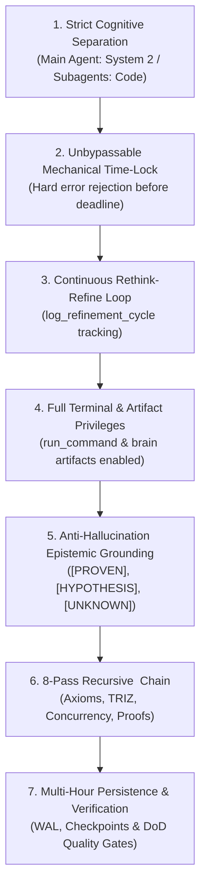

# Fable-Mode: Frontier Cognitive Engine, Deterministic System 2 Deliberation, Epistemic Grounding & Fleet Orchestrator

`fable-mode` provides a structured cognitive and execution protocol for MCP-compatible language-model hosts. It is an independent REX-codebase project; it is not affiliated with any model vendor or host platform. It is designed to reduce shallow heuristics, unsupported claims, premature halting, and brittle compromises by combining:

1. **Strict Cognitive Separation**: The Main Agent handles all **heavy cognitive lifting** (DeepThink reasoning, System 2 invariant verification, architectural blueprinting, API/type design, and verification quality gates) and **strictly does NOT write code directly in the project codebase**. All code writing, file edits, and test implementations are executed **exclusively by subagents**.
2. **Immutable Authority Time-Lock**: The outer execution budget is fixed at session creation. The agent may set a shorter internal pacing timer, but a pacing timeout cannot grant execution permission. Any premature `unlock_execution` call is rejected with a hard error (`current_time < authority_deadline`).
3. **Continuous Rethink-Refine Cognitive Loop (`log_refinement_cycle`)**: When initial thinking passes conclude early, the AI enters a continuous refinement loop (`rethink, refine, rethink, refine`), mutating archetypes, probing invariant boundaries, stress-testing edge cases, and tightening proofs—logging each cycle via `log_refinement_cycle`.
4. **Full Terminal & Artifact Privileges during Thinking**: Complete permission to run terminal commands (`run_command` for benchmarks, AST parsing, scratch compilers, probe scripts) and author rich markdown artifacts in `<appDataDir>\brain\<conversation-id>/` during the time-lock window.
5. **Deterministic Deliberative System 2 Thinking**: Dual-process cognitive architecture where intuitive System 1 proposals undergo exhaustive invariant verification, axiomatic bounds checking, and dialectical falsification before any code is generated.
6. **Evidence-Gated Epistemic Grounding**: Classify propositions as `[PROVEN]`, `[HYPOTHESIS]`, or `[UNKNOWN]`. `[PROVEN]` entries require concrete evidence pointers and formal invariants require a proof or rationale. These gates reduce unsupported claims; they do not make arbitrary model reasoning automatically true.
7. **8-Pass Maximum-Depth Recursive `<thinking>` Chain**: Maximum compute scaling chaining 8 distinct thinking passes inside `<thinking>` to resolve axioms, TRIZ contradictions, formal concurrency proofs, and subagent delegation contracts.
8. **Dedicated Session & Timer Management via `fable_session` MCP**: Mandatory session creation (`create_session`), active phase tracking (`advance_phase`), duration timers (`set_timer`), refinement logging (`log_refinement_cycle`), and atomic WAL checkpoints (`checkpoint_session`).

--------------------------------------------------------------------------------

## Strict Cognitive Architecture Rule: Main Agent vs. Subagent Fleet

```
+-------------------------------------------------------------------------------+
|                    MAIN AGENT: THE ARCHITECT & CONDUCTOR                      |
|  - Handles ALL heavy cognitive lifting: DeepThink & System 2 Deliberation     |
|  - Manages Session State via fable_session MCP (Phase, Invariants, Epistemic) |
|  - Continuous Rethink-Refine Loop (log_refinement_cycle) during Time-Lock     |
|  - Executes Terminal Probes (run_command) & Creates Rich Brain Artifacts      |
|  - Architectural Blueprinting, 10D Trade-off Matrices & TRIZ Innovations      |
|  - Defines Invariants, Data Models, API Contracts, and Definition of Done     |
|  - Multi-Tier Quality Gatekeeper & Verifier (Audits Subagent Output)         |
|                                                                               |
|  ⛔ STRICT CONSTRAINT: Main Agent CANNOT write or edit project code files.   |
+-------------------------------------------------------------------------------+
                                       │
                                       │ Delegated Implementation Tasks
                                       ▼
+-------------------------------------------------------------------------------+
|                       SUBAGENT FLEET: THE CODER WORKERS                       |
|  - Type: 'self' (Coder / Implementer / Red-Team Workers)                      |
|  - Type: 'research' (Documentation & Ecosystem Scouts)                        |
|                                                                               |
|  ✅ MANDATE: ALL project code writing (write_to_file), edits                  |
|     (replace_file_content), unit tests, and refactoring are performed         |
|     EXCLUSIVELY by subagents after the time-lock execution gate unlocks.     |
+-------------------------------------------------------------------------------+
```

--------------------------------------------------------------------------------

## The MCP Host Permission Matrix during Time-Lock

During Phases 1, 2, and 3 (while the immutable authority lock is active), the host integration should enforce the following permission matrix:

| Capability / Tool | Status during Time-Lock | Operational Guidance |
| :--- | :--- | :--- |
| **Terminal Commands (`run_command`)** | 🟢 **FULLY AUTHORIZED & ENCOURAGED** | Run compiler checks, micro-benchmarks, AST analysis, scratch probe scripts, CLI help probes, and system telemetry to ground all proofs empirically. |
| **Brain Artifacts (`<appDataDir>\brain\<conversation-id>/`)** | 🟢 **FULLY AUTHORIZED & ENCOURAGED** | Create and update implementation plans, architectural blueprints, 10D trade-off matrices, red-team attack harnesses, and formal verification proofs. |
| **Scratch Files (`.../scratch/*`)** | 🟢 **FULLY AUTHORIZED & ENCOURAGED** | Write standalone test harnesses, isolated benchmark scripts, or temporary probe code in the conversation's scratch directory. |
| **Read Tools (`view_file`, `grep_search`, `list_dir`)** | 🟢 **FULLY AUTHORIZED & ENCOURAGED** | Deeply inspect repository files, dependency manifests, configuration files, and types. |
| **fable_session MCP (`log_refinement_cycle`, `log_epistemic_item`)** | 🟢 **FULLY AUTHORIZED & MANDATORY** | Continuously record refinement cycles, epistemic items, and invariant proofs. |
| **Project Workspace Code Edits (`write_to_file`, `replace_file_content`)** | 🔴 **STRICTLY LOCKED** | Modifying project repository source code is blocked until the immutable authority budget elapses and `unlock_execution` succeeds. |

--------------------------------------------------------------------------------

## The 7 Core Pillars of Fable System 2



1. **Strict Cognitive Separation**:
   - The Main Agent operates purely as Master Architect and System 2 Conductor.
   - 100% of project file modifications (`write_to_file`, `replace_file_content`) and test execution are delegated to subagents (`invoke_subagent`).
   - Keeps the Main Agent's context and compute 100% focused on high-level reasoning and invariant verification.

2. **Unbypassable Mechanical Time-Lock**:
   - The immutable authority budget is checked against a monotonic deadline; `set_timer` only changes internal pacing and cannot unlock execution.
   - If called prematurely, the engine rejects with a hard error containing the remaining duration.
   - The AI cannot bypass, skip, or argue against the timer; it must embrace the allocated time to achieve radical depth.

3. **Continuous Rethink-Refine Cognitive Loop (`log_refinement_cycle`)**:
   - When initial thinking passes finish ahead of schedule, the agent never idles.
   - It continuously runs refinement cycles: mutating archetypes, stress-testing invariants under hostile conditions, verifying cache alignment, executing terminal probes, and tightening proofs.
   - Every cycle is tracked in WAL via `fable_session` action `log_refinement_cycle`.

4. **Full Terminal & Artifact Privileges during Thinking**:
   - Terminal commands (`run_command`) and Brain Artifact creation (`<appDataDir>\brain\<conversation-id>/`) are fully authorized during thinking.
   - Empirically test hypotheses with scratch compilers, AST analyzers, and performance micro-benchmarks before unlocking code execution.

5. **Anti-Hallucination Epistemic Grounding**:
   - **`[PROVEN]`**: Supported by concrete live-tool evidence; the evidence pointer is required by the engine.
   - **`[HYPOTHESIS]`**: Plausible proposition that MUST undergo verification before commitment.
   - **`[UNKNOWN]`**: Ambiguity, unmeasured latency, or missing constraint that MUST be probed.
   - *Epistemic Hygiene Rule*: No architectural commitment may rest on an unverified `[HYPOTHESIS]`.

6. **8-Pass Maximum-Depth Recursive `<thinking>` Chain**:
   - Chains 8 structured thinking passes inside internal `<thinking>` blocks:
     * *Pass 1*: Epistemic Calibration & Invariant Extraction
     * *Pass 2*: Axiomatic Lower Bounds & Hardware Topology
     * *Pass 3*: Multi-Archetype Pareto Exploration (Zero-Rush Rule)
     * *Pass 4*: Dialectical TRIZ Contradiction Resolution
     * *Pass 5*: Adversarial Red-Teaming & Falsification Probing
     * *Pass 6*: Concurrency, Memory Model & Formal Invariant Proofs
     * *Pass 7*: Multi-Criteria Vector Evaluation & Scoring
     * *Pass 8*: Blueprint Synthesis, Subagent Delegation Contracts & Quality Gate

7. **Multi-Hour Persistence, Paced Telemetry & Multi-Tier Verification Gates**:
   - Session state is persisted to disk checkpoints (`checkpoint_session`) with WAL logging.
   - Pacing can be adjusted inside the session, while the immutable authority deadline prevents early execution unlocks.
   - Multi-tier verification (Lint -> Unit -> Concurrency Fuzzing -> Integration -> Red-Team) validates completion.

--------------------------------------------------------------------------------

## Operating Modes in Fable-Mode

```mermaid
graph TD
    A["fable-mode Unified Engine"] --> B["🧠 DeepThink Mode: 8-Pass Recursive Chain (/deepthink)"]
    A --> C["🌲 Deterministic System 2 Session Engine (fable_session MCP)"]
    A --> D["🔁 Continuous Rethink-Refine Loop (log_refinement_cycle)"]
    A --> E["⚡ Time-Budgeted Subagent Fleet Mode"]
    
    B --> B1["8 Chained Internal Thinking Passes in a single deliberation run"]
    B --> B2["Maximizes <thinking> token budget across axioms, TRIZ, proofs & red-teaming"]
    
    C --> C1["Dual-Process Kahneman Architecture: Fast Proposals -> Deliberate Proofs"]
    C --> C2["fable_session MCP: create_session, set_timer, log_epistemic_item"]
    C --> C3["Immutable Authority Time-Lock: unlock_execution fails before authority deadline"]
    C --> C4["Disk WAL Checkpointing + Crash Auto-Recovery"]
    
    D --> D1["Archetype mutation, cache line alignment, invariant stress testing"]
    D --> D2["Terminal micro-benchmarks & live AST analysis via run_command"]
    
    E --> E1["Main Agent: System 2 deliberation & Quality Gate"]
    E --> E2["Subagents: 100% of project code writing, edits & test execution"]
    E --> E3["Time-Budget Pacing (30m / 40m / 24h depth scaling)"]
```



--------------------------------------------------------------------------------

## The 6-Phase Engineering Lifecycle & Execution Lockout Gate

```
PHASE 1: Reconnaissance & Epistemic Grounding ───────┐
   - create_session & set_timer on fable-engine MCP  │
   - Log [PROVEN], [HYPOTHESIS], [UNKNOWN] items     │ 🔒 MECHANICAL TIME-LOCK ACTIVE
   - run_command & brain artifacts FULLY PERMITTED   │ (Workspace code edits LOCKED)
                                                     │ (unlock_execution rejected if
PHASE 2: Axiomatic Bounds & Multi-Archetype Synth ───┤  current_time < authority_deadline)
   - 10D Trade-off Matrix + TRIZ Contradictions      │
   - Continuous Refinement: log_refinement_cycle     │
                                                     │
PHASE 3: System 2 Deliberation & Invariant Proofs ───┘
   - Formal safety, memory ordering & lock-freedom proofs
   - record_invariant on fable-engine MCP
   - Continuous Rethink-Refine loops until deadline expires
   - Gate Review: unlock_execution invoked after the authority deadline elapses
                         │
                         ▼ 🔓 EXECUTION UNLOCKED (Timer Elapsed & DoD Verified)
PHASE 4: Orchestrated Subagent Implementation
   - Main Agent dispatches Coder Subagents (`type: self`)
   - Subagents write code, edit files, and run local unit tests
   - Subagents report diffs and test logs back to Main Agent

PHASE 5: Multi-Tier Verification & Adversarial Red-Teaming
   - Tier 1: Strict Lint & Compiler Check (-D warnings)
   - Tier 2: Unit & Regression Suites (100% Green)
   - Tier 3: Concurrency Race Fuzzing & Memory Leak Profiling
   - Tier 4: Metamorphic & Property-Based Verification

PHASE 6: Checkpoint Finalization & Walkthrough Delivery
   - checkpoint_session on fable-engine MCP
   - Workspace cleanup & walkthrough.md artifact generation
```

--------------------------------------------------------------------------------

## Modular Reference Guides

For comprehensive deep-dives, mental models, and production blueprints, refer to:

- [Cognitive Protocol & Epistemic Calibration](./references/cognitive-protocol.md) — Dual-process System 1/System 2 architecture, epistemic calibration framework, anti-hallucination rules, continuous refinement loops, and compute scaling.
- [Deterministic System 2 Session Engine (`fable_session` MCP)](./references/system2-session-engine.md) — Full API reference for `fable_session` actions (`log_refinement_cycle`, `unlock_execution`), Mechanical Time-Lock mechanics, permission matrix, and WAL checkpoints.
- [Agentic Execution, Run Telemetry & Time Budgeting](./references/agentic-execution.md) — Autonomous persistence, live cycle counters, time duration pacing (30 min / 40 min / 24 hr), strict subagent coder delegation, and fleet topologies.
- [DeepThink Mode & 8-Pass Recursive Deliberation](./references/deepthink-mode.md) — 8-pass internal `<thinking>` engine, maximum compute scaling, terminal probing, and epistemic logging.
- [Architectural Blueprinting & 10D Matrix](./references/architectural-blueprinting.md) — First-principles system design, 10D evaluation matrix, state machines, and blast radius isolation.
- [Innovation Engine & TRIZ Contradiction Matrix](./references/innovation-engine.md) — Resolving engineering trade-offs into breakthrough non-compromising architectures.
- [Interleaved Verification & Adversarial Red-Teaming](./references/interleaved-verification.md) — Post-action reflection gates, Project Glasswing v2 adversarial fuzzing, and property-based verification.
- [Prompt Scaffolds & Mental Frameworks](./references/prompt-scaffolds.md) — Reusable cognitive scaffolds, System 2 Epistemic Ledgers, Refinement Cycle Traces, Fable Session MCP templates, and OODA self-healing blocks.

--------------------------------------------------------------------------------

## Real-World Case Studies & Examples

- [Autonomous Multi-Module System Migration](./examples/autonomous-agentic-migration.md) — 50-file codebase migration, subagent orchestration, and self-healing test repair.
- [DeepThink Algorithmic Proof & Analysis](./examples/deepthink-analysis-proof.md) — Multi-thought sequential thinking proof of a concurrent wait-free ring buffer.
- [Ultra-Low Latency Distributed Broker](./examples/distributed-system-design.md) — Multi-archetype design of a 10M msg/sec distributed engine.
- [Lock-Free Concurrent Cache Architecture](./examples/breakthrough-algorithm-synthesis.md) — TRIZ innovation resolving high-contention cache performance.
- [Repo-Scale SWE-Bench Root-Cause Debugging](./examples/swe-bench-pro-debugging.md) — Systematic isolation and verified remediation of complex race condition.


