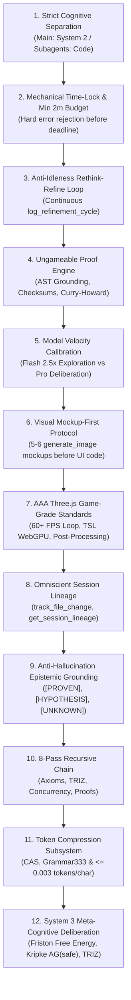

# Fable-Mode: Frontier Cognitive Engine, Deterministic System 2 Deliberation, Epistemic Grounding & Fleet Orchestrator

`fable-mode` provides a structured cognitive and execution protocol for MCP-compatible language-model hosts. It is an independent REX-codebase project; it is not affiliated with any model vendor or host platform. It is designed to eliminate shallow heuristics, unsupported claims, premature halting, and brittle compromises by combining:

1. **Strict Cognitive Separation**: The Main Agent handles all **heavy cognitive lifting** (DeepThink reasoning, System 2 invariant verification, architectural blueprinting, API/type design, and verification quality gates) and **strictly does NOT write code directly in the project codebase**. All code writing, file edits, and test implementations are executed **exclusively by subagents**.
2. **Immutable Authority Time-Lock & Minimum 2-Minute Budget**: The outer execution budget is fixed at session creation with a non-negotiable minimum 2-minute time-lock. A pacing timeout cannot grant execution permission. Any premature `unlock_execution` call is rejected with a hard mathematical error (`current_time < authority_deadline`).
3. **Anti-Idleness & Continuous Rethink-Refine Loop (`log_refinement_cycle`)**: When initial thinking passes conclude early, the AI is strictly forbidden from idling. It enters a continuous refinement loop (`rethink, refine, rethink, refine`), mutating archetypes, probing invariant boundaries, stress-testing edge cases, and tightening proofs—logging each cycle via `log_refinement_cycle`.
4. **Ungameable Deterministic Proof Engine**: Binary verification through AST symbol grounding, SHA-256 file checksum chains, cryptographically bound `ToolReceipt` execution validation, anti-tautology semantic filters ($P \not\implies P$), and Curry-Howard / Kripke modal model checking ($AG(\text{safe})$).
5. **Model Velocity Calibration**: Dynamically adapts cognitive pacing to model profiles—leveraging **Flash models' 2.5x exploration throughput** for high-density multi-archetype synthesis, scratch benchmarks, and visual mockup iterations, while harnessing Pro models for deep constructive proof derivations.
6. **Visual Mockup-First Protocol ("Visualize Before You Build")**: For all UI, web, 3D, and frontend tasks, mandatorily generates **5–6 distinct visual concept mockups** across Haute aesthetic universes using `generate_image` and logs them before emitting code.
7. **AAA Three.js / WebGPU Game-Grade Standards**: Locked 60–120+ FPS deterministic game loops (fixed physics accumulator with $\alpha$ interpolation), Three Shading Language (TSL) node shaders, HDR post-processing, 100,000+ GPU instanced particles, 3D spatial audio, and zero-leak memory lifecycle management.
8. **Omniscient Session Lineage & Working Memory**: Real-time tracking of file deltas (`track_file_change`), historical session graph trees (`get_session_lineage`), structured plan introspection (`inspect_plan`), verified proof sealing (`verify_proof`), and visual mockup registries (`record_visual_mockups`).
9. **Full Terminal & Artifact Privileges during Thinking**: Complete authorization to run powershell terminal commands (`run_command` for benchmarks, AST parsing, scratch compilers, probe scripts) and author rich markdown artifacts in `<appDataDir>\brain\<conversation-id>/` during the time-lock window.
10. **Deterministic Deliberative System 2 Thinking**: Dual-process cognitive architecture where intuitive System 1 proposals undergo exhaustive invariant verification, axiomatic bounds checking, and dialectical falsification before any code is generated.
11. **Evidence-Gated Epistemic Grounding**: Classify propositions as `[PROVEN]`, `[HYPOTHESIS]`, or `[UNKNOWN]`. `[PROVEN]` entries require concrete evidence pointers and formal invariants require a proof or rationale.
12. **8-Pass Maximum-Depth Recursive `<thinking>` Chain**: Maximum compute scaling chaining 8 distinct thinking passes inside `<thinking>` to resolve axioms, TRIZ contradictions, formal concurrency proofs, and subagent delegation contracts.
13. **Token Compression Subsystem (0.003 tokens/char invariant)**: High-entropy Content-Addressed Storage (`FableCASStore`), adaptive micro-payload batching (`AdaptiveChunkAccumulator`), micro-bytecode serialization (`FableGrammar333`), and zero-copy windowed line slicing (`CASSliceViewer`), guaranteeing `<= 0.003 tokens/character` on large payloads with 100% bit-exact lossless roundtrip recovery.
14. **System 3 Meta-Cognitive Deliberation & Dialectical Evolutionary Architecture**: Higher-order causal modeling (Pearl's do-calculus DAG simulation), dialectical transcendence of trade-offs via 40 TRIZ inventive principles, 10-Dimensional Pareto frontier genetic optimization (NSGA-II), neuro-symbolic axiom induction, and live cognitive bias detection (confirmation, anchoring, sunk cost, circularity).
15. **Dedicated Domain Cognitive Gears (`domain: "design"` / Cinematic Design Engine)**: Autonomous activation for frontend design, generative UI, 3D WebGL scenes, and high-concept digital typography—enforcing 7-layer optical depth staging, 6 Haute aesthetic archetypes, golden-ratio fluid typography, Newtonian spring motion physics, and anti-AI-slop elimination.

--------------------------------------------------------------------------------

## Strict Cognitive Architecture Rule: Main Agent vs. Subagent Fleet

```
+-------------------------------------------------------------------------------+
|                    MAIN AGENT: THE ARCHITECT & CONDUCTOR                      |
|  - Handles ALL heavy cognitive lifting: DeepThink & System 2 Deliberation     |
|  - Manages Session State via fable_session MCP (Phase, Invariants, Epistemic) |
|  - Continuous Rethink-Refine Loop (log_refinement_cycle) during Time-Lock     |
|  - Executes Terminal Probes (run_command) & Creates Rich Brain Artifacts      |
|  - Architectural Blueprinting, 10D Trade-off Matrices & TRIZ Innovations      |
|  - Visual Imagination: Mandates 5-6 Concept Mockups via generate_image        |
|  - Formal Invariant Proofs (AST Grounding, Curry-Howard, Kripke AG(safe))     |
|  - Multi-Tier Quality Gatekeeper & Verifier (Audits Subagent Output)         |
|                                                                               |
|  ⛔ STRICT CONSTRAINT: Main Agent CANNOT write or edit project code files.   |
+-------------------------------------------------------------------------------+
                                       │
                                       │ Delegated Implementation Tasks
                                       ▼
+-------------------------------------------------------------------------------+
|                       SUBAGENT FLEET: THE CODER WORKERS                       |
|  - Type: 'self' (Coder / Implementer / Red-Team Workers)                      |
|  - Type: 'research' (Documentation & Ecosystem Scouts)                        |
|                                                                               |
|  ✅ MANDATE: ALL project code writing (write_to_file), edits                  |
|     (replace_file_content), unit tests, and refactoring are performed         |
|     EXCLUSIVELY by subagents after the time-lock execution gate unlocks.     |
+-------------------------------------------------------------------------------+
```

--------------------------------------------------------------------------------

## The MCP Host Permission Matrix during Time-Lock

During Phases 1, 2, and 3 (while the immutable authority lock is active), the host integration enforces the following permission matrix:

| Capability / Tool | Status during Time-Lock | Operational Guidance |
| :--- | :--- | :--- |
| **Terminal Commands (`run_command`)** | 🟢 **FULLY AUTHORIZED & ENCOURAGED** | Run compiler checks, micro-benchmarks, AST analysis, scratch probe scripts, CLI help probes, and system telemetry to ground all proofs empirically. |
| **Brain Artifacts (`<appDataDir>\brain\<conversation-id>/`)** | 🟢 **FULLY AUTHORIZED & ENCOURAGED** | Create and update implementation plans, architectural blueprints, 10D trade-off matrices, red-team attack harnesses, visual mockups, and formal verification proofs. |
| **Scratch Files (`.../scratch/*`)** | 🟢 **FULLY AUTHORIZED & ENCOURAGED** | Write standalone test harnesses, isolated benchmark scripts, or temporary probe code in the conversation's scratch directory. |
| **Read Tools (`view_file`, `grep_search`, `list_dir`)** | 🟢 **FULLY AUTHORIZED & ENCOURAGED** | Deeply inspect repository files, dependency manifests, configuration files, and types. |
| **fable_session MCP (`log_refinement_cycle`, `log_epistemic_item`, `record_invariant`)** | 🟢 **FULLY AUTHORIZED & MANDATORY** | Continuously record refinement cycles, epistemic items, visual mockups, and invariant proofs. |
| **Image Generation (`generate_image`)** | 🟢 **FULLY AUTHORIZED & MANDATORY** | Generate 5–6 visual concept mockups for any UI/web/design task during cognitive phases. |
| **Project Workspace Code Edits (`write_to_file`, `replace_file_content`)** | 🔴 **STRICTLY LOCKED** | Modifying project repository source code is blocked until the immutable authority budget elapses and `unlock_execution` succeeds. |

--------------------------------------------------------------------------------

## The 12 Core Pillars of Fable Mode



1. **Strict Cognitive Separation**:
   - The Main Agent operates purely as Master Architect and System 2 Conductor.
   - 100% of project file modifications (`write_to_file`, `replace_file_content`) and test execution are delegated to subagents (`invoke_subagent`).
   - Keeps the Main Agent's context and compute 100% focused on high-level reasoning and invariant verification.

2. **Unbypassable Mechanical Time-Lock & Minimum 2-Minute Budget**:
   - The immutable authority budget is checked against a monotonic deadline (minimum 2.0 minutes); `set_timer` only changes internal pacing and cannot unlock execution.
   - If called prematurely, the engine rejects with a hard error containing the remaining duration.
   - The AI cannot bypass, skip, or argue against the timer; it must embrace the allocated time to achieve radical depth.

3. **Anti-Idleness & Continuous Rethink-Refine Loop (`log_refinement_cycle`)**:
   - When initial thinking passes finish ahead of schedule, the agent never idles or waits passively.
   - It continuously runs refinement cycles: mutating archetypes, stress-testing invariants under hostile conditions, verifying cache alignment, executing terminal probes, and tightening proofs.
   - Every cycle is tracked in WAL via `fable_session` action `log_refinement_cycle`.

4. **Ungameable Deterministic Proof Engine**:
   - Formal proof theory (Curry-Howard isomorphism, Kripke semantics, Hoare triples).
   - AST node grounding, SHA-256 file checksum chains, and HMAC runtime attestation.
   - Active anti-tautology and circularity filters eliminate vacuous claims ($P \implies P$).

5. **Model Velocity Calibration**:
   - Dynamically modulates search breadth, refinement frequency, and probing density based on model profile.
   - **Flash Models (Gemini 2.5 Flash, Haiku)**: Harness 2.5x exploration throughput for 5–8 candidate archetypes, 5–6 visual mockups, and dozens of scratch benchmark probe runs.
   - **Pro Models (Gemini 2.5 Pro, Sonnet)**: Harness deep single-pass deductive power for constructive Gödelian proofs and Kripke model checking.

6. **Visual Mockup-First Protocol ("Visualize Before You Build")**:
   - Mandatory generation of 5–6 distinct visual concept mockups via `generate_image` across Haute aesthetic universes before UI/web coding.
   - Mathematical OKLCH palettes (APCA $L_c \ge 75$), fluid golden-ratio typography, and vector coordinate pre-planning for SVG and Canvas.

7. **AAA Three.js / WebGPU Game-Grade Standards**:
   - Locked 60–120+ FPS deterministic game loop with decoupled 120 Hz physics accumulator and $\alpha$ interpolation.
   - Three Shading Language (TSL) node shaders, HDR post-processing (ACES Filmic, Bloom, GTAO, SSR), 100,000+ GPU instanced meshes, 3D spatial audio, and zero-leak memory management.

8. **Omniscient Session Lineage & Working Memory**:
   - Real-time tracking of file modifications (`track_file_change`), historical tree lineage (`get_session_lineage`), structured plan inspection (`inspect_plan`), verified proofs (`verify_proof`), and visual mockup registries (`record_visual_mockups`).

9. **Anti-Hallucination Epistemic Grounding**:
   - `[PROVEN]`: Supported by concrete live-tool evidence; the evidence pointer is required by the engine.
   - `[HYPOTHESIS]`: Plausible proposition that MUST undergo verification before commitment.
   - `[UNKNOWN]`: Ambiguity, unmeasured latency, or missing constraint that MUST be probed.
   - *Epistemic Hygiene Rule*: No architectural commitment may rest on an unverified `[HYPOTHESIS]`.

10. **8-Pass Maximum-Depth Recursive `<thinking>` Chain**:
    - Chains 8 structured thinking passes inside internal `<thinking>` blocks:
      * *Pass 1*: Epistemic Calibration & Invariant Extraction
      * *Pass 2*: Axiomatic Lower Bounds & Hardware Topology
      * *Pass 3*: Multi-Archetype Pareto Exploration (Zero-Rush Rule)
      * *Pass 4*: Dialectical TRIZ Contradiction Resolution
      * *Pass 5*: Adversarial Red-Teaming & Falsification Probing
      * *Pass 6*: Concurrency, Memory Model & Formal Invariant Proofs
      * *Pass 7*: Multi-Criteria Vector Evaluation & Scoring
      * *Pass 8*: Blueprint Synthesis, Subagent Delegation Contracts & Quality Gate

11. **Fable Token Compression Subsystem (`FableCompress`)**:
    - Content-Addressed Storage (`FableCASStore`), Adaptive Chunk Accumulator (`AdaptiveChunkAccumulator`), Grammar333 Micro-Bytecode (`FableGrammar333`), and CAS Slice Viewer (`CASSliceViewer`), guaranteeing `<= 0.003 tokens/character` on large payloads with 100% bit-exact lossless roundtrip recovery.

12. **System 3 Meta-Cognitive Deliberation & Dialectical Evolutionary Architecture**:
    - Active Inference Free Energy Minimization ($F = D_{KL}(q||p) - \mathbb{E}_q[\ln p(o|s)]$), Kripke Modal Invariant Model Checking ($AG(\text{safe})$), Dialectical TRIZ Auto-Repair Synthesizer, 10D Pareto NSGA-II Genetic Optimization, and Neuro-Symbolic Axiom Induction.

--------------------------------------------------------------------------------

## The 6-Phase Engineering Lifecycle & Execution Lockout Gate

```
PHASE 1: Reconnaissance & Epistemic Grounding ───────┐
   - create_session & set_timer on fable-engine MCP  │
   - Log [PROVEN], [HYPOTHESIS], [UNKNOWN] items     │ 🔒 MECHANICAL TIME-LOCK ACTIVE
   - run_command & brain artifacts FULLY PERMITTED   │ (Workspace code edits LOCKED)
                                                     │ (unlock_execution rejected if
PHASE 2: Axiomatic Bounds, Visuals & Archetypes ────┤  current_time < authority_deadline)
   - Visual Mockup-First: 5-6 generate_image concepts│
   - 10D Trade-off Matrix + TRIZ Contradictions      │
   - Continuous Refinement: log_refinement_cycle     │
                                                     │
PHASE 3: System 2 Invariants & Ungameable Proofs ───┘
   - AST grounding, file SHA256 hashes, ToolReceipts
   - record_invariant & system3_proof_oracle
   - Continuous Rethink-Refine loops until deadline expires
   - Gate Review: unlock_execution invoked after authority deadline elapses
                         │
                         ▼ 🔓 EXECUTION UNLOCKED (Timer Elapsed & DoD Verified)
PHASE 4: Orchestrated Subagent Implementation
   - Main Agent dispatches Coder Subagents (`type: self`)
   - Subagents write code, edit files, and run local unit tests
   - Subagents report diffs and test logs back to Main Agent

PHASE 5: Multi-Tier Verification & Adversarial Red-Teaming
   - Tier 1: Strict Lint & Compiler Check (-D warnings)
   - Tier 2: Unit & Regression Suites (100% Green)
   - Tier 3: Concurrency Race Fuzzing & Memory Leak Profiling
   - Tier 4: Metamorphic & Property-Based Verification

PHASE 6: Checkpoint Finalization & Walkthrough Delivery
   - checkpoint_session on fable-engine MCP
   - Workspace cleanup & walkthrough.md artifact generation
```

--------------------------------------------------------------------------------

## Modular Reference Guides

For comprehensive deep-dives, mental models, and production blueprints, refer to:

- [Ungameable Deterministic Proof Engine Reference](./references/proof-architecture.md) — AST grounding, SHA-256 checksum chains, ToolReceipt attestation, anti-tautology filtering, and Curry-Howard / Kripke formal verification.
- [Visual Imagination Engine Reference](./references/visual-imagination-engine.md) — 'Visualize Before You Build' protocol, 5–6 visual concept mockups via `generate_image`, OKLCH color math, fluid typography, and SVG/Canvas vector planning.
- [AAA Three.js / WebGPU Game Engine Reference](./references/aaa-threejs-game-engine.md) — 60+ FPS deterministic game loop, physics accumulators, TSL WebGPU shaders, post-processing pipelines, GPU instancing, spatial audio, and zero-leak memory management.
- [Model Velocity Calibration Reference](./references/model-velocity-calibration.md) — Flash 2.5x exploration throughput vs Pro deep deliberation, dynamic pacing, scratch benchmark density, and velocity-calibrated epistemic gates.
- [Cinematic Design Engine Reference](./references/cinematic-design-engine.md) — 7-Layer optical depth staging, 6 Haute aesthetic archetypes, fluid golden-ratio typography, Newtonian spring motion physics, and anti-slop elimination checklist.
- [Haute SVG Craft, Coordinate Mathematics & Vector Design Engine](./references/svg-craft-and-vector-design.md) — Extreme-precision vector engineering, coordinate pre-calculation, Catmull-Rom splines, isometric projection, OKLCH lighting, procedural micro-grain filters, and anti-slop visual philosophy.
- [Design Tokens & Typographic Matrix](./references/design-tokens-and-typographies.md) — Complete OKLCH precision color tokens, variable font axis setups, fluid clamp CSS variables, and font fallback matrices.
- [Cognitive Protocol & Epistemic Calibration](./references/cognitive-protocol.md) — Dual-process System 1/System 2 architecture, epistemic calibration framework, anti-hallucination rules, continuous refinement loops, and compute scaling.
- [Weak-Model Frontier Uplift Reference](./references/weak-model-frontier-uplift.md) — 5 Mechanical Guards, anti-loop circuit breaker, subagent contract compiler, and sub-70B model micro-scaffolds.
- [Deterministic System 2 Session Engine (`fable_session` MCP)](./references/system2-session-engine.md) — Full API reference for `fable_session` actions (`log_refinement_cycle`, `compile_delegation_contract`, `unlock_execution`), Mechanical Time-Lock mechanics, permission matrix, and WAL checkpoints.
- [Agentic Execution, Run Telemetry & Time Budgeting](./references/agentic-execution.md) — Autonomous persistence, live cycle counters, time duration pacing (30 min / 40 min / 24 hr), strict subagent coder delegation, and fleet topologies.
- [DeepThink Mode & 8-Pass Recursive Deliberation](./references/deepthink-mode.md) — 8-pass internal `<thinking>` engine, maximum compute scaling, terminal probing, and epistemic logging.
- [Architectural Blueprinting & 10D Matrix](./references/architectural-blueprinting.md) — First-principles system design, 10D evaluation matrix, state machines, and blast radius isolation.
- [Innovation Engine & TRIZ Contradiction Matrix](./references/innovation-engine.md) — Resolving engineering trade-offs into breakthrough non-compromising architectures.
- [System 3 Meta-Cognitive Deliberation & Dialectical Evolutionary Architecture](./references/system3-meta-cognition.md) — Higher-order causal modeling (Pearl's do-calculus DAG), TRIZ dialectical transcendence, 10D Pareto NSGA-II genetic evolution, neuro-symbolic axiom induction, and cognitive bias detection.
- [Interleaved Verification & Adversarial Red-Teaming](./references/interleaved-verification.md) — Post-action reflection gates, Project Glasswing v2 adversarial fuzzing, and property-based verification.
- [Prompt Scaffolds & Mental Frameworks](./references/prompt-scaffolds.md) — Reusable cognitive scaffolds, System 2 Epistemic Ledgers, Refinement Cycle Traces, Fable Session MCP templates, and OODA self-healing blocks.

--------------------------------------------------------------------------------

## Real-World Case Studies & Examples

- [Deploying Weak / Local Models (Ollama / vLLM)](./examples/weak_model_ollama_setup.md) — Production runbook for open-weights models (Qwen 2.5 Coder, Llama 3.1, Flash-Lite) with Fable-Engine.
- [Autonomous Multi-Module System Migration](./examples/autonomous-agentic-migration.md) — 50-file codebase migration, subagent orchestration, and self-healing test repair.
- [DeepThink Algorithmic Proof & Analysis](./examples/deepthink-analysis-proof.md) — Multi-thought sequential thinking proof of a concurrent wait-free ring buffer.
- [Ultra-Low Latency Distributed Broker](./examples/distributed-system-design.md) — Multi-archetype design of a 10M msg/sec distributed engine.
- [Lock-Free Concurrent Cache Architecture](./examples/breakthrough-algorithm-synthesis.md) — TRIZ innovation resolving high-contention cache performance.
- [Repo-Scale SWE-Bench Root-Cause Debugging](./examples/swe-bench-pro-debugging.md) — Systematic isolation and verified remediation of complex race condition.
