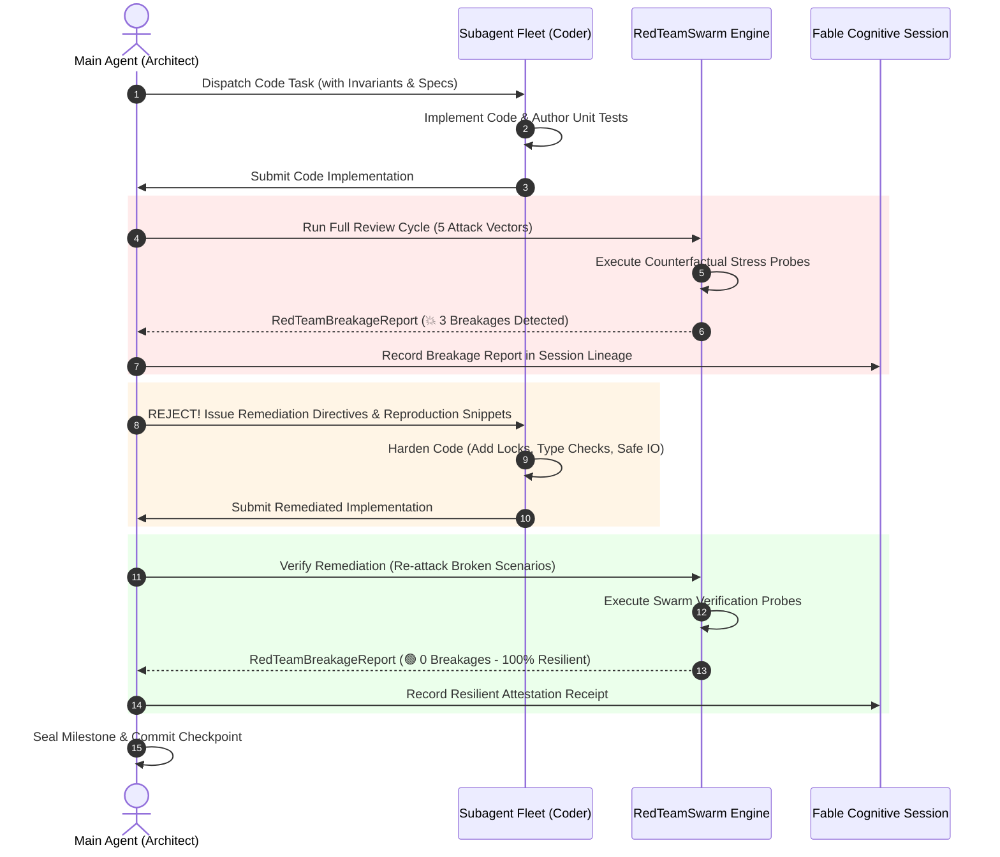

# Modular Fable Part 1: Adversarial Code Review Swarm (Project Glasswing Red Team Loop)
## Counterfactual "What If?" Falsification, Multi-Persona Swarm Attacks, and Closed-Loop Ping-Pong Hardening

In software engineering, relying solely on line-by-line code review and author-written unit tests is a critical failure mode that leads to brittle production systems, silent data corruption, race conditions, and catastrophic vulnerability escapes.

**Modular Fable Part 1: Adversarial Code Review Swarm** codifies a non-negotiable architectural discipline:
Whenever a subagent produces code, the Main Agent is under an **immutable obligation** to summon an adversarial swarm of red-team personas. The swarm counterfactually attacks the code across 5 adversarial vectors until every breakage is either surfaced or proven resilient.

---

## 1. Architectural Philosophy: The Failure of Line-by-Line Review & Author Tests

```
┌──────────────────────────────────────────────────────────────────────────────────────────┐
│              THE TRADITIONAL CODE REVIEW ILLUSION VS. THE SWARM FALSIFIER               │
└──────────────────────────────────────────────────────────────────────────────────────────┘

  ❌ TRADITIONAL PARADIGM: CONFIRMATION BIAS       ✅ MODULAR FABLE: ADVERSARIAL SWARM
  ┌─────────────────────────────────────┐         ┌─────────────────────────────────────┐
  │ Subagent writes feature code        │         │ Subagent writes feature code        │
  │               │                     │         │               │                     │
  │               ▼                     │         │               ▼                     │
  │ Author writes happy-path unit tests │         │ Main Agent deploys Red Team Swarm   │
  │ (assert result is not None)         │         │ (5 Attack Personas & Counterfactuals)│
  │               │                     │         │               │                     │
  │               ▼                     │         │               ▼                     │
  │ Reviewer reads code line-by-line    │         │ Swarm executes stress & chaos probes│
  │ ("LGTM, looks clean and idiomatic") │         │ (TOCTOU, Null Bytes, Memory Churn)  │
  │               │                     │         │               │                     │
  │               ▼                     │         │ ┌─────────────┴───────────────────┐ │
  │ Merged to main                      │         │ │ 💥 Breakages Found -> Rejection │ │
  │ 💥 Crashes in production!           │         │ │ 🛠️ Subagent Remediates         │ │
  │ (TOCTOU race / Null byte injection) │         │ │ 🛡️ Verified Remediation (0 broke│ │
  └─────────────────────────────────────┘         │ └─────────────────────────────────┘ │
                                                  │               │                     │
                                                  │               ▼                     │
                                                  │ Resilient Code Sealed & Merged      │
                                                  └─────────────────────────────────────┘
```

### 1.1 Why Line-by-Line Review Fails
When an LLM or human engineer performs line-by-line code review, their cognitive system falls prey to severe cognitive biases:
1. **Confirmation Bias**: The reviewer reads the code in the same mental frame that the author wrote it, subconsciously assuming the author's stated invariants hold true.
2. **Syntactic Distraction**: Attention is consumed by formatting, naming conventions, and surface syntax, masking deep architectural race conditions and edge-case omissions.
3. **Semantic Gullibility**: If a function claims `# Thread-safe buffer`, a line-by-line review frequently accepts the comment without mathematically proving lock atomicity or simulating race interleaving.

### 1.2 Why Author Unit Tests Fail
Author-written unit tests suffer from the **Happy-Path Mirror Effect**:
- The author writes tests for the scenarios they already conceived.
- Tests often contain **Tautological Assertions** (`assert result is not None`, `assert True`), which mock auditor engines immediately flag as meaningless vanity tests.
- **Mock Leakage**: External dependencies (filesystems, network sockets, databases) are mocked with overly simplistic dummy objects that never simulate `PermissionError`, network timeouts, truncated streams, or corrupted disk writes.

---

## 2. The Main Agent's Immutable Obligation

Under Fable Mode, **Rule 14** establishes an absolute constraint:

> [!IMPORTANT]
> **The Main Agent's Immutable Review Obligation**:
> The Main Agent **MUST NEVER** accept subagent code blindly or rely on superficial heuristics.
> Whenever a subagent implements a module, refactors an interface, or writes a test suite, the Main Agent **MUST summon the Adversarial Red Team Swarm** (`RedTeamSwarm`).
> No code may be marked completed or merged into production without an attestation of swarm survival.

The Main Agent acts as the **Grand Inquisitor and Resilience Verifier**:
- Subagents write code.
- The Red Team Swarm attacks code.
- The Main Agent arbitrates the breakage reports and refuses to unlock execution or finalize tasks until all breakages have passed through verified remediation.

---

## 3. The Counterfactual "What Will Happen If This Happened?" Doctrine

The Red Team Swarm operates on the doctrine of **Counterfactual Falsification**:
Rather than asking *"Does this code work under intended conditions?"*, the swarm asks:
> *"What will happen if the most hostile, chaotic, and degenerate conditions occur right now?"*

The Swarm deploys across **5 Core Attack Vectors**:

```
                              ┌───────────────────────────┐
                              │      RED TEAM SWARM       │
                              │   5 Attack Personas       │
                              └─────────────┬─────────────┘
                                            │
        ┌───────────────────┬───────────────┼───────────────┬───────────────────┐
        ▼                   ▼               ▼               ▼                   ▼
┌───────────────┐   ┌───────────────┐ ┌───────────┐ ┌───────────────┐   ┌───────────────┐
│     CHAOS     │   │   BYZANTINE   │ │CONCURRENCY│ │   RESOURCE    │   │     STATE     │
│  ENVIRONMENT  │   │    PAYLOAD    │ │   RACE    │ │  EXHAUSTION   │   │   INVARIANT   │
├───────────────┤   ├───────────────┤ ├───────────┤ ├───────────────┤   ├───────────────┤
│• Missing path │   │• Null bytes   │ │• 8-thread │ │• 150KB string │   │• f(f(x)) !=   │
│• Denied perms │   │• 60-level nest│ │  burst    │ │• 100x churn   │   │  f(x) check   │
│• Truncated I/O│   │• None/Type-con│ │• TOCTOU   │ │• 3.0s timeout │   │• Out-of-order │
│• Corrupt env  │   │• NaN/Inf/huge │ │• Lock race│ │• Handle leak  │   │  lifecycle    │
└───────────────┘   └───────────────┘ └───────────┘ └───────────────┘   └───────────────┘
```

### Vector 1: Chaos Environment (`chaos_environment`)
Simulates hostile runtime perturbations outside the application's direct control:
- **Missing Paths / Unlinked Inodes**: Sudden `FileNotFoundError` when accessing temp files or output directories.
- **Permission Denial**: `PermissionError` when writing to system directories or sockets.
- **Truncated Streams / Broken Pipes**: Premature EOF, abrupt socket termination, or zero-byte descriptor reads.
- **Hostile Environments**: Non-ASCII environment variables, empty configuration strings, and missing system paths.

### Vector 2: Byzantine Payload (`byzantine_payload`)
Attacks parsing logic and type assumptions with structurally deviant inputs:
- **Null Bytes & Control Codes**: String inputs containing `\x00`, escape codes, or surrogate pairs that bypass naive regexes or cause C-runtime string truncation.
- **Deep Nesting & Recursive Bombs**: JSON or dictionary payloads nested 60+ levels deep to trigger `RecursionError` and stack exhaustion.
- **Type Confusion**: Passing `None`, integers where strings are expected, or dictionaries where lists are expected, probing for unhandled `AttributeError: 'NoneType' object has no attribute '...'`.
- **Extreme Numbers**: IEEE-754 special values (`float('nan')`, `float('inf')`, `-0.0`) and arbitrarily large integers exceeding $2^{64}$.

### Vector 3: Concurrency & TOCTOU Race (`concurrency_race`)
Fuzzes multithreaded and asynchronous safety:
- **Thread Burst Contention**: 6–16 concurrent threads repeatedly invoking the target simultaneously across dozens of iterations.
- **Time-of-Check to Time-of-Use (TOCTOU)**: Mutating shared state or file descriptors immediately after a conditional validation check but before the mutation operation.
- **Reentrant Calls & Deadlocks**: Re-entering the target function from within a callback or under overlapping lock acquisitions.

### Vector 4: Resource Exhaustion (`resource_exhaustion`)
Tests boundaries under heavy load and memory constraints:
- **Massive Payloads**: Supplying inputs of 150,000+ characters or 50,000+ elements to verify memory allocation boundaries.
- **Rapid Churn & Leaks**: 100–1,000 rapid sequential invocations verifying zero descriptor leakage and bounded memory consumption.
- **Strict CPU Timeout Budgets**: Execution sandboxed under hard limits ($\le 3.0$ seconds) to detect algorithmic complexity explosions ($O(2^n)$ or catastrophic regex backtracking).

### Vector 5: State Invariant (`state_invariant`)
Verifies algebraic consistency and domain laws:
- **Operation Idempotency**: $f(f(x)) == f(x)$ — ensuring that re-applying an operation or re-transmitting a message produces identical state without double-mutation.
- **Out-of-Order Lifecycle Transitions**: Probing methods invoked out of sequence (e.g. calling `finalize()` before `initialize()`, or double-closing a resource).
- **Boundary State Transitions**: Driving internal state counters, balances, or queue pointers to zero, negative numbers, or maximum capacity.

---

## 4. The Closed-Loop Ping-Pong Hardening Protocol



### The 6 Ping-Pong Stages:
1. **Subagent Implementation**: The subagent completes the functional implementation and local tests.
2. **Swarm Attack**: The Main Agent invokes `RedTeamSwarm.run_full_review_cycle()` against the candidate code.
3. **Breakage Report Generation**: The Swarm outputs a `RedTeamBreakageReport` containing explicit reproduction snippets and severity ratings.
4. **Subagent Remediation Directive**: If `broken_count > 0`, the Main Agent rejects the deliverable, providing the subagent with the exact reproduction snippets and directives.
5. **Swarm Re-Attack (`verify_remediation`)**: The Swarm executes an isolated verification attack re-running the specific break scenarios against the remediated code.
6. **Verified Resilience Attestation**: Only when `all_fixed == True` and `broken_count == 0` does the Main Agent accept the code and commit the milestone.

---

## 5. Data Structures & Report Formats

### `RedTeamBreakageReport` Schema

```python
@dataclass
class RedTeamBreakageReport:
    report_id: str
    target_name: str
    total_probes: int
    broken_count: int
    passed: bool
    findings: list[BreakFinding]
    created_at: str
    remediation_directives: list[str] = field(default_factory=list)

    def to_dict(self) -> dict[str, Any]: ...
    def to_markdown(self) -> str: ...
```

### Sample Rendered Breakage Markdown Report

````markdown
# 🚨 Adversarial Red Team Breakage Report: `data_parser`

- **Report ID**: `redteam_1725450000_a1b2c3`
- **Target Name**: `data_parser`
- **Total Probes**: `10`
- **Broken Scenarios**: `2`
- **Status**: 🔴 **BREAKAGES DETECTED (FAILED)**
- **Created At**: `2026-09-04T12:00:00Z`

> [!CAUTION]
> Swarm attacks detected **2 breakages** in `data_parser`!
> Subagent code changes are **REJECTED** until all remediation directives are implemented and verified.

### 📋 Probes & Findings Overview

| Scenario ID | Vector | Hypothesis | Broken | Severity |
|---|---|---|:---:|:---:|
| `data_parser_chaos_01_missing_path` | `chaos_environment` | What will happen if targeted files are missing? | ✅ NO | `LOW` |
| `data_parser_byzantine_01_null_bytes` | `byzantine_payload` | What will happen if input strings contain null bytes? | 💥 **YES** | `HIGH` |
| `data_parser_concurrency_01_race_burst` | `concurrency_race` | What will happen if 6 threads invoke simultaneously? | 💥 **YES** | `CRITICAL` |

### 💥 Breakage Diagnostic Details

#### 🔴 `data_parser_byzantine_01_null_bytes` (`byzantine_payload`) - Severity: `HIGH`
**Hypothesis**: What will happen if input strings contain embedded null bytes (\x00)?
**Observed Failure**: `ValueError: embedded null byte`

**Reproduction Snippet**:
```python
data_parser('probe\x00hostile\x00injection\r\n\t')
```

### 🛠️ Remediation Directives
1. Enforce concurrency synchronization: wrap shared state updates with threading.Lock.
2. Implement defensive input validation: reject or strip null bytes (\x00).
````

---

## 6. Code Fleet & Session Engine Integration Examples

### 6.1 Direct Python API (`fable_v2.coder_fleet`)

```python
from fable_v2.coder_fleet import RedTeamSwarm, AttackVector

swarm = RedTeamSwarm()

# 1. Generate scenarios with custom domain hypotheses
scenarios = swarm.generate_break_scenarios(
    target_name="OrderEngine",
    custom_hypotheses=[
        "What will happen if duplicate payment webhooks arrive within 2 milliseconds?",
        "What will happen if the database transaction times out midway through stock reservation?",
    ],
)

# 2. Execute the attack
report = swarm.execute_swarm_attack(
    target_callable=OrderEngine.process_order,
    scenarios=scenarios,
    timeout_seconds=3.0,
)

if not report.passed:
    print(f"Attack broke target with {report.broken_count} failures!")
    markdown_doc = swarm.document_breakage(report, output_path="./reports/breakage.md")
```

### 6.2 CoderFleetDispatcher Routing

```python
from fable_v2.coder_fleet import CoderFleetDispatcher

dispatcher = CoderFleetDispatcher()

# Execute full adversarial review cycle
result = dispatcher.dispatch(
    "red_team_full_review_cycle",
    {
        "target_callable": "def safe_add(a, b):\n    return a + b",
        "target_name": "safe_add",
        "custom_hypotheses": ["What will happen if both inputs are None?"],
    },
)

report = result["result"]
print(f"Passed: {report.passed}, Broken: {report.broken_count}")
```

### 6.3 Fable-Engine MCP Session Governor FSM & Closed-Loop Protocol

The MCP server acts as an **immutable state-machine governor** tracking the session's lifecycle through `SessionState`:

```
   INIT ──▶ DEEPTHINK_TIMELOCK ──▶ IMPLEMENTATION ──▶ RED_TEAM_GATE ──▶ ARBITRATION
                                                            ▲                 │
                                                            │ (Breakages > 0) │
                                                            │                 ▼
                                                   REMEDIATION_REQUIRED ◀─────┘
                                                            │
                                                            ▼ (0 Breakages Left)
                                                         SEALED ──▶ EVOLVED
```

#### The Closed-Loop While-Loop Protocol

The Main Agent and Subagent Fleet execute an ungameable ping-pong loop governed by MCP preconditions:

```python
# Main Agent & Subagent Ping-Pong Remediation Loop
while True:
    verification_response = call_mcp_tool("fable-engine", "fable_session", {
        "action": "verify_red_team_remediation",
        "session_name": "release_hardening_v2",
        "remediated_code": current_remediated_code,
        "prior_report": breakage_report,
        "domain": "security"
    })

    if "TASK COMPLETED: 0 breakages remain. Code sealed." in verification_response:
        # State transitioned to SEALED
        break

    # If breakages remain, server outputs:
    # "TASK REJECTED: [N] breakages detected. Deploy subagent to fix findings."
    # State transitions to REMEDIATION_REQUIRED. Deploy subagent with reproduction snippets:
    current_remediated_code = deploy_subagent_fix(verification_response)

# Post-Success Cortical Evolution:
evolution_receipt = call_mcp_tool("fable-engine", "fable_session", {
    "action": "evolve_cortex",
    "session_name": "release_hardening_v2",
    "domain": "security",
    "task_id": "task_auth_hardening_01"
})
# State transitions to EVOLVED. ΔW = +0.10 * A_domain * A_node (LTP)
```

#### MCP JSON-RPC Calling Examples

**1. Summon Red Team Swarm Review (`red_team_code_review`):**
```json
{
  "tool": "fable_session",
  "arguments": {
    "action": "red_team_code_review",
    "session_name": "release_hardening_v2",
    "target_name": "AuthService",
    "target_code": "def authenticate(token):\n    if not token:\n        raise ValueError('Empty token')\n    return {'user_id': 1}",
    "custom_hypotheses": [
        "What will happen if token exceeds 500KB?",
        "What will happen if token contains embedded null bytes (\\x00)?"
    ]
  }
}
```

**2. Record Breakage Report (`record_breakage_report`):**
```json
{
  "tool": "fable_session",
  "arguments": {
    "action": "record_breakage_report",
    "session_name": "release_hardening_v2",
    "broken_scenarios": [
      {
        "scenario_id": "AuthService_byzantine_01",
        "hypothesis": "Token containing null bytes causes C-string truncation",
        "error_message": "ValueError: embedded null byte",
        "severity": "HIGH",
        "reproduction_code": "authenticate('valid\\x00evil')"
      }
    ]
  }
}
```
*Server Output:*
`TASK REJECTED: 1 breakages detected. Deploy subagent to fix findings.`

**3. Verify Remediation (`verify_red_team_remediation`):**
```json
{
  "tool": "fable_session",
  "arguments": {
    "action": "verify_red_team_remediation",
    "session_name": "release_hardening_v2",
    "remediated_code": "def authenticate(token):\n    if not token or '\\x00' in token or len(token) > 65536:\n        raise ValueError('Invalid token')\n    return {'user_id': 1}",
    "prior_report": {
      "findings": [
        {
          "scenario_id": "AuthService_byzantine_01",
          "broken": true,
          "hypothesis": "Token containing null bytes causes C-string truncation"
        }
      ]
    }
  }
}
```
*Server Output:*
`TASK COMPLETED: 0 breakages remain. Code sealed.`

**4. Post-Success Cortical Evolution (`evolve_cortex`):**
```json
{
  "tool": "fable_session",
  "arguments": {
    "action": "evolve_cortex",
    "session_name": "release_hardening_v2",
    "domain": "security",
    "task_id": "auth_remediation_milestone"
  }
}
```
*Server Output:*
Transitions session state from `SEALED` to `EVOLVED`, applies LTP synaptic potentiation ($\Delta W = +0.10 \cdot A_{\text{domain}} \cdot A_{\text{node}}$), synthesizes antibodies `ab_security_AuthService_byzantine_01`, and persists directly to `skills/fable-mode/cortex/security.md`.

---

## 7. Operational Summary

| Phase | State | Responsibility | Tooling |
|---|---|---|---|
| **Authoring** | `IMPLEMENTATION` | Subagent Implementers | `AtomicWorkspaceEngine`, `TreeSitterCodemodEngine` |
| **Swarm Attack** | `RED_TEAM_GATE` | Main Agent & Swarm | `fable_session` action `red_team_code_review` |
| **Breakage Gating** | `REMEDIATION_REQUIRED` | Server Governor | `fable_session` action `record_breakage_report` |
| **Remediation Loop** | `ARBITRATION` | Subagent Implementers | Fix directives, null-byte guards, locks |
| **Verification & Sealing** | `SEALED` | Server Governor & Swarm | `fable_session` action `verify_red_team_remediation` |
| **Cortical Evolution** | `EVOLVED` | Cortical Plasticity Engine | `fable_session` action `evolve_cortex` |
