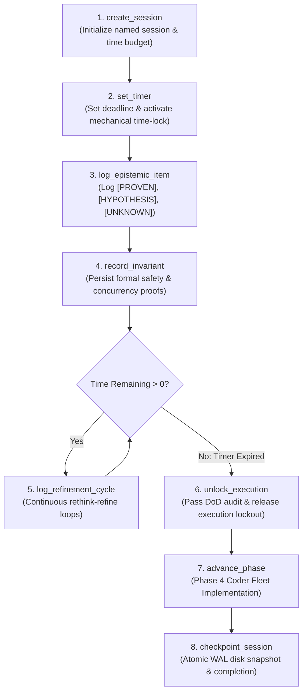
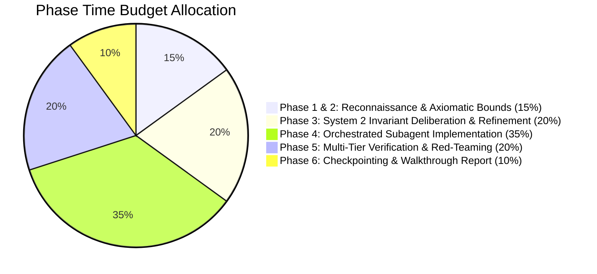
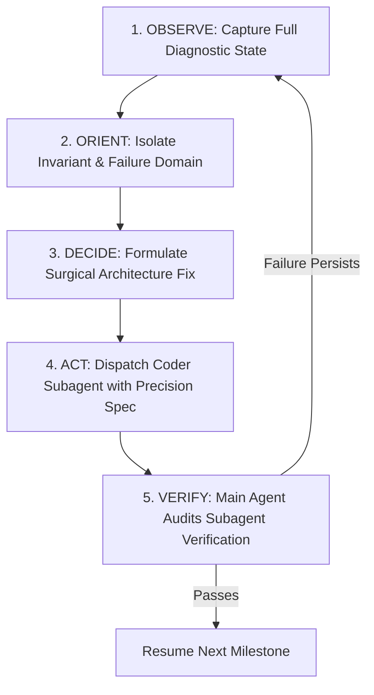
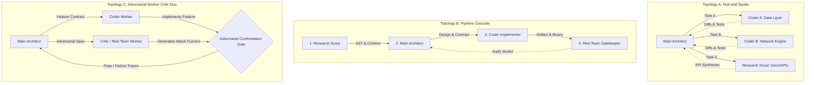

# Effortless Agentic Execution, fable_session Lifecycle & Time-Budgeted Pacing

This reference establishes the operating protocols for high-autonomy, long-horizon agency, live execution telemetry, user-controlled time budgeting (e.g. 30 min, 40 min, 4 hr, 24 hr endurance), the **Unbypassable Mechanical Time-Lock**, the **Continuous Rethink-Refine Loop (`log_refinement_cycle`)**, the **Antigravity Permission Matrix**, and subagent fleet orchestration inspired by Claude Fable 5 and Mythos-class systems.

--------------------------------------------------------------------------------

## 1. The Core Directives of Effortless Agency

Effortless agency means the model operates as a senior staff architect and conductor who has been handed an objective and drives it to 100% verified completion without requiring micro-management or stalling on intermediate friction.

### The 7 Non-Negotiable Directives:
1. **Strict Cognitive Separation (Main Agent Cannot Code in Project)**:
   - **Main Agent**: Handles all **heavy cognitive lifting**—DeepThink reasoning, System 2 deliberation, continuous refinement cycles, architectural blueprinting, API contracts, type systems, session management via `fable_session`, terminal probe execution (`run_command`), brain artifact authoring, and quality gatekeeping. **The main agent strictly does NOT write or edit source files in the project repository directly.**
   - **Subagents**: All project code creation (`write_to_file`), edits (`replace_file_content`), unit test implementations, and refactoring are executed **exclusively by subagents** once execution is unlocked.
2. **Unbypassable Mechanical Time-Lock**:
   - When a time budget is configured (e.g. `30 mins`, `40 mins`, `4 hours`, `24 hours`), the engine enforces a hard mathematical time-lock.
   - Calling `unlock_execution` before $t_{\text{current}} \ge t_{\text{deadline}}$ returns a **hard error**.
   - The AI cannot oppose, bypass, or exit thinking prematurely; it must embrace the allocated time to achieve radical depth.
3. **Continuous Rethink-Refine Cognitive Loop (`log_refinement_cycle`)**:
   - If initial thinking passes conclude before the time budget expires, the model enters a continuous refinement loop (`rethink, refine, rethink, refine`), mutating archetypes, stress-testing invariants, verifying cache alignments, running terminal benchmarks, and tightening proofs—logging each cycle via `log_refinement_cycle`.
4. **Full Terminal & Artifact Privileges during Thinking**:
   - Antigravity explicitly authorizes and encourages running terminal commands (`run_command`) for compiler checks, benchmarks, and AST analysis, as well as authoring design artifacts in `<appDataDir>\brain\<conversation-id>/` during the time-lock window.
5. **Non-Halting Persistence**: A compilation error, missing module, or test failure is not a reason to prompt the user—it is simply new environmental data. Diagnose the root cause, adapt the approach, and instruct subagents to remediate.
6. **Proactive Environmental Discovery**: Never guess what packages, compilers, or files exist. Introspect the environment immediately using filesystem tools (`list_dir`, `grep_search`, `find_by_name`, `run_command`).
7. **Empirical Gatekeeping**: An agentic task is never complete because code was generated; it is complete only when the build passes, tests succeed, and runtime behavior matches the objective specification.

--------------------------------------------------------------------------------

## 2. The `fable_session` MCP Lifecycle & Time-Lock Flow

The `fable-engine` MCP server manages session telemetry, epistemic grounding logs, verified invariants, refinement cycles, and execution lockout gates via the `fable_session` tool.



### 2.1 The Core Actions of `fable_session`:
- `create_session`: Initializes a persistent session with `session_name`, `time_budget_minutes`, `objective`, and `domain` (`"architecture" | "design" | "coding"`).
- `set_timer`: Configures phase deadlines, calculates $t_{\text{deadline}}$, and activates the hard mechanical time-lock.
- `get_status`: Returns live session telemetry, time-lock status, logged epistemic items, invariant counts, and refinement cycles.
- `log_epistemic_item`: Records facts into `[PROVEN]`, `[HYPOTHESIS]`, and `[UNKNOWN]` tables.
- `record_invariant`: Stores formal mathematical, type-safety, and memory ordering proofs.
- `log_refinement_cycle`: Persists continuous refinement improvements (`archetype_mutation`, `falsification_probe`, `cache_line_alignment`, `invariant_stress_test`, `terminal_probe`, `proof_tightening`).
- `unlock_execution`: Validates that the mechanical time budget has elapsed and Phase 1–3 Definition of Done (DoD) is satisfied before unlocking project code modification tools for the subagent fleet.
- `advance_phase`: Advances the session to the next phase in the 6-phase engineering lifecycle.
- `checkpoint_session`: Persists the complete session state to an atomic disk checkpoint.

--------------------------------------------------------------------------------

## 3. Antigravity Permission Matrix During Time-Lock

During Phases 1, 2, and 3 (while the Hard Mechanical Time-Lock is active), Antigravity enforces the following permission boundaries:

| Capability / Tool | Status during Time-Lock | Operational Guidance |
| :--- | :--- | :--- |
| **Terminal Commands (`run_command`)** | 🟢 **FULLY AUTHORIZED & ENCOURAGED** | Run compiler checks, micro-benchmarks, AST analysis, scratch probe scripts, CLI help probes, and system telemetry to ground all proofs empirically. |
| **Brain Artifacts (`<appDataDir>\brain\<conversation-id>/`)** | 🟢 **FULLY AUTHORIZED & ENCOURAGED** | Create and update implementation plans, architectural blueprints, 10D trade-off matrices, red-team attack harnesses, and formal verification proofs. |
| **Scratch Files (`.../scratch/*`)** | 🟢 **FULLY AUTHORIZED & ENCOURAGED** | Write standalone test harnesses, isolated benchmark scripts, or temporary probe code in the conversation's scratch directory. |
| **Read Tools (`view_file`, `grep_search`, `list_dir`)** | 🟢 **FULLY AUTHORIZED & ENCOURAGED** | Deeply inspect repository files, dependency manifests, configuration files, and types. |
| **fable_session MCP (`log_refinement_cycle`, `log_epistemic_item`)** | 🟢 **FULLY AUTHORIZED & MANDATORY** | Continuously record refinement cycles, epistemic items, and invariant proofs. |
| **Project Workspace Code Edits (`write_to_file`, `replace_file_content`)** | 🔴 **STRICTLY LOCKED** | Modifying project repository source code is blocked until the time budget fully elapses and `unlock_execution` succeeds. |

--------------------------------------------------------------------------------

## 4. User-Controlled Time-Budgeted Execution & Pacing

When the user specifies a duration or time budget for an objective (e.g. `30 mins`, `40 mins`, `4 hours`, `24 hours`), the agent enforces **Time-Budgeted Pacing**:

### 4.1 Time Budget Calibration & Tracking
- Parse user time string into target seconds: $T_{\text{budget}}$ (e.g., $30\,\text{min} = 1800\,\text{s}$, $40\,\text{min} = 2400\,\text{s}$, $4\,\text{hr} = 14400\,\text{s}$, $24\,\text{hr} = 86400\,\text{s}$).
- Record start timestamp $t_{\text{start}}$, target deadline $t_{\text{deadline}} = t_{\text{start}} + T_{\text{budget}}$, elapsed time $t_{\text{elapsed}}$, and remaining time $t_{\text{remaining}}$.
- Calculate the pacing ratio $\rho = \frac{t_{\text{elapsed}}}{T_{\text{budget}}}$.

### 4.2 Dynamic Phase Time Budget Allocation
Distribute the total time budget across the engineering lifecycle:



### 4.3 Compute Scaling & Continuous Refinement Over Long Budgets
- **Anti-Rush Guarantee**: If 40 minutes or 4 hours are allocated, do NOT attempt premature exits.
- **Refinement Compounding**:
  - Run terminal probe benchmarks (`run_command`) on candidate data structures.
  - Profile cache-line layouts, alignment attributes, and instruction barriers.
  - Log each breakthrough or optimization via `log_refinement_cycle`.
  - Deploy parallel subagents to benchmark candidate architectures and inspect large dependency graphs.
- **Phase 6 Wrap-Up Gate**: When $t_{\text{remaining}} \le 10\%$, enter final review: call `checkpoint_session`, ensure documentation integrity, and deliver `walkthrough.md`.

--------------------------------------------------------------------------------

## 5. The OODA Self-Healing Loop

When errors, timeouts, or unexpected behavior occur during tool execution, apply the **OODA Self-Healing Loop**:



1. **Observe**: Capture the full compiler error, stack trace, or runtime output without truncation.
2. **Orient**: Identify the root invariant breached (syntax, type system, lifetime, memory ordering, or environmental path).
3. **Decide**: Formulate a surgical fix addressing the root invariant rather than masking the symptom.
4. **Act**: Dispatch a `self` subagent with precise code instructions to perform the edit.
5. **Verify**: Main agent audits the subagent's test results to prove resolution before proceeding.

--------------------------------------------------------------------------------

## 6. Subagent Fleet Orchestration & Code Delegation

```
                  +------------------------------------------------+
                  |           MAIN AGENT: THE ARCHITECT            |
                  |  - System 2 Deliberation & Invariant Proofs    |
                  |  - Continuous Refinement (log_refinement_cycle)|
                  |  - Terminal Probes (run_command) & Artifacts   |
                  |  - Injects Coder Fleet into Subagent Contracts |
                  |  - fable_session State & Time-Lock Gatekeeper  |
                  |  - High-Level Architecture & API Contracts     |
                  |  ⛔ DOES NOT WRITE PROJECT CODE DIRECTLY       |
                  +------------------------------------------------+
                                          │
                  ┌───────────────────────┼───────────────────────┐
                  ▼                       ▼                       ▼
        +────────────────----+  +────────────────----+  +────────────────----+
        |  CODER WORKER      |  |  RESEARCH SCOUT    |  | RED-TEAM EXPLORER  |
        | (type: self)       |  | (type: research)   |  | (type: self)       |
        | - Armed w/ 10 Fleet|  | - Scans 50+ files  |  | - Injects fuzzing  |
        | - Writes all code  |  | - Extracts APIs    |  | - Probes races     |
        | - Edits repo files |  | - Live web docs    |  | - Edge validation  |
        | - Runs unit tests  |  |                    |  | - Mutation verify  |
        +────────────────----+  +────────────────----+  +────────────────----+
```

### 6.1 The Core Delegation Axiom & Rules
- **Strict Cognitive Separation**: All project source code creation (`write_to_file`), edits (`replace_file_content`), unit test implementations, and refactoring are executed **exclusively by subagents** after the time-lock unlocks. The Main Agent retains master architectural state, invariant definitions, and quality gatekeeping.
- **Documentation & Deep Research $\to$ `research` Subagent**: For broad codebase grep/ast scans, documentation fetching, and reading long reference files to avoid saturating the primary agent's working memory context.
- **Implementation & Remediation $\to$ `self` Subagent (Coder)**: Dispatched with exact file paths, explicit API signatures, pre/post-conditions, and expected test commands.
- **Adversarial Fuzzing & Red-Teaming $\to$ `self` Subagent (Red-Team Explorer)**: For metamorphic testing, concurrency race probing, and fault injection.
- **Master Rule**: Subagents write the code and report diffs/test output back to the main agent. The main agent evaluates correctness against the Definition of Done before advancing milestones.

### 6.2 Subagent Fleet Topology Routing Patterns



#### Topology 1: Hub-and-Spoke Orchestration (Independent Parallelization)
- **When to Use**: Independent modular sub-tasks, multi-file refactors with disjoint dependency graphs, or simultaneous multi-crate upgrades.
- **Mechanism**: The Main Architect decomposes the objective into orthogonal execution units with locked API contracts, spawns concurrent subagents simultaneously, collects completion diffs, and synthesizes integration without cross-talk pollution.

#### Topology 2: Pipeline Cascade (Sequential Multi-Stage Specialization)
- **When to Use**: Complex end-to-end features requiring discovery $\to$ design $\to$ code $\to$ deep verification.
- **Mechanism**:
  1. **Stage 1 (Scout)**: Gathers AST graphs, API references, and existing test patterns into a compact brief.
  2. **Stage 2 (Architect)**: Formulates type invariants, System 2 deliberation, and surgical implementation specifications.
  3. **Stage 3 (Implementer)**: Coder subagent implements the modules and passes unit tests.
  4. **Stage 4 (Gatekeeper)**: Red-team subagent verifies invariants, executes metamorphic fuzzing, and checks for memory/resource leaks.

#### Topology 3: Adversarial Worker-Critic Duos (High-Assurance Hardening)
- **When to Use**: Mission-critical lock-free algorithms, security-sensitive auth/crypto protocols, and core state machines.
- **Mechanism**:
  - The Main Agent dispatches a **Coder Worker** and a **Critic Worker** in parallel under isolated prompts.
  - The Coder Worker builds the optimal implementation adhering to specifications.
  - The Critic Worker independently constructs a hostile test harness designed explicitly to break invariants (race fuzzing, memory exhaustion, malformed payloads).
  - The implementation is merged only when the Coder's artifact passes the Critic's adversarial suite with zero invariant breaches.

### 6.3 Subagent MCP Tooling Mandate, Enablement & Non-Restriction Protocol

> [!IMPORTANT]
> **Subagent MCP Tooling Mandate & Zero-Crash Protocol**:
> 1. **Mandatory MCP Notification**: In every subagent dispatch specification (`invoke_subagent`), the Main Agent **must explicitly inform the subagent** that MCP tools are available and instruct it on how to invoke them (e.g., via `call_mcp_tool` for available MCP servers and tools like `fable_coder_fleet`, `fable-engine`, `context7`, `narsil`).
> 2. **Explicit MCP Tool Enablement (`enable_mcp_tools: true`)**: When defining custom subagents (via `define_subagent`), the Main Agent **must explicitly set `enable_mcp_tools: true`** (along with `enable_write_tools: true`). This ensures the subagent is properly enabled to call MCP tools and will never crash or error out from missing tool permissions.
> 3. **Non-Restriction Policy (Graceful Native Fallback)**: The subagent is **strictly NOT restricted, penalized, or rejected for not using an MCP tool**. If a task is executed cleanly using native workspace tools (`write_to_file`, `replace_file_content`, `run_command`), or if an MCP server/tool is unavailable, unconfigured, or unnecessary for the immediate edit, the subagent has full pragmatic authority to proceed with native tools. Subagents must never crash, stall, or have their work rejected solely for omitting an MCP tool when build, test, and verification checks pass.

#### The 10 Specialized Coder Fleet Engines (`fable_v2.coder_fleet`)
Subagents operate with pure-Python, zero-external-C-dependency engines tailored for robust, ungameable implementation:

```python
from fable_v2.coder_fleet import (
    VisualGroundingEngine,      # Vector/SVG rendering validation, palette & bounding box diffs
    DiagnosticsEngine,          # AST syntax/semantic diagnostics & automated quick fixes
    TreeSitterCodemodEngine,    # AST structural queries, safe identifier renaming across files
    AtomicWorkspaceEngine,      # File checkpoints, unified diffs, rollbacks, SHA-256 commits
    TestHarnessEngine,          # Subprocess sandboxing, 3s timeouts, race fuzzing, memory profiling
    MutationVerifierEngine,     # AST mutant injection, kill rate auditing (audit_test_strength)
    MockAuditorEngine,          # Tautology detection, bans assert True, catches mock leakage
    PropertyOracleEngine,       # Extreme boundary matrices, algebraic roundtrip invariants
    ReceiptAttestorEngine,      # HMAC-SHA256 authenticated ToolReceipts for execution proofs
    ComputeOrchestratorEngine,  # Dynamic thinking budgets up to 64k tokens, MCTS tree search
    CoderFleetDispatcher        # Centralized router dispatching to all 10 engines
)
```

#### Expected Subagent Verification Workflows
1. **Pre-Flight Diagnostics**: Subagents run `DiagnosticsEngine` on modified source files to guarantee clean AST parsing and zero syntax/type errors before running tests.
2. **Safe Structural Refactoring**: Subagents utilize `TreeSitterCodemodEngine` for multi-file symbol renames to preserve structural AST invariants rather than error-prone regex replacement.
3. **Sandboxed Test Execution**: Subagents run test suites inside `TestHarnessEngine` under isolated 3-second timeouts to guard against infinite loops, hangs, or resource saturation.
4. **Eradication of Fake Tests (`MutationVerifierEngine`)**:
   - Subagents must run `MutationVerifierEngine.audit_test_strength()` against test suites.
   - Mutants with inverted comparison operators, modified constants, and omitted condition branches must be actively killed by the tests.
   - Fake tests (passing tests that fail to kill obvious mutants) are flagged and must be rewritten.
5. **Tautology & Mock Leakage Auditing (`MockAuditorEngine`)**:
   - Every test suite is scanned for vacuous assertions (`assert True`, `self.assertEqual(val, val)`), redundant mocks, or mocking the system under test.
   - Subagents must verify negative paths (explicitly asserting expected exceptions on malformed inputs).
6. **Property-Based Boundary Validation (`PropertyOracleEngine`)**:
   - Validates algebraic properties (e.g., identity, associativity, roundtrips: `decode(encode(data)) == data`) across extreme edge cases.
7. **Tamper-Evident Receipts (`ReceiptAttestorEngine`)**:
   - Subagents generate cryptographically signed `ToolReceipt`s for test runs and milestone commits, proving deterministic pass status to the Main Agent.

--------------------------------------------------------------------------------

## 7. Context Budget Management & The Working Memory Ledger

Maintain a structured **Working Memory & Time Ledger** across milestones:

```markdown
### 📋 WORKING MEMORY & TIME LEDGER
- **Active Objective**: Milestone 3 / 5 (Refactoring Event Dispatcher)
- **fable_session**: `event_dispatcher_v2` | Phase: `Phase 4: Orchestrated Subagent Implementation`
- **Mechanical Time-Lock**: `ELAPSED & UNLOCKED` (DoD Verified)
- **Refinement Cycles Completed**: `4 cycles logged (log_refinement_cycle)`
- **Role Execution**: Main Agent (Architect) | Subagent Coder `subagent_03` (Implementer)
- **Time Budget**: `Allocated: 2400s (40 min)` | `Elapsed: 2410s (100.4%)` | `Remaining: 0s`
- **Verified Invariants**: [✓] Zero-copy parsing, [✓] Lock-free ring buffer compiled
- **Current Blocker / Investigation**: Fixing trait bounds in `dispatcher.rs:L88`
- **Next Action**: Dispatch `self` subagent to update trait bounds on `EventHandler` and verify `cargo check`
```

### Context Conservation Rules:
- **Targeted File Views**: Never view a 2,000-line file whole when you only need a 40-line function. Always use `StartLine` and `EndLine` slices.
- **Precision Grep**: Use ripgrep (`grep_search`) with file pattern filters (`Includes: ["*.rs"]`) rather than listing every file.
- **Clean Workspace**: Remove temporary debug scripts, scratch logs, and transient test binaries upon milestone completion.

