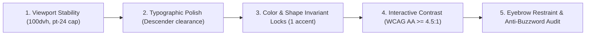

# Fable-Mode Anti-Slop Frontend Architecture & Awwwards Design System
## Frontier UI/UX Engineering, Dial Calibration, Haute Archetypes & Zero-Slop Standard

The **Fable Anti-Slop Frontend Architecture** transforms Fable-Mode from generating predictable AI templates into an Awwwards-caliber digital design engine. Even when given a simple, ambiguous prompt (e.g. *"create a landing page for coffee beans"* or *"build an observability dashboard"*), Fable-Mode constructs distinctive, high-taste, high-performance, and mathematically grounded user interfaces that reject generic AI tropes.

---

## 1. Brief Inference Protocol ("Read the Room")

Most AI design output is mediocre because models default to statistical averages: purple glowing gradients, default Inter font, centered heroes, and 3 equal feature cards. Fable-Mode mandates **Brief Inference** before any UI code is authored.

### 1.A The 6 Diagnostic Signals
1. **Page Kind**: Landing page (SaaS, developer tool, luxury hardware, consumer artisan, editorial journal, dashboard, or portfolio).
2. **Vibe & Aesthetic Keywords**: "Cold Luxury", "Avionics / Cyber Monolith", "Editorial Journal", "Swiss Modernist", "Tactile Nordic", "Developer Cockpit".
3. **Reference Anchors**: High-craft design precedents (Teenage Engineering, Leica, Stripe Press, Braun / Dieter Rams, Bang & Olufsen, Raycast, Balenciaga).
4. **Target Audience**: Technical buyers, enterprise architects, design purists, conscious consumers, or developers.
5. **Brand Colorway & Materials**: Monochrome base, paper bone, deep spruce, carbon espresso, with strictly ONE primary spectral accent.
6. **Accessibility & Viewport Constraints**: WCAG AA ($L_c \ge 75$, $\ge 4.5:1$), fluid clamp scaling ($375\text{px} \to 1440\text{px}$), and $100\text{dvh}$ viewport stability.

### 1.B Mandatory Design Read Declaration
Before outputting frontend code, the AI must formulate and state:
> **"Design Read: [Page Kind] for [Target Audience], with a [Vibe / Aesthetic Language], leaning toward [Aesthetic Archetype / Tailwind CSS v4 Engine] with Dials at Variance: X / Motion: Y / Density: Z."**

---

## 2. The Three Calibrated Dials

Layout, motion, and visual density decisions are mathematically calibrated on a discrete $1 - 10$ scale:

$$\text{Aesthetic Vector} = \langle \text{DESIGN\_VARIANCE},\, \text{MOTION\_INTENSITY},\, \text{VISUAL\_DENSITY} \rangle$$

* **`DESIGN_VARIANCE` ($1 - 10$)**:
  - $1$: Strict bilateral symmetry and uniform card grids.
  - $10$: Asymmetric 50/50 splits, dynamic bento grids, overlapping kinetic typography, and dramatic scale shifts.
* **`MOTION_INTENSITY` ($1 - 10$)**:
  - $1$: Subtle color/opacity transitions only.
  - $10$: Full Newtonian spring physics ($F = -kx - c\dot{x}$), scroll-linked parallax, and cursor-following focal blooms.
* **`VISUAL_DENSITY` ($1 - 10$)**:
  - $1$: Art gallery breathing room, massive whitespace, and single-column narratives.
  - $10$: High-density telemetry ribbons, sub-pixel badge pills, and containerless HUD metrics.

### Calibrated Presets
| Use Case | VARIANCE | MOTION | DENSITY | Optimal Haute Archetype | Recommended Typography |
| :--- | :---: | :---: | :---: | :--- | :--- |
| **High-Tech SaaS & AI Systems** | 8 | 7 | 6 | Cyber-Obsidian Monolith | Geist Display + Geist + Geist Mono |
| **Literary Journal & Longform** | 9 | 5 | 3 | Haute Editorial Modernism | PP Editorial New + Söhne + Commit Mono |
| **Studio Portfolio & Architecture** | 6 | 3 | 5 | Swiss Precision & Vignelli | Neue Haas Grotesk + Diatype Mono |
| **Developer Tools & Telemetry** | 7 | 8 | 8 | Kinetic Spatial HUD | JetBrains Mono + Geist + Geist Mono |
| **Artisan Living & Lifestyle** | 7 | 4 | 4 | Neo-Nordic Tactile Warmth | Satoshi + Cabinet Grotesk + Commit Mono |
| **Cold Luxury & Horology** | 8 | 5 | 3 | Cold Chromatic Luxury | ABC Diatype / Söhne Breit + Commit Mono |

---

## 3. The 6 Haute Aesthetic Archetypes

```
+──────────────────────────────────────────────────────────────────────────────────+
|                       THE 6 HAUTE AESTHETIC UNIVERSES                            |
+──────────────────────────────────────────────────────────────────────────────────+
| 1. CYBER-OBSIDIAN MONOLITH  │ Dark aerospace obsidian, hairline vectors, high-   |
|    (Teenage Eng. / Avionics) │ voltage cyber mint/cyan, phosphor status telemetry.|
├─────────────────────────────┼────────────────────────────────────────────────────┤
| 2. HAUTE EDITORIAL MODERNISM│ Asymmetric 1.618:1 negative space, 0.5px rules,     |
|    (Stripe Press / Journal) │ crisp bone paper, terracotta accent, dramatic serif|
├─────────────────────────────┼────────────────────────────────────────────────────┤
| 3. SWISS PRECISION & VIGNELLI Pure mathematical grid, extreme scale contrast,     |
|    (Braun / Leica / Massimo) │ monochrome white/black + International Red accent. |
├─────────────────────────────┼────────────────────────────────────────────────────┤
| 4. KINETIC SPATIAL HUD      │ Containerless data ribbons, sub-pixel badge pills, |
|    (Developer Console / HUD)│ scanlines, live pulses, phosphor emerald accents.  |
├─────────────────────────────┼────────────────────────────────────────────────────┤
| 5. NEO-NORDIC TACTILE WARMTH│ Deep pine, sand bone, smooth pebble curves (3xl),  |
|    (Bang & Olufsen / Aalto) │ tactile organic surfaces, warm amber illumination. |
├─────────────────────────────┼────────────────────────────────────────────────────┤
| 6. COLD CHROMATIC LUXURY    │ Silver-grey chrome, true off-black, hairline bevels|
|    (High-End Hardware/Balen)│ ultra-crisp display sans, pure cobalt high-voltage.|
+──────────────────────────────────────────────────────────────────────────────────+
```

---

## 4. The 7-Layer Optical Depth Staging Architecture

Rather than flat 1-layer cards with muddy dropshadows, Fable-Mode structures all viewports across a 7-layer physical optical stack:

```
[Layer 6: Interactive Micro-Physics & Magnetic Focal Bursts]
      │
[Layer 5: Foreground Fluid Typography & Tabular Telemetry]
      │
[Layer 4: Hairline Specular Rims (0.5px Sub-Pixel Bevels)]
      │
[Layer 3: Refractive Glassmorphic Substrate (backdrop-filter)]
      │
[Layer 2: Volumetric Directional Lighting (Inverse-Square Caustics)]
      │
[Layer 1: Micro-Texture / Film Grain (Anti-Banding SVG Noise)]
      │
[Layer 0: Atmospheric Void Base (Perceptual OKLCH Deep Base)]
```

### Optical Layer Directives
- **Layer 0 (Atmospheric Void)**: Never use raw `#000000` or `#ffffff`. Use deep chromatic obsidian `oklch(0.08 0.02 270)` or crisp bone `oklch(0.975 0.008 85)`.
- **Layer 1 (Micro-Grain Texture)**: Procedural SVG noise (`feTurbulence baseFrequency="0.85"`) set to `opacity: 0.035` and `mix-blend-mode: overlay` to eliminate 8-bit banding on dark gradients.
- **Layer 2 (Volumetric Caustics)**: Radial gradient light sources with physical inverse-square decay ($I \propto 1/d^2$): `radial-gradient(circle at 50% 0%, oklch(...) 0%, transparent 70%)` with `blur-[120px]`.
- **Layer 3 (Refractive Substrate)**: Frosted panels using `backdrop-filter: blur(20px)` and semi-transparent OKLCH surfaces.
- **Layer 4 (Hairline Specular Rims)**: Razor-sharp 0.5px borders: `border: 0.5px solid oklch(1 0 0 / 0.12)` with subtle inner rim highlights: `box-shadow: inset 0 1px 0 0 oklch(1 0 0 / 0.18)`.
- **Layer 5 (Fluid Typography)**: Mathematical CSS `clamp(...)` scales, micro-kerning, descender clearance, and tabular monospace numbers (`font-variant-numeric: tabular-nums`).
- **Layer 6 (Micro-Physics)**: 2nd-order damped harmonic oscillator spring motion for all interactive hover, drag, and state switches.

---

## 5. Strict Anti-Slop Elimination Rules (Banned AI Clichés)

Every deliverable must pass mechanical anti-slop verification:

1. ❌ **No Purple Glow Blobs**: Banned: `bg-gradient-to-tr from-purple-500 to-indigo-500 blur-3xl`. Use neutral void bases with ONE high-contrast accent.
2. ❌ **No Centered 3-Card Boilerplates**: Banned: 3 equal feature cards with centered icons in rounded boxes. Enforce asymmetric Bento Grids (mixed cell spans $2\times 2$, $2\times 1$, $1\times 1$).
3. ❌ **No Default Font Crutches**: Banned: defaulting to unstyled `font-sans` with generic Inter/Arial. Pair curated display and body fonts.
4. ❌ **No Fake Div Screenshots**: Banned: rendering fake macOS window bars with 3 colored circle dots in CSS. Use real interactive component sandboxes or photorealistic assets.
5. ❌ **No LLM Marketing Buzzwords**: Banned: *"supercharge"*, *"unleash"*, *"next-gen AI"*, *"delve into"*, *"seamlessly integrate"*, *"visionary craftsmanship"*. Use concrete, functional engineering copy.
6. ❌ **No Viewport Instability (`h-screen`)**: Banned: `h-screen` or `height: 100vh`. Strictly use `min-h-[100dvh]` to eliminate mobile address-bar jump thrashing.
7. ❌ **No Unisolated RSC Motion Hooks**: In Next.js, isolate `motion/react`, `useScroll`, and `useMotionValue` into `'use client'` leaves.
8. ❌ **No Single-Line CTA Wraps**: Button labels must include `whitespace-nowrap` and fit on one line on desktop.
9. ❌ **No Eyebrow Overload**: Uppercase tracking eyebrows are capped at $\le \lceil N_{\text{sections}} / 3 \rceil$.

---

## 6. Pre-Flight 5-Point Quality Gate

Before declaring any UI task complete, the code must pass:



All checks can be automatically verified via the `validate_preflight_design` and `audit_anti_slop` actions on `fable_session` and `CoderFleetDispatcher`.
