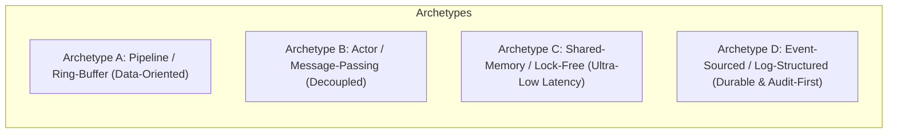
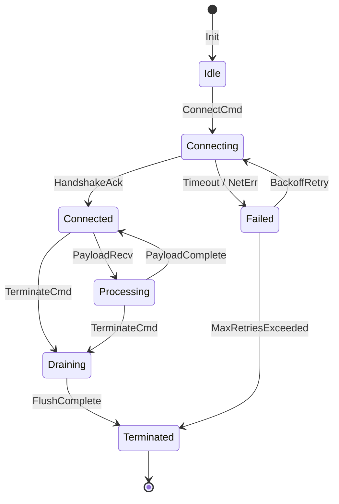

# Architectural Blueprinting & First-Principles System Design

This guide provides the formal framework for blueprinting enterprise-grade, mission-critical systems and data engines with Fable 5 xhigh depth.

--------------------------------------------------------------------------------

## 1. The 10-Dimensional Architectural Evaluation Matrix

When designing or refactoring any non-trivial system, evaluate candidate archetypes against these 10 dimensions:

| Dimension | Metric / Question | Optimization Target |
| :--- | :--- | :--- |
| **1. Latency & CPU Efficiency** | What is the p99.9 latency under load? How many context switches, cache misses, and heap allocations occur per operation? | Minimize allocations, favor zero-copy buffers, align data to cache lines (64 bytes). |
| **2. Throughput & Scalability** | Can throughput scale linearly with CPU cores ($O(N)$) without global lock contention? | Use partition-based concurrency, lock-free queues, or worker-per-core architectures. |
| **3. Memory & Cache Locality** | What is the memory layout? Is data stored in contiguous Struct-of-Arrays (SoA) or fragmented pointer graphs? | Maximize L1/L2 cache hits, avoid pointer-chasing, bound memory growth deterministically. |
| **4. Concurrency & Contention** | What synchronization primitives are used? Can reads proceed without blocking writes? | Favor CAS atomics, RCU (Read-Copy-Update), epoch-based reclamation, and channels. |
| **5. Fault Tolerance & Blast Radius** | If an unhandled panic, OOM, or hardware failure occurs in component $X$, does it crash the entire node? | Isolate failure domains using process boundaries, actor supervisor trees, or bulkheads. |
| **6. Developer Ergonomics** | How steep is the API learning curve? Can an engineer use the API incorrectly without compiler warnings? | Design pit-of-success type systems: make invalid states unrepresentable. |
| **7. Testability & Determinism** | Can race conditions, network delays, and cluster rebalances be simulated deterministically in unit tests? | Decouple pure state transitions from I/O; inject mock clocks and virtual networks. |
| **8. Security & Attack Surface** | Where are the trust boundaries? Does unvalidated user input touch raw pointers or unsanitized deserializers? | Defense-in-depth: strict schema validation, capability-based security, memory safety. |
| **9. Evolvability & Extensibility** | Can a new storage engine or wire protocol be added without modifying core business logic? | Clean hexagonal/ports-and-adapters architecture with explicit domain interfaces. |
| **10. Operational Simplicity** | How hard is it to observe, debug, backup, and upgrade in production at 3 AM? | Structured metrics, zero external magic, unambiguous health checks, append-only logs. |

--------------------------------------------------------------------------------

## 2. The 4 Universal Architectural Archetypes

When exploring solution spaces, always formulate variants corresponding to these archetypes:



1. **Pipeline / Ring-Buffer Archetype**:
   - *Best for*: High-throughput streaming, batching, financial trading, network packet processing.
   - *Mechanism*: Fixed-size ring buffers (e.g. LMAX Disruptor), single-writer sequences, zero heap allocations.
2. **Actor / Supervisor Mesh Archetype**:
   - *Best for*: Complex distributed state, multi-tenant sessions, failure-isolated workflows.
   - *Mechanism*: Isolated state per actor, asynchronous message queues, supervision hierarchies.
3. **Lock-Free Shared-Memory Archetype**:
   - *Best for*: In-memory indexes, high-concurrency caches, inter-thread coordination.
   - *Mechanism*: Atomic CAS, Hazard Pointers / Epoch-Based Reclamation, memory-mapped files.
4. **Log-Structured / Event-Sourced Archetype**:
   - *Best for*: ACID transaction logs, collaborative document editing, reproducible state engines.
   - *Mechanism*: Append-only commit log, periodic immutable snapshots, deterministic state replay.

--------------------------------------------------------------------------------

## 3. Formal State Machine Specification

Never represent multi-state systems with scattered boolean flags (`isLoading`, `isFailed`, `isRetrying`). Always specify state transitions as a formal deterministic finite automaton (DFA):

$$\mathcal{M} = (S, \Sigma, \delta, s_0, F)$$



### Invariant Enforcement Rules
1. **Exhaustive Transition Table**: Every tuple of $(\text{Current State}, \text{Event})$ must have an explicit handler. Illegal transitions must yield typed error events, never undefined state.
2. **Atomic Transition Execution**: State mutations must be atomic with respect to observers (using atomic CAS or mutex guards holding state + queues together).
3. **Replay Determinism**: Given an initial state $s_0$ and sequence of events $[e_1, e_2, \dots, e_n]$, the final state must be uniquely determined.

--------------------------------------------------------------------------------

## 4. Blast Radius Partitioning & Failure Isolation

Design systems so failure is localized and graceful degradation is guaranteed:

```
+-------------------------------------------------------------+
|                     Public API Gateway                      |
|      (Rate-Limiting, TLS Termination, Schema Validation)    |
+-------------------------------------------------------------+
                               | (Circuit Breakers)
          +--------------------+--------------------+
          |                                         |
+----------------------+                  +----------------------+
| Core Execution Engine|                  | Analytics & Telemetry|
|  (In-Memory / Lock-  |                  | (Asynchronous Queue /|
|   Free / Hard SLA)   |                  |  Loss-Tolerant)      |
+----------------------+                  +----------------------+
          |                                         |
  [Bulkhead Boundary]                       [Degrades Safely]
```

- **Bulkheads**: Prevent resource exhaustion in secondary features (analytics, telemetry, plugins) from consuming thread pools or memory allocated to the critical path.
- **Circuit Breakers**: Fast-fail dependencies when error rates or latency thresholds cross tolerance limits.
- **Shedding & Backpressure**: Reject excess load at the boundary with HTTP 429 / backpressure signals before memory thresholds breach.
