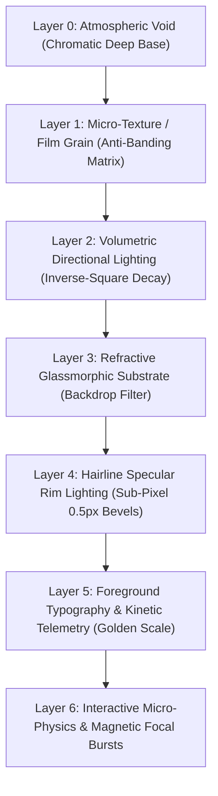

# Fable Cinematic Design Engine Reference Manual
## Extreme-Craft Visual Physics, Haute Typographies, Spatial Choreography & Anti-Slop Cognitive System

`Fable Cinematic Design Engine` is a dedicated **Domain Cognitive Gear (`domain: "design"`)** within Fable Mode. It activates autonomously whenever a task involves visual interface design, frontend development, generative UI, 3D WebGL scenes, design systems, editorial layouts, or creative computing.

It completely eliminates generic AI tropes ("slop") and elevates digital design to the caliber of Awwwards Site-of-the-Year winners, luxury hardware interfaces (Teenage Engineering, Bang & Olufsen, Leica, Apple Pro), high-concept publications (Stripe Press, Wired UK, 032c), and Swiss modernist precision.

---

## 1. The 7-Layer Optical Depth Staging Architecture

Standard AI web design renders flat, 1-layer or 2-layer surfaces. The Fable Cinematic Design Engine constructs all interfaces as a **7-layer physical optical stack**, creating spatial depth, volumetric atmospheric lighting, and refractive material presence.



### Layer Breakdown & Implementation Directives

| Layer | Optical Role | CSS / Shader Implementation |
| :--- | :--- | :--- |
| **Layer 0: Atmospheric Void** | Infinite depth base | `oklch(0.08 0.02 270)` (Obsidian) or `oklch(0.97 0.005 90)` (Bone). Never raw `#000000` or `#ffffff`. |
| **Layer 1: Micro-Grain Texture** | Organic presence & anti-banding | SVG procedural noise filter (`feTurbulence baseFrequency="0.8"`) or SVG data URI with `opacity: 0.035`, `mix-blend-mode: overlay`, `pointer-events: none`. |
| **Layer 2: Volumetric Caustics** | Directional depth & spatial warmth | `radial-gradient(circle at 50% 0%, oklch(0.65 0.20 250 / 0.12) 0%, transparent 70%)` with inverse-square falloff ($I \propto 1/d^2$). |
| **Layer 3: Refractive Substrate** | Frosted physical glass planes | `backdrop-filter: blur(20px) saturate(180%)`, background: `oklch(0.12 0.01 270 / 0.65)`. |
| **Layer 4: Hairline Specular Rims** | Precision edge definition | `border: 0.5px solid oklch(1 0 0 / 0.12)` + `box-shadow: inset 0 1px 0 0 oklch(1 0 0 / 0.18), 0 12px 32px -4px oklch(0 0 0 / 0.35)`. |
| **Layer 5: Fluid Typography** | Hierarchical signal | Golden-ratio clamp typography (`clamp(...)`), variable font axes (`opsz`, `wght`), micro-kerning, tabular telemetry. |
| **Layer 6: Micro-Physics** | Tactile responsiveness | Newtonian damped spring transformations ($F = -kx - c\dot{x}$), magnetic button attraction, and smooth cursor parallax. |

---

## 2. The 6 Haute Aesthetic Archetypes

Instead of defaulting to generic AI templates, the Design Engine selects from 6 discrete aesthetic universes based on brief inference:

```
+──────────────────────────────────────────────────────────────────────────────────+
|                       THE 6 HAUTE AESTHETIC UNIVERSES                            |
+──────────────────────────────────────────────────────────────────────────────────+
| 1. CYBER-OBSIDIAN MONOLITH  │ Dark industrial aerospace, hairline vectors, high-  |
|    (Teenage Eng. / Avionics) │ voltage spectral accents (Luminescent Cyan/Lime).   |
├─────────────────────────────┼────────────────────────────────────────────────────┤
| 2. HAUTE EDITORIAL MODERNISM│ Asymmetric 1.618:1 negative space, 0.5px rules,      |
|    (Stripe Press / Journal) │ PP Editorial New + Söhne, dramatic drop quotes.    |
├─────────────────────────────┼────────────────────────────────────────────────────┤
| 3. SWISS PRECISION & VIGNELLI Pure mathematical grid, extreme scale contrast,     |
|    (Braun / Leica / Massimo) │ monochrome + International Red/Blue single accent. |
├─────────────────────────────┼────────────────────────────────────────────────────┤
| 4. KINETIC SPATIAL HUD      │ Containerless telemetry ribbons, live scanlines,   |
|    (Cyber Terminal / Scifi) │ sub-pixel badge pills, Geist Mono + Instrument.    |
├─────────────────────────────┼────────────────────────────────────────────────────┤
| 5. NEO-NORDIC FLUIDITY      │ Deep pine, sand bone, warm amber, smooth pebble    |
|    (Bang & Olufsen / Aalto) │ curves (rounded-3xl), organic tactile warmth.       |
├─────────────────────────────┼────────────────────────────────────────────────────┤
| 6. COLD CHROMATIC BRUTALISM │ Exposed coordinate indices ([01] // INDEX), high-   |
|    (Balenciaga / 032c)      │ contrast raw manifestos, Druk Wide + Monument Mono.|
+──────────────────────────────────────────────────────────────────────────────────+
```

---

## 3. Golden-Ratio Fluid Typography & Variable Font Choreography

### Fluid Scale Formula
$$\text{FontSize}(V) = \text{clamp}\left(S_{\min},\, S_{\min} + (S_{\max} - S_{\min}) \cdot \left(\frac{V - V_{\min}}{V_{\max} - V_{\min}}\right),\, S_{\max}\right)$$

Where $V_{\min} = 375\text{px}$ and $V_{\max} = 1440\text{px}$.

### Curated Fluid Typographic Scale Tokens

| Token | Min Size ($375\text{px}$) | Max Size ($1440\text{px}$) | CSS Clamp Declaration | Tracking | Leading |
| :--- | :--- | :--- | :--- | :--- | :--- |
| `--font-display-hero` | `2.75rem` (44px) | `6.50rem` (104px) | `clamp(2.75rem, 1.43rem + 5.63vw, 6.50rem)` | `-0.04em` | `0.92` |
| `--font-display-h1` | `2.00rem` (32px) | `4.25rem` (68px) | `clamp(2.00rem, 1.21rem + 3.38vw, 4.25rem)` | `-0.03em` | `1.00` |
| `--font-display-h2` | `1.50rem` (24px) | `2.75rem` (44px) | `clamp(1.50rem, 1.06rem + 1.88vw, 2.75rem)` | `-0.025em` | `1.10` |
| `--font-heading-h3` | `1.25rem` (20px) | `1.875rem` (30px) | `clamp(1.25rem, 1.03rem + 0.94vw, 1.875rem)` | `-0.015em` | `1.25` |
| `--font-body-lead` | `1.0625rem` (17px) | `1.25rem` (20px) | `clamp(1.0625rem, 0.99rem + 0.28vw, 1.25rem)` | `-0.01em` | `1.50` |
| `--font-body-base` | `0.9375rem` (15px) | `1.0625rem` (17px) | `clamp(0.9375rem, 0.89rem + 0.19vw, 1.0625rem)` | `0.00em` | `1.60` |
| `--font-caption-sm` | `0.8125rem` (13px) | `0.875rem` (14px) | `clamp(0.8125rem, 0.79rem + 0.09vw, 0.875rem)` | `+0.02em` | `1.40` |
| `--font-mono-telemetry`| `0.6875rem` (11px) | `0.8125rem` (13px) | `clamp(0.6875rem, 0.64rem + 0.19vw, 0.8125rem)` | `+0.16em` | `1.20` |

---

## 4. Newtonian Spring Motion Physics & Gesture Choreography

All transitions are governed by 2nd-order damped harmonic oscillators:
$$m \frac{d^2 x}{dt^2} + c \frac{dx}{dt} + k x = 0, \qquad \zeta = \frac{c}{2\sqrt{mk}}$$

### Production Spring Presets

```typescript
export const springPresets = {
  // Snappy Micro-Spring: Micro-buttons, badges, toggle switches
  snappy: { stiffness: 380, damping: 28, mass: 1, zeta: 0.72 },
  
  // Critically Damped: Modal dialogues, drawers, navigation switches (Zero overshoot)
  modal: { stiffness: 280, damping: 33.5, mass: 1, zeta: 1.00 },
  
  // Liquid Velvet Float: Scroll parallax, cursor follow, layout morphs
  velvet: { stiffness: 140, damping: 18, mass: 1, zeta: 0.88 },
  
  // Heavy Magnetic Snap: Drag-and-drop docking, card snapping
  magnetic: { stiffness: 450, damping: 36, mass: 1.2, zeta: 0.77 }
};
```

---

## 5. System 2/3 Design TRIZ Contradiction Matrix

| Contradiction | Improving Parameter | Worsening Parameter | TRIZ Principles Applied | Breakthrough Resolution |
| :--- | :--- | :--- | :--- | :--- |
| **Richness vs Performance** | Visual Depth & Glassmorphism | Frame Latency / GPU Budget | Principle 1 (Segmentation), Principle 36 (Phase Transition) | Hardware compositor layers (`transform: translate3d(0,0,0)`), CSS `backdrop-filter` isolation, `@media (prefers-reduced-transparency)` automatic fallback. |
| **Density vs Clarity** | Information Throughput | Cognitive Clutter | Principle 7 (Nested Doll), Principle 17 (Transition into New Dimension) | Monospace telemetry ribbons with progressive disclosure hover-slices and HUD overlays. |
| **High Art vs Accessibility** | Avant-Garde Contrast & Drama | WCAG AAA / APCA Compliance | Principle 19 (Periodic Action), Principle 32 (Color Changes) | APCA $L_c \ge 75$ mathematical luminance mapping ensuring AAA compliance across all OKLCH coordinates. |

---

## 6. The Anti-AI-Slop Strict Elimination Checklist

Before finalizing any UI, verify the code passes the strict anti-slop audit:
1. ❌ **No Purple Glow Blobs**: No generic `bg-gradient-to-tr from-purple-500 to-indigo-500 blur-3xl` ambient radial backgrounds.
2. ❌ **No Default Inter/Fraunces Crutch**: Default font must match the chosen Haute Archetype.
3. ❌ **No 3-Card Centered Boilerplates**: Use asymmetric $5/7$ or $8/4$ bento grids or containerless telemetry strips.
4. ❌ **No Fake Div Screenshots**: Use genuine interactive components or generated photorealistic assets.
5. ❌ **No LLM Buzzwords**: Zero instances of *"Supercharge your workflow"*, *"Next-gen AI"*, or *"Delve into seamless ecosystems"*.
