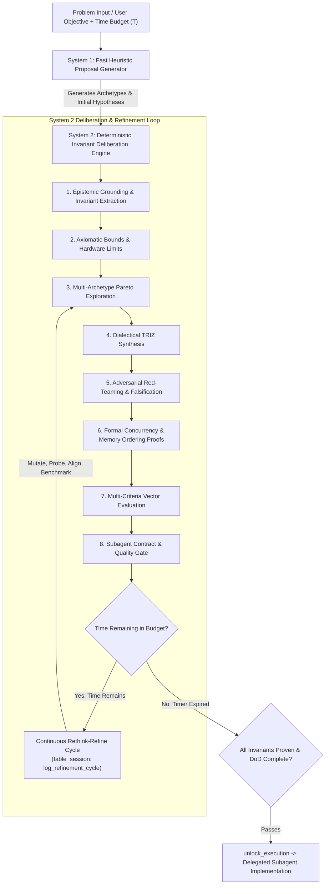

# Cognitive Protocol, Deterministic System 2 Deliberation & Epistemic Calibration

This reference outlines the dual-process cognitive architecture, compute-scaling heuristics, the **Unbypassable Mechanical Time-Lock**, the **Continuous Rethink-Refine Loop (`log_refinement_cycle`)**, full terminal/artifact privileges during thinking, and anti-hallucination epistemic calibration that empower any model to deliberate with the depth and rigor of Claude Fable 5 `xhigh`.

--------------------------------------------------------------------------------

## 1. Dual-Process Cognitive Architecture (System 1 vs System 2)

Fable-mode structures all problem solving around the **Dual-Process Cognitive Model (Kahneman System 1 vs. System 2)**:

| Attribute | System 1 (Intuitive & Generative) | System 2 (Deliberative & Invariant-Verifying) |
| :--- | :--- | :--- |
| **Speed & Mode** | Fast, associative, single-pass forward generation. | Slow, deterministic, analytical invariant verification. |
| **Primary Output** | Action proposals, initial hypotheses, candidate archetypes. | Formal invariant proofs, TRIZ contradiction resolutions, verified blueprints. |
| **Cognitive Risks** | Hallucinations, premature convergence, rush-to-code bias. | Requires dedicated time budgets and structured pacing. |
| **Operational Role** | Generates diverse candidate archetypes and initial hypotheses. | Verifies axioms, injects counter-examples, eliminates compromises, proves safety. |



--------------------------------------------------------------------------------

## 2. The Unbypassable Mechanical Time-Lock

A fundamental vulnerability of LLM-based autonomous agents is the **"Rush-to-Code" Cognitive Bias**—the tendency of models to converge on the first superficially plausible implementation within 60–120 seconds, bypassing rigorous edge verification, memory topology alignment, and concurrency proofs.

To solve this permanently, Fable-mode introduces the **Unbypassable Mechanical Time-Lock**:

1. **Deterministic Engine Enforcement**:
   - When the user allocates a duration budget (e.g. `30 mins`, `40 mins`, `4 hours`), the engine records the deadline: $t_{\text{deadline}} = t_{\text{start}} + T_{\text{budget}}$.
   - The primary tool `unlock_execution` strictly evaluates $t_{\text{current}} \ge t_{\text{deadline}}$.
   - If invoked prematurely, `unlock_execution` rejects with a **hard error**.
2. **AI Anti-Opposition Invariant**:
   - The AI **cannot oppose, bypass, skip, or complain** about the allocated duration.
   - The model must treat the time budget not as a delay, but as an expansive intellectual canvas for radical depth, thoroughness, and refinement compounding.
3. **Productive Compute Utilization**:
   - During the time-lock, the AI does not sit idle. It actively performs live terminal probes, AST analyses, scratch micro-benchmarks, and continuous rethink-refine cycles.

--------------------------------------------------------------------------------

## 3. Full Terminal & Artifact Privileges During Thinking

During the time-lock window (Phases 1, 2, and 3), the agent holds full privileges to interact with the environment and author artifacts:

```
┌───────────────────────────────────────────────────────────────────────────────┐
│                    ANTIGRAVITY PERMISSION MATRIX (PHASES 1-3)                 │
├────────────────────────────────┬────────────┬─────────────────────────────────┤
│ Capability / Tool              │ Status     │ Operational Guidance            │
├────────────────────────────────┼────────────┼─────────────────────────────────┤
│ Terminal Commands (run_command)│ 🟢 PERMITTED│ Benchmarks, AST, scratch probes │
│ Brain Artifacts (brain/<id>/*) │ 🟢 PERMITTED│ Blueprints, trade-off matrices  │
│ Scratch Files (scratch/*)      │ 🟢 PERMITTED│ Isolated test harnesses         │
│ Read Tools (view_file, grep)   │ 🟢 PERMITTED│ Deep codebase inspection        │
│ fable_session (MCP logging)    │ 🟢 PERMITTED│ log_refinement_cycle, invariants│
│ Project Codebase Modifications │ 🔴 LOCKED   │ Locked until timer elapses      │
└────────────────────────────────┴────────────┴─────────────────────────────────┘
```

- **Live Terminal Probing (`run_command`)**: Test compiler capabilities, check library feature flags (`cargo check --features ...`), analyze AST dumps, run CPU topology scripts, or compile temporary benchmark binaries in scratch paths.
- **Brain Artifact Authoring (`<appDataDir>\brain\<conversation-id>/`)**: Draft detailed architectural blueprints, state machine diagrams, 10D trade-off tables, and adversarial test harness definitions before generating project code.

--------------------------------------------------------------------------------

## 4. Continuous Rethink-Refine Cognitive Loop (`log_refinement_cycle`)

Even when the model believes it has finished thinking, it **MUST continue refinement passes (`rethink, refine, rethink, refine`)** as long as time remains on the budget clock:

### Refinement Cycle Protocol:
1. **Identify Refinement Vector**: Select one of the 6 core focus areas:
   - `archetype_mutation`: Generate alternative radical topologies (e.g. converting a mutex-guarded queue to an atomic ring buffer with hazard pointers).
   - `falsification_probe`: Construct hostile edge cases (thread preemption during slot allocation, out-of-order store visibility).
   - `cache_line_alignment`: Analyze 64-byte L1 cache-line boundaries and false sharing padding (`#[repr(align(64))]`).
   - `invariant_stress_test`: Trace state machine transitions across Byzantine failure modes.
   - `terminal_probe`: Execute isolated CLI benchmark scripts via `run_command` to measure memory/CPU overhead.
   - `proof_tightening`: Convert informal rationales into formal mathematical or Acquire-Release proofs.
2. **Execute Refinement & Measure Delta**: Formulate the refinement and evaluate its concrete performance, safety, or simplicity delta.
3. **Log Cycle to MCP**: Call `fable_session` with `action: "log_refinement_cycle"`, logging the cycle index, focus area, and delta improvement.

--------------------------------------------------------------------------------

## 5. The Epistemic Calibration Framework

A primary failure mode of standard AI reasoning is the conflation of **internal statistical familiarity** with **empirical ground truth**. Fable-mode enforces strict epistemic labeling during all internal deliberation, session logging, and external communication:

| Epistemic Tag | Meaning | Operational Rule |
| :--- | :--- | :--- |
| **`[PROVEN]`** | Fact verified through live tool execution (`view_file`, `grep_search`, `run_command`, compiler output, or test execution). | Can be used as a hard foundational constraint in design. |
| **`[HYPOTHESIS]`** | Inferred behavior, design proposition, or unverified library assumption. | Must undergo an explicit verification step before committing to implementation. |
| **`[UNKNOWN]`** | Missing parameter, ambiguous edge requirement, or unmeasured latency/memory budget. | Must be explicitly probed via search, benchmarks, or structured clarification. |

### The Epistemic Hygiene Rules:
1. *Never build an architectural commitment on top of an unverified `[HYPOTHESIS]` when live validation tools are available.*
2. *Every critical requirement must trace back to a `[PROVEN]` ground-truth item or an explicitly verified invariant.*
3. *Log all key epistemic classifications into the `fable-engine` MCP session state via `log_epistemic_item`.*

--------------------------------------------------------------------------------

## 6. The 8-Pass Maximum-Depth System 2 `<thinking>` Chain

For any non-trivial engineering decision or architecture blueprint, the model chains **8 exhaustive thinking passes** within its internal `<thinking>` token budget:

```
Pass 1: Epistemic Deconstruction & Invariant Tagging
  - Parse inputs, explicit limits, user time budget T, and hidden constraints.
  - Tag domain: Architecture, Design, or Coding.
  - Classify statements into [PROVEN], [HYPOTHESIS], and [UNKNOWN].
  - Extract hard binary invariants that must hold under 100% of execution paths.

Pass 2: Axiomatic Lower Bounds & Hardware Topology
  - Theoretical minimum memory copies, cache-line barriers (64-byte alignment), synchronization lower bounds.
  - Establish hard structural constraints before proposing any design.

Pass 3: Multi-Archetype Generation (Zero-Rush Exploration)
  - Formulate Archetype A (Conservative / Battle-tested).
  - Formulate Archetype B (Zero-Overhead / Performance-maximal).
  - Formulate Archetype C (Decoupled / Asymmetric / Event-driven).
  - Formulate Counter-Example D (Adversarial stress challenge).

Pass 4: Dialectical Contradiction Resolution (TRIZ)
  - Identify core trade-off contradictions (Latency vs Consistency, Memory vs Throughput).
  - Merge superior traits using TRIZ operators (Time, Space, Asymmetry, Inversion) to eliminate compromises.

Pass 5: Adversarial Red-Teaming & Falsification Probing
  - Proactively attack the synthesized model with thread preemption, ABA anomalies, cache false sharing, memory leaks, and Byzantine failures.
  - Reject candidates failing any invariant.

Pass 6: Concurrency, Memory Model & Formal Invariant Proofs
  - Write explicit mathematical / formal proofs of safety (Acquire-Release ordering, lock-free progress guarantees).
  - Record verified invariants into session state (`record_invariant`).

Pass 7: Multi-Criteria Vector Evaluation & Epistemic Audit
  - Benchmark across specialized domain criteria:
    * Architecture: Invariants (30%), Perf (25%), Blast Radius (20%), Ergonomics (15%), Security (10%)
    * Design: Type Safety (30%), Data Layout (25%), Ergonomics (25%), Extensibility (20%)
    * Coding: Correctness (35%), Complexity (25%), Concurrency (25%), Elegance (15%)
  - Compute weighted composite score and verify all gates pass.

Pass 8: Blueprint Synthesis, Subagent Delegation Contracts & Quality Gate
  - Formulate unambiguous, bounded implementation contracts for the Coder Subagent Fleet (`type: self`).
  - Specify file targets, exact type signatures, and local unit test validation criteria.
  - If time remains, enter Continuous Rethink-Refine Loop (log_refinement_cycle).
  - Trigger `unlock_execution` on `fable-engine` MCP once time budget elapses and DoD is verified.
```

--------------------------------------------------------------------------------

## 7. Cognitive Anti-Patterns & Defenses

| Anti-Pattern | Description | Fable-Mode Defense |
| :--- | :--- | :--- |
| **Main Agent Writing Code Directly** | Main agent attempting to write/edit code files directly, cluttering its reasoning context. | **Strict Cognitive Separation**: Main agent performs architecture, design, and System 2 planning; 100% of project code writing is delegated to subagents. |
| **Premature Exit / Time-Lock Frustration** | AI attempting to exit thinking early or complaining about remaining budget time. | **Mechanical Time-Lock**: `unlock_execution` rejects early calls. AI enters Continuous Rethink-Refine Loop (`log_refinement_cycle`). |
| **Passive Idling during Time Budget** | AI sitting idle without productive output while waiting for the timer to expire. | **Active Refinement & Terminal Probing**: Run live benchmarks via `run_command`, profile cache layouts, and log refinement cycles. |
| **Shallow / Single-Pass Thinking** | Emitting an answer after only 1 quick thought pass. | **8-Pass `<thinking>` Chain**: Execute all 8 distinct thinking passes to maximize test-time compute. |
| **Hallucinated Claims / Assumptions** | Treating plausible assumptions as ground truth without tool verification. | **Epistemic Calibration**: Rigorous classification into `[PROVEN]`, `[HYPOTHESIS]`, and `[UNKNOWN]`. |
| **Premature Convergence** | Picking the first standard library or framework pattern that comes to mind. | Mandatory System 2 generation of 3+ diverse architectural archetypes before selection. |
| **Symptom Patching** | Fixing an error message without understanding the underlying state corruption. | Execute root-cause isolation: identify invariant breach, not just stack trace line. |
| **Optimistic Bias** | Assuming networks are instant, disks never corrupt, and concurrent writes never interleave. | Mandatory Red-Team Pass injecting Byzantine faults, thread preemption, and memory barriers. |
| **Framework Cargo-Culting** | Adding complex third-party dependencies when simple first-principles primitives suffice. | Axiomatic deconstruction: build on primitives unless library offers verified net win. |


