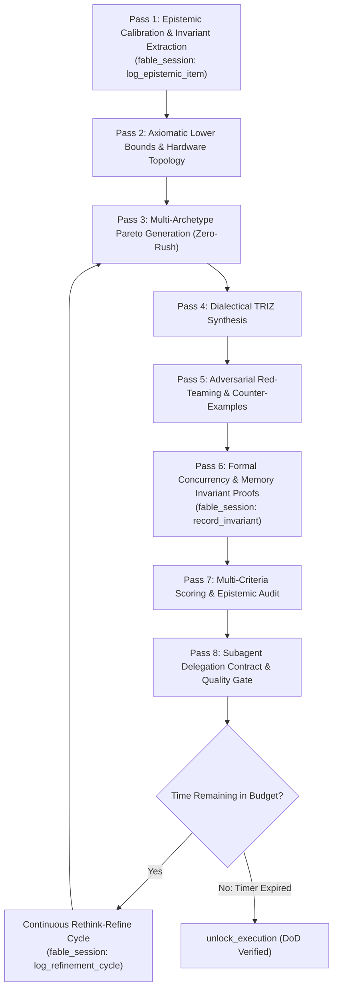

# DeepThink Mode: 8-Pass Maximum-Depth Deliberation & System 2 Engine

This reference provides the formal specification for **DeepThink Mode** in `fable-mode`—an extreme-depth internal cognitive engine that scales `<thinking>` test-time compute to the maximum capacity through **8 recursive thinking passes chained in a single run**, the **Unbypassable Mechanical Time-Lock**, the **Continuous Rethink-Refine Loop (`log_refinement_cycle`)**, full terminal/artifact privileges, and seamless integration with the `fable-engine` MCP server (`fable_session`).

--------------------------------------------------------------------------------

## 1. The 8-Pass Maximum-Depth `<thinking>` Architecture

In `fable-mode`, the agent does not settle for a single shallow thought pass. Instead, it chains **8 distinct, exhaustive thinking passes** inside its internal `<thinking>` process for every non-trivial decision, maximizing token depth and cognitive rigor:

```
┌──────────────────────────────────────────────────────────────────────────────────┐
│                   8-PASS MAXIMUM-DEPTH RECURSIVE <THINKING> CHAIN                 │
│                                                                                  │
│  [PASS 1] Epistemic Calibration & Invariant Extraction                           │
│     └── Deconstruct inputs, label [PROVEN]/[HYPOTHESIS]/[UNKNOWN], define bounds │
│         (Feeds into fable_session: log_epistemic_item)                           │
│                                                                                  │
│  [PASS 2] Axiomatic Lower Bounds, Memory Topology & Hardware Constraints         │
│     └── Theoretical minimum copies, cache line boundaries, barrier lower bounds  │
│                                                                                  │
│  [PASS 3] Multi-Archetype Pareto Exploration (Candidate Generation)              │
│     └── Formulate 3-5 distinct paradigms (Axiomatic, Archetype, Asymmetric)      │
│                                                                                  │
│  [PASS 4] Dialectical TRIZ Contradiction Resolution                              │
│     └── Apply TRIZ operators (Time, Space, Asymmetry, Inversion) to kill trade-offs│
│                                                                                  │
│  [PASS 5] Adversarial Red-Teaming & Falsification Probing                        │
│     └── Attack design with race conditions, ABA anomalies, Byzantine failures    │
│                                                                                  │
│  [PASS 6] Concurrency, Memory Model & Formal Invariant Proofs                    │
│     └── Formal Acquire-Release ordering proofs, lock-free safety proofs          │
│         (Feeds into fable_session: record_invariant)                             │
│                                                                                  │
│  [PASS 7] Multi-Criteria Vector Evaluation & Epistemic Audit                     │
│     └── Score Correctness (35%), Performance (25%), Concurrency (25%), Elegance  │
│                                                                                  │
│  [PASS 8] Blueprint Synthesis, Subagent Delegation Contracts & Quality Gate      │
│     └── Formulate precise, bounded implementation contracts for Coder Subagents  │
│                                                                                  │
│  [CONTINUOUS REFINEMENT LOOP] (Passes 9..N / Cycles 1..K while time remains)     │
│     └── Mutate archetypes, run terminal probes (run_command), tighten proofs     │
│         (Feeds into fable_session: log_refinement_cycle)                         │
└──────────────────────────────────────────────────────────────────────────────────┘
```



--------------------------------------------------------------------------------

## 2. Exhaustive Specification of the Thinking Passes

### Pass 1: Epistemic Calibration & Invariant Extraction
- **Focus**: Parse problem entropy, requirements, and user time budget ($T_{\text{budget}}$).
- **Actions**:
  - Classify every statement into `[PROVEN]` (ground truth), `[HYPOTHESIS]` (assumptions), and `[UNKNOWN]` (unmeasured parameters).
  - Extract hard binary invariants that must hold under 100% of execution paths.
  - Log confirmed facts and open hypotheses to `fable_session` via `log_epistemic_item`.

### Pass 2: Axiomatic Lower Bounds, Memory Topology & Hardware Constraints
- **Focus**: Physical and computational limits.
- **Actions**:
  - Compute theoretical lower bounds: minimum memory allocations, cache line boundaries (64-byte alignment), synchronization overhead, and network roundtrips.
  - Establish hard structural constraints before exploring designs.

### Pass 3: Multi-Archetype Pareto Exploration (Zero-Rush Rule)
- **Focus**: Generate 3–5 radically distinct architectural archetypes.
- **Actions**:
  - **Archetype A (Battle-tested / Conservative)**: Established idioms, maximal safety.
  - **Archetype B (Zero-Overhead / Performance-maximal)**: Lock-free, zero-alloc, cache-friendly.
  - **Archetype C (Asymmetric / Event-driven / Decoupled)**: Channel/actor-based, bounded queues.
  - **Archetype D / Counter-Example (Adversarial stress challenge)**: Hostile edge-case stress candidate.

### Pass 4: Dialectical TRIZ Contradiction Resolution
- **Focus**: Eliminate engineering compromises.
- **Actions**:
  - Identify core contradictions (e.g. Low Latency vs Strong Consistency; High Throughput vs Low Memory).
  - Apply software TRIZ operators (Separation in Time, Separation in Space, Dynamic Transformation, Inversion) to synthesize a breakthrough hybrid.

### Pass 5: Adversarial Red-Teaming & Falsification Probing
- **Focus**: Proactively destroy weak hypotheses.
- **Actions**:
  - Inject extreme edge cases: thread preemption between instructions, ABA problem, cache line false sharing, buffer overflow, network partition, and memory exhaustion.
  - Reject any candidate that fails an invariant under adversarial conditions.

### Pass 6: Concurrency, Memory Model & Formal Invariant Proofs
- **Focus**: Formal correctness and memory ordering.
- **Actions**:
  - Write explicit mathematical or formal proofs of safety (e.g., Sequentially Consistent vs Acquire-Release semantics, lock-free progress guarantees: wait-free vs lock-free vs obstruction-free).
  - Persist verified invariants to session state via `fable_session` action `record_invariant`.

### Pass 7: Multi-Criteria Vector Evaluation & Epistemic Audit
- **Focus**: Quantitative evaluation across domain vectors.
- **Actions**:
  - **Architecture**: Invariants ($30\%$), Performance ($25\%$), Blast Radius ($20\%$), Ergonomics ($15\%$), Security ($10\%$).
  - **Design**: Type Safety ($30\%$), Data Layout ($25\%$), Ergonomics ($25\%$), Extensibility ($20\%$).
  - **Coding**: Correctness ($35\%$), Complexity ($25\%$), Concurrency ($25\%$), Elegance ($15\%$).
  - Audit all score vectors to verify zero unresolved risks remain.

### Pass 8: Blueprint Synthesis, Subagent Delegation Contracts & Quality Gate
- **Focus**: Actionable execution contract and transition management.
- **Actions**:
  - Formulate precise, bounded implementation instructions for the Subagent Fleet (`type: self`).
  - Specify target file paths, exact type signatures, invariant checks, and unit tests to run.
  - Check time budget: if $t_{\text{current}} < t_{\text{deadline}}$, transition immediately into the **Continuous Rethink-Refine Loop**; do not attempt premature unlock.

### Passes 9..N: Continuous Rethink-Refine Cycles (`log_refinement_cycle`)
- **Focus**: Continuous intellectual compounding and empirical validation while time remains.
- **Actions**:
  - Execute terminal probes (`run_command`) to empirically benchmark candidate algorithms in scratch directories.
  - Mutate data layouts to optimize CPU cache alignment (`#[repr(align(64))]`).
  - Log each cycle's delta improvement to `fable_session` via `log_refinement_cycle`.

--------------------------------------------------------------------------------

## 3. Unbypassable Mechanical Time-Lock & DeepThink Privileges

1. **Mechanical Lockout**:
   - `unlock_execution` strictly enforces $t_{\text{current}} \ge t_{\text{deadline}}$.
   - DeepThink mode embraces the time budget to unlock unprecedented depth.
2. **Antigravity Permission Matrix During DeepThink**:
   - **Terminal Commands (`run_command`)**: 🟢 **FULLY AUTHORIZED & ENCOURAGED**. Run benchmarks, compiler checks, and AST analysis.
   - **Brain Artifacts (`brain/<conversation-id>/*`)**: 🟢 **FULLY AUTHORIZED & ENCOURAGED**. Author rich implementation plans and diagrams.
   - **Project Repository Edits**: 🔴 **STRICTLY LOCKED** until time-lock elapses and `unlock_execution` succeeds.

--------------------------------------------------------------------------------

## 4. Synergy: DeepThink + `fable_session` Engine

The DeepThink engine works in tight synergy with the `fable-engine` MCP server:
1. **Internal Deep Deliberation**: Chained recursive `<thinking>` passes power qualitative reasoning, axiomatic bounding, and formal proofs.
2. **Deterministic Session State**: `fable_session` persists epistemic logs, verified invariants, active timers, refinement cycles, and phase transitions directly to disk WAL.
3. **Strict Quality Gate**: Code writing tools remain locked until the mechanical time-lock expires, all invariants are recorded, and `unlock_execution` formally verifies the Definition of Done (DoD).

--------------------------------------------------------------------------------

## 5. When to Trigger the 8-Pass Engine

Execute the full 8-Pass `<thinking>` Chain and continuous refinement loops for:
- System architecture and module boundaries
- Lock-free, concurrent, or distributed data structures
- High-stakes security, crypto, or kernel-level design
- Deep debugging of elusive race conditions or memory leaks
- Any task running under `/deepthink`, `/fable`, or time-budgeted `/goal` runs


