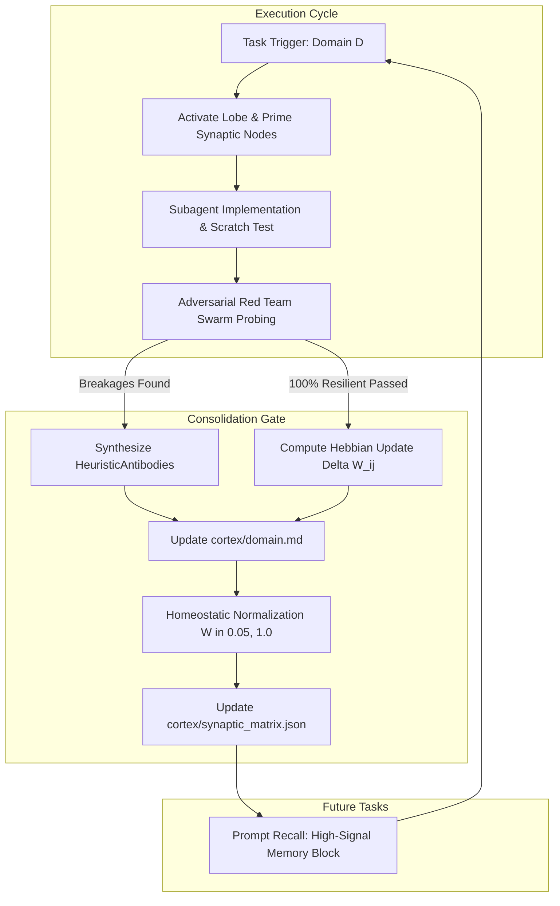

# Hebbian Cortical Plasticity & Lifelong Neuro-Evolutionary Engine

> [!IMPORTANT]
> **Modular Fable Part 2 Core Blueprint**: Replaces static, amnesiac context windows and fragile vector retrieval with persistent, living domain lobes. Incorporates biological Hebbian plasticity ($\Delta W_{ij} = \eta \cdot \text{Score} \cdot (A_i \cdot A_j)$) and homeostatic synaptic normalization to permanently evolve specialization in Rust, Python, Design/3D, Research, and Concurrency on the local workstation.

---

## 1. The Core Philosophy: Why Vector RAG Fails vs. Persistent Cortical Plasticity

Traditional Retrieval-Augmented Generation (RAG) models and naive embedding search suffer from acute systemic flaws when applied to agentic code generation and complex engineering:

| Dimension | Traditional Vector RAG / Chunk Embeddings | Hebbian Cortical Plasticity Engine |
| :--- | :--- | :--- |
| **Cognitive Paradigm** | Stateless string similarity; retrieves text fragments based on superficial cosine distance in latent space. | Dynamic biological synaptic wiring; co-activates verified tools, heuristics, and invariants based on real execution history. |
| **Semantic Drift** | Prone to false analogies; irrelevant snippets pollute context when token similarity $\neq$ logical truth. | Zero drift; associations are locked to empirically verified unit test pass rates and compiler successes. |
| **Immunological Memory** | Amnesiac across runs; repeatedly falls into the same fatal bugs, deadlocks, and anti-patterns. | Synthesizes permanent `HeuristicAntibody` defenses directly from Red-Team adversarial scars. |
| **Plasticity & Scaling** | Static index or expensive fine-tuning; cannot safely adapt without catastrophic forgetting. | Continuous lifelong neuro-evolution; homeostatic normalization bounds weights within $[0.05, 1.0]$. |
| **Prompt Signal-to-Noise** | Floods context window with 10k+ tokens of verbose documentation. | Injects high-signal, laser-focused Markdown memory blocks directly into agent prompts. |

Donald Hebb's fundamental postulate (1949)—*"When an axon of cell A is near enough to excite cell B and repeatedly or persistently takes part in firing it, some growth process or metabolic change takes place in one or both cells such that A's efficiency, as one of the cells firing B, is increased"*—is adapted here into a computational cognitive architecture.



---

## 2. The 5 Specialized Domain Lobes

Fable-Mode partitions its cortical architecture into 5 persistent lobes located in `skills/fable-mode/cortex/`:

### 1. `rust.md` — Systems Invariants & Zero-Cost Abstractions
- **Ownership Semantics**: Uncompromising adherence to single-writer / multiple-reader invariants without `RefCell` crutches.
- **Pin / Unpin Projections**: Safe handling of self-referential futures and async state machine transformations.
- **Tokio Thread Barriers**: Enforces `Send + 'static` on cross-task spawns; strictly bans `std::sync::MutexGuard` held across `.await` points.
- **Unsafe Auditing**: Demands formal `// SAFETY:` proofs addressing pointer validity, alignment, provenance, and non-aliasing under Miri.

### 2. `python.md` — High-Performance CPython & Modern Typing
- **Async Event Loop Health**: Mandatory `asyncio.TaskGroup` usage (Python 3.11+) and cancellation signal propagation (`CancelledError`).
- **Free-Threaded CPython 3.13 (nogil)**: Thread-safe memory primitives without reliance on implicit GIL bytecode atomicity.
- **Structural Subtyping**: Decoupled systems through `typing.Protocol` and `@runtime_checkable`.
- **Memory Efficiency**: Explicit `__slots__` enforcement and zero-copy `memoryview` slicing for high-throughput buffers.

### 3. `design_3d.md` — Haute Aesthetics & WebGPU Engineering
- **Three.js & WebGPU**: Node shaders with Three Shading Language (TSL) and storage buffers.
- **Physics Pacing**: Fixed 120Hz physics accumulator decoupled from frame ticks, utilizing $\alpha$ interpolation.
- **Fluid Typography**: Golden-ratio responsive clamping (`clamp()`) guaranteeing zero Cumulative Layout Shift (CLS).
- **Newtonian Motion**: Natural spring physics ($k=170, c=26$) eliminating artificial linear transitions.
- **Frame Budget Allocation**: Zero heap allocation during render loop; pre-allocated scratch vectors to prevent GC frame drops.

### 4. `research.md` — First-Principles Epistemics & Causal Derivation
- **First-Principles Synthesis**: Reduction of empirical claims to fundamental algorithmic and mathematical truths.
- **Counterfactual Citation Grounding**: Primary DOI and arXiv triangulation; elimination of phantom references.
- **TRIZ Contradiction Resolution**: Identification of latent boundary conditions to synthesize opposing architectural claims.
- **Causal DAG Modeling**: Pearlian do-calculus and back-door criterion verification to prevent collider bias.

### 5. `concurrency.md` — Lock-Free Synchronization & Race Hardening
- **Atomic CAS Loops**: Dynamic `compare_exchange_weak` loops resilient against spurious LL/SC retries.
- **Memory Ordering**: Tailored Acquire-Release pairs avoiding unnecessary global `SeqCst` overhead.
- **ABA Hazard Prevention**: Tagged pointers and epoch-based hazard pointer reclamation.
- **TOCTOU Elimination**: Unified atomic operations across state verification and mutation steps.

---

## 3. Mathematical Formulation: Synaptic Learning & Homeostasis

### Hebbian Weight Delta
When a task within domain $D$ executes, co-activated tools, subagent engines, and domain concepts $i$ and $j$ experience a synaptic weight adjustment governed by:

$$\Delta W_{ij} = \eta \cdot \text{Score} \cdot (A_i \cdot A_j)$$

Where:
- $\eta = 0.10$: The learning rate coefficient.
- $\text{Score} \in [0.20, 1.00]$: Quantitative success metric. Tasks passing all verification and Red-Team gates receive $\text{Score} = 1.00$; partial or remediated runs receive lower scores.
- $A_i, A_j \in [0.0, 1.0]$: Activation levels of nodes $i$ and $j$ during the execution episode ($A = 1.0$ when actively utilized).

For connections between the master domain lobe $D$ and active tool $i$:

$$\Delta W_{Di} = \eta \cdot \text{Score} \cdot (A_D \cdot A_i) = 0.10 \cdot \text{Score}$$

### Homeostatic Normalization
Unchecked Hebbian learning leads to runaway synaptic excitation where weights saturate at maximum values. In accordance with neurobiological homeostatic synaptic plasticity (Turrigiano, 2008), the engine maintains balance through dual mechanisms:

1. **Strict Bounding**:
   Every synaptic weight is strictly clamped to the operational interval:
   $$W_{ij} \in [0.05, 1.00]$$

2. **Network Capacity Scaling**:
   When total synaptic weight within a lobe exceeds maximum capacity $C_{\text{max}} = 25.0$:
   $$W_{ij} \leftarrow W_{ij} \cdot \frac{C_{\text{max}}}{\sum_{k} W_{ik}}$$
   Followed by clamping each weight back into $[0.05, 1.00]$. This guarantees that relative synaptic importance is preserved without saturation.

---

## 4. The Immunological Memory Gate: `HeuristicAntibody`

When the Adversarial Red-Team Swarm (`RedTeamSwarm`) uncovers vulnerabilities (e.g., deadlock under load, TOCTOU race, memory leak, unhandled cancellation), the engine does not merely patch the immediate file. It synthesizes a permanent **Heuristic Antibody**:

```python
@dataclass
class HeuristicAntibody:
    antibody_id: str             # Unique identifier (e.g. ab_rust_mutex_await_deadlock)
    domain: str                  # Target cortical lobe (e.g. rust)
    trigger_condition: str       # High-risk context or AST signature
    lethal_anti_pattern: str     # Code pattern that caused the failure
    prescribed_defense: str      # Exact architectural fix or pattern to enforce
    severity: str = "HIGH"       # CRITICAL, HIGH, MEDIUM, LOW
    source_task_id: str = ""     # Originating task run
    created_at: str = ""         # Timestamp
    verified_counterfactual: str # Attested proof that defense defeated the attack
```

Antibodies are appended directly to the corresponding `cortex/<domain>.md` lobe. Once recorded, the antibody is recalled during every future prompt construction for that domain, preventing the entire agent fleet from ever repeating the mistake.

---

## 5. Prompt Recall Injection Protocol

Before dispatching a subagent or commencing deep deliberation in a specific domain, the Main Agent invokes:

```python
memory_block = plasticity_engine.recall_cortical_context(domain="rust", max_antibodies=5)
```

This compiles a high-density, prompt-ready memory block:

```markdown
### 🧠 Cortical Lobe Memory: `RUST` (Activations: 14)

> [!IMPORTANT]
> Cortical recall retrieved 3 heuristic antibodies and 5 domain invariants.

#### 🛡️ Immunological Heuristic Antibodies (Red-Team Scars)
- **[CRITICAL] Trigger**: Holding std::sync::MutexGuard across an .await suspension point in asynchronous Tokio tasks
  - **Lethal Anti-Pattern**: `let guard = std_mutex.lock().unwrap(); some_async_fn().await; drop(guard);`
  - **Prescribed Defense**: Use tokio::sync::Mutex if the lock must span across await points, or strictly scope std::sync::MutexGuard within a synchronous block before the await point.
  - **Counterfactual**: `tokio-deadlock-detector verified zero thread starvation under 100 concurrent async tasks`

#### ⚡ Specialized Domain Heuristics & Invariants
1. Zero-Cost Abstractions: Iterator chains and monomorphized generics compile to equivalent assembly...
2. Borrow Checker Invariants: Enforce strict single-writer or multiple-reader ownership...

#### 🔗 Strongly-Wired Synaptic Companion Tools & Nodes
- `borrow_checker`: weight `0.9500`
- `tokio`: weight `0.9200`
- `zero_cost_abstractions`: weight `0.9000`
```

---

## 6. Dispatcher API Reference

The Coder Fleet Dispatcher (`fable_v2.coder_fleet.fleet_dispatcher`) exposes the following actions for seamless subagent and host integration:

| Action | Parameters | Return Type | Description |
| :--- | :--- | :--- | :--- |
| `cortical_activate_lobe` | `{"domain": str, "co_activated_nodes": list[str]}` | `CorticalLobe` | Activates domain lobe, increments counter, and primes synaptic weights. |
| `cortical_consolidate_task` | `{"domain": str, "task_id": str, "broken_scenarios": list, "final_passed": bool, "lessons": list, "co_activated_nodes": list}` | `dict` | Executes Hebbian weight updates, normalizes homeostasis, synthesizes antibodies, and commits to disk. |
| `cortical_recall_context` | `{"domain": str, "max_antibodies": int}` | `str` | Generates prompt-ready Markdown memory block. |
| `cortical_inspect_matrix` | `{}` | `dict` | Returns the global cross-domain synaptic co-activation graph. |
