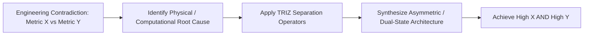

# Innovation Engine & TRIZ Contradiction Matrix

This reference provides the technical methodology for dialectical innovation—transforming seemingly irreconcilable engineering trade-offs into breakthrough architectural solutions.

--------------------------------------------------------------------------------

## 1. The Principle of Non-Compromise

Conventional engineering settles for trade-off compromises:
$$\text{Standard Mindset: } \text{Speed} \longleftrightarrow \text{Safety} \quad (\text{Choose a point on the line})$$

Fable-mode operates on dialectical synthesis (adapted from TRIZ inventive principles):
$$\text{Fable-Mode Mindset: } \text{Thesis (Speed)} + \text{Antithesis (Safety)} \Longrightarrow \text{Breakthrough Synthesis (Speed AND Safety)}$$

--------------------------------------------------------------------------------

## 2. Software TRIZ Contradiction Matrix

Use this matrix whenever two critical requirements are in opposition:

| Contradiction | Root Cause | TRIZ Inventive Operator | Breakthrough Solution Pattern |
| :--- | :--- | :--- | :--- |
| **High Read Throughput vs. Strong Write Consistency** | Global locks block readers while writers mutate shared state. | **Separation in Time / Phase & Asymmetry** | **Read-Copy-Update (RCU) / MVCC / Shadow Copies**: Readers access immutable snapshot zero-lock; writers publish new pointer via atomic swap. |
| **Ultra-Low Latency vs. Rich Extensibility / Plugins** | Dynamic dispatch, virtual calls, and IPC boundaries cause cache misses and context switches. | **Compile-Time Monomorphization & JIT Inlining** | **Static Polymorphism (Rust Generics / C++ Templates / eBPF Sandbox)**: Zero-cost abstractions with inlined plugin byte-code. |
| **Ironclad Memory Safety vs. Zero-Copy Hardware Speed** | Bounds checking and memory copying overhead degrade raw bus throughput. | **Segmentation & Capability Handles** | **Ring-Buffer DMA with Slice Borrows**: Pre-allocated memory pools where ownership tokens pass across threads without byte copies. |
| **Strict Ordering vs. Horizontal Scale** | Single-leader serialization creates a throughput bottleneck. | **Separation in Space (Partition Key Hashing)** | **Partitioned Virtual Actors + Causal Chains**: Strict ordering within hash partitions ($O(1)$ serialized) with concurrent cross-partition scaling. |
| **Rich Observability vs. Zero Overhead** | Collecting logs, traces, and metrics consumes CPU and generates lock contention. | **Ring Buffers & Dynamic Sampling (Inversion)** | **LMAX Lock-Free Telemetry Ring + eBPF Kernel Probes**: Asynchronous off-CPU batch drainers that never stall worker threads. |

--------------------------------------------------------------------------------

## 3. The 4 Universal Innovation Operators

### Operator 1: Separation in Time (Phase Shift)
Separate the conflicting requirements across different execution phases or lifecycle epochs.
* *Example*: **Epoch-Based Garbage Reclamation (EBR)**. High-speed lock-free reads happen during Epoch $E$; deletion and memory deallocation happen asynchronously during Epoch $E+2$ when no reader can possibly hold a pointer.

### Operator 2: Separation in Space (Topology Partitioning)
Distribute the conflicting requirements across distinct physical or logical boundaries.
* *Example*: **NUMA-Aware Thread-Local Storage**. Instead of contending on a single global allocator, give every CPU core its own slab cache. Threads allocate in zero-lock $O(1)$ space; cross-thread balance happens only during cache replenishment.

### Operator 3: Dynamic Asymmetry (Fast-Path / Slow-Path Split)
Do not treat all operations equally. Optimize 99% of traffic through an ultra-fast speculative path, reserving a robust fallback kernel for the 1% edge cases.
* *Example*: **Optimistic Read-Validation (Seqlock)**. Readers read without taking a lock, check a version counter at the end. If a write occurred during the read, retry once or drop to a shared lock. 99.9% of reads finish in single-digit nanoseconds.

### Operator 4: Inversion (Antipodal Inversion)
Flip the traditional operational model 180 degrees.
* *Standard*: Push updates from servers to thousands of active client sockets (high connection memory).
* *Inversion*: Pull updates via HTTP/3 WebTransport delta-streams with memory-mapped immutable page diffs.
* *Standard*: Runtime schema reflection and parsing.
* *Inversion*: Zero-cost compile-time AST code-generation (e.g. Cap'n Proto / FlatBuffers).

--------------------------------------------------------------------------------

## 4. Innovation Validation Protocol

Before adopting any novel synthesis, subject it to the **3-Point Reality Check**:
1. **Mathematical Invariant**: Is correctness formally provable under all interleavings?
2. **Hardware Harmony**: Does the design align with hardware architecture (cache lines, branch predictors, SIMD pipelines)?
3. **Ergonomic Surface**: Can downstream developers consume the novel engine without having to understand its complex internal mechanics?
