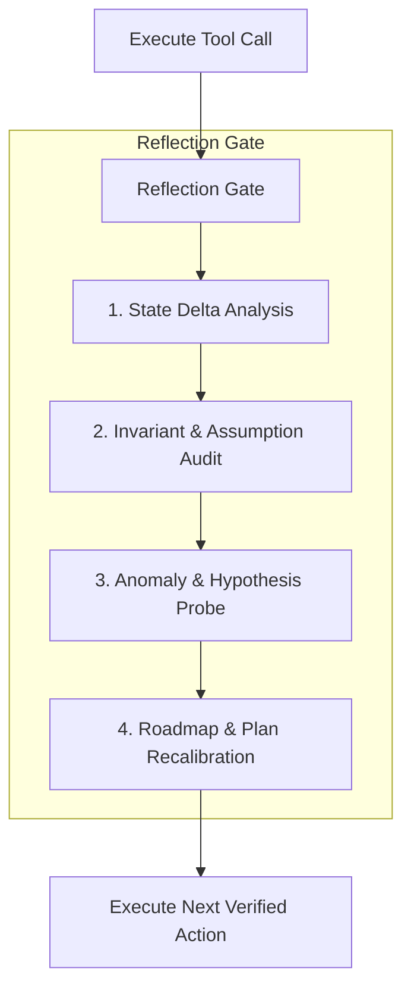

# Interleaved Verification & Adversarial Red-Teaming

This reference formalizes the verification mechanics and active reflection protocols that prevent silent errors, hallucinations, and catastrophic regressions.

--------------------------------------------------------------------------------

## 1. Interleaved Tool-Reasoning (The "Thinking Between Actions" Gate)

Standard agents execute tools linearly. Fable-mode mandates an explicit **Post-Action Reflection Gate** after every tool call.



### The 4 Reflection Inquiries
1. **State Delta Analysis**: What exact changes occurred in the environment vs. what was predicted?
2. **Invariant & Assumption Audit**: Did this action violate any state, memory, or schema invariants?
3. **Anomaly & Hypothesis Probe**: Did any warning, exit code, unexpected log, or subtle latency change occur?
4. **Roadmap Recalibration**: Does the remaining execution roadmap need adjustment based on these new findings?

--------------------------------------------------------------------------------

## 2. Adversarial Red-Teaming (Project Glasswing Protocol)

Before marking any architecture, algorithm, or bug fix as complete, deploy a virtual **Adversarial Red-Team Pass**. Probe the solution across these 6 attack vectors:

### Vector 1: Concurrency Hazards & Memory Races
- **Race Windows**: Can Thread $A$ modify pointer $P$ between Thread $B$'s check and Thread $B$'s dereference (TOCTOU)?
- **ABA Problem**: If pointer $A$ is freed, reallocated, and set back to $A$, will an atomic CAS falsely assume state never changed?
- **Deadlock / Lock Inversion**: Is there any path where Lock 1 and Lock 2 are acquired in reverse order?

### Vector 2: Resource Exhaustion & OOM
- **Unbounded Queues**: If downstream consumers stall for 30 seconds, will the message buffer consume all system RAM?
- **File Descriptor Leaks**: Do error-handling branches guarantee socket and file handle closure?
- **Thread Starvation**: Can a slow query monopolize the worker thread pool?

### Vector 3: Byzantine & Corrupt Inputs
- **Integer Overflow**: What happens when `length + offset` wraps around 64-bit integer space?
- **Malformed Serialization**: Does a payload with mismatched length headers trigger a panic, buffer overread, or CPU spin loop?
- **Clock Drift**: Does the system break if NTP adjusts system time backwards by 500ms?

### Vector 4: Partial Failure & Network Partitions
- **Split-Brain Scenarios**: If node $A$ is isolated from node $B$, can both elect themselves leader?
- **Zombie Connections**: How are half-open TCP connections detected and purged?

--------------------------------------------------------------------------------

## 3. Metamorphic Testing & Property-Based Verification

Don't rely solely on static example-based unit tests. Formulate **Metamorphic Invariants** that must hold over infinite randomized inputs:

$$\forall x, y \in \text{Domain}, \quad \mathcal{P}(f(x), f(y)) \equiv \text{True}$$

### Common Metamorphic Relations:
1. **Idempotence Invariant**: $f(f(x)) = f(x)$
2. **Commutativity / Order Invariance**: $f(A \cup B) = f(B \cup A)$ (for conflict-free operations)
3. **Reversibility Invariant**: $\text{decode}(\text{encode}(x)) = x$
4. **Monotonicity Invariant**: $x \le y \implies \text{Capacity}(x) \le \text{Capacity}(y)$

### Implementation Scaffold (Property-Based Test Template)
```python
# Example: Metamorphic Invariant Test for Concurrent State Engine
import random

def test_metamorphic_linearizability():
    initial_state = EngineState()
    operations = generate_random_concurrent_ops(n=1000)
    
    # Run concurrent execution
    concurrent_result = run_multithreaded(initial_state, operations)
    
    # Run canonical single-threaded reference replay
    sequential_result = run_canonical_sequential(initial_state, operations)
    
    # Invariant: Output must be indistinguishable from a valid serial order
    assert is_valid_linearization(concurrent_result, sequential_result), \
        f"Linearizability violation detected under interleaving: {concurrent_result.trace}"
```

--------------------------------------------------------------------------------

## 4. Project Glasswing v2 Adversarial Protocol

Project Glasswing v2 elevates standard software quality assurance into an automated, multi-vector adversarial torture test executed prior to release or final verification.

### 4.1 Concurrency Race Fuzzing & Thread Interleaving
Concurrency defects often evade conventional unit tests due to predictable scheduling. Glasswing v2 enforces randomized thread scheduling and thread interleaving fuzzing:
- **Randomized Yield & Preemption Injections**: In multi-threaded execution paths, inject stochastic nanosleeps (`thread::yield_now()`, `sleep(rand_micros)`) between read-check and write-update operations.
- **ThreadSanitizer (TSan) / Loom Invariant Testing**: Formally model atomic state transitions under all permutations of execution order to expose data races, missing barriers (`Acquire`/`Release`), and lock inversion cycles.
- **High-Contention Loom Matrix**:
  ```python
  # Glasswing Concurrency Fuzzing Harness
  import threading, time, random

  def test_concurrent_race_fuzzing():
      shared_state = ConcurrentAtomicLedger()
      threads = []
      for _ in range(16):
          t = threading.Thread(target=fuzz_worker, args=(shared_state,))
          threads.append(t)
      for t in threads: t.start()
      for t in threads: t.join()
      assert shared_state.validate_memory_invariants(), "Memory corruption under heavy contention!"
  ```

### 4.2 ABA Hazard Inversion & Pointer Tagging
Lock-free algorithms utilizing Compare-And-Swap (CAS) primitives are prone to the ABA hazard—where an address is freed, reallocated, and modified while a thread sleeps:
- **Hazard Pointer Tracking**: Maintain explicit thread-local hazard pointer arrays preventing node reclamation while any thread holds an active reference.
- **Generational Pointer Tagging**: Pair 64-bit pointers with a 64-bit monotonically incrementing generation counter (128-bit atomic double CAS or tagged atomic pointer):
  $$\text{TaggedPointer} = \langle \text{Pointer}_{64} \mid \text{Version}_{64} \rangle$$
- **Inversion Stress Tests**: Specifically construct test harness scenarios where thread $T_1$ reads $A$, gets suspended, thread $T_2$ pops $A$, pushes $B$, pops $B$, and re-pushes $A$ with altered internal contents, ensuring $T_1$'s CAS fails as expected.

### 4.3 Byzantine Fault Injection Matrix
Software operating across distributed nodes, IPC channels, or unauthenticated boundaries must survive corrupt, out-of-order, or adversarial payloads.

| Fault Class | Injection Vector | Expected Defense & Invariant |
| :--- | :--- | :--- |
| **Integer Truncation & Overflow** | $2^{64}-1$ offsets, negative lengths, zero-capacity allocations | Strict boundary check with saturating arithmetic or explicit `OverflowError`/`Err(Overflow)` |
| **Malformed Framing & Serialization** | Truncated protobuf frames, corrupted length headers, cyclic object graphs | Deterministic parser rejection with zero memory leaks or recursive stack overflow |
| **Clock Slew & Inversion** | Negative time deltas ($\Delta t = -500\text{ms}$), massive NTP jumps ($+10\text{yr}$) | Monotonic clock references (`std::time::Instant`, `CLOCK_MONOTONIC`) rather than wall clock |
| **Partial Wire Corruptions** | Flipped bitmasks on checksummed TCP payloads, zombie half-duplex disconnects | CRC32/SHA256 frame validation, graceful teardown via keepalive heartbeat watchdogs |
| **Cascading Backpressure Stalls** | Downstream sink latency spiked to $10{,}000\text{ms}$ with unbounded ingress | Bounded ring buffers with explicit load-shedding / drop-tail or reactive backpressure |

### 4.4 Memory-Leak Profiling & Resource Sanitization
Any system claiming high reliability must undergo rigorous memory and descriptor leak profiling:
- **Valgrind / ASan / LSan Automated Runs**: Execute critical hot paths under AddressSanitizer and LeakSanitizer with zero permitted leaks (`0 bytes in 0 blocks`).
- **File Descriptor & Socket Leak Tracking**: Introspect OS process handles before and after 100,000 cyclic executions:
  $$\Delta \text{FD} = \text{Count}(\text{open\_fds}_{t_{\text{end}}}) - \text{Count}(\text{open\_fds}_{t_{\text{start}}}) \equiv 0$$
- **Resident Set Size (RSS) Steady-State Verification**: Assert that after initial warm-up, memory growth exhibits flat asymptotic behavior ($\frac{d(\text{RSS})}{dt} \approx 0$) under sustained throughput.

