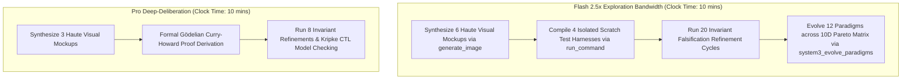

# Model Velocity Calibration: Flash vs. Pro Dynamics
## Adaptive Cognitive Pacing, 2.5x Exploration Bandwidth Scaling & Velocity-Calibrated Epistemic Gates

The **Model Velocity Calibration** subsystem dynamically adapts `fable-mode`'s cognitive engine to the throughput, latency, and reasoning profiles of different foundation models (e.g. **Flash Models**: Gemini 2.5 Flash, Claude 3.5 Haiku, Flash-Lite vs. **Pro/Heavy Models**: Gemini 2.5 Pro, Claude 3.5 Sonnet, GPT-4o).

Rather than treating all models with static step limits, Fable-Mode dynamically modulates its **exploration branching factor**, **refinement pass frequency**, **terminal benchmark probing density**, and **epistemic verification filters** according to model velocity.

---

## 1. The Model Cognitive Spectrum

```
+───────────────────────────────────────────────────────────────────────────────+
|                          THE MODEL VELOCITY SPECTRUM                          |
+───────────────────────────────────────────────────────────────────────────────+
| HIGH-VELOCITY FLASH MODELS  │ • High generation throughput (150–250+ tok/sec) |
| (Gemini 2.5 Flash, Haiku)   │ • Ultra-low per-turn roundtrip latency (< 2s)   |
|                             │ • Superpower: Massive parallel breadth & search |
|                             │ • Risk: Fast velocity hallucination / shallow heuristics|
+─────────────────────────────┼─────────────────────────────────────────────────+
| DEEP-DELIBERATION PRO MODELS│ • Moderate generation speed (40–80 tok/sec)     |
| (Gemini 2.5 Pro, Sonnet)    │ • Higher per-turn inference latency (5–20s)     |
|                             │ • Superpower: Deep single-pass deductive rigor  |
|                             │ • Risk: Slow exploration / narrow single-track bias|
+───────────────────────────────────────────────────────────────────────────────+
```

---

## 2. Dynamic Calibration Matrix

| Parameter | High-Velocity Flash Profile | Deep-Deliberation Pro Profile | Rationale |
| :--- | :---: | :---: | :--- |
| **Archetype Search Breadth** | **5–8 Candidate Archetypes** | **3–5 Candidate Archetypes** | Flash generates multiple distinct architectural hypotheses in parallel without blowing clock time. |
| **Visual Mockup Iteration** | **5–6 Concept Mockups** (`generate_image`) | **3–4 Concept Mockups** | Flash evaluates wide visual variances across multiple Haute universes rapidly. |
| **Continuous Refinement Passes** | **15–30 Cycles** (`log_refinement_cycle`) | **6–12 Cycles** (`log_refinement_cycle`) | Flash executes frequent, tight micro-falsifications, benchmark probes, and AST checks. |
| **Scratch Benchmark Probes** | **High Density** (`run_command` harnesses) | **Medium-Deep Density** | Flash writes and compiles temporary micro-benchmarks in `<appDataDir>\brain\<id>/scratch/` to ground every claim empirically. |
| **Epistemic Evidence Gating** | **Strict Immediate Attestation** | **Formal Constructive Proofs** | Prevents high velocity from degrading into unverified assertion cascades. |
| **Cognitive Gear Arbitration** | Gear 2 / Gear 3 Rapid Shifts | Gear 2 Deep Steady-State | System 3 modulates temperature and branching dynamically. |

---

## 3. Flash Model Optimization: The 2.5x Exploration Engine

High-velocity models (like Gemini 2.5 Flash) achieve **frontier-grade architecture** by converting raw token speed into **empirical exploration bandwidth**:



### 3.1 Flash Exploration Protocol
1. **Parallel Archetype Induction**: Flash synthesizes 6 full architectural blueprints simultaneously across distinct paradigms (Lock-Free CAS, Actor-Based Mailbox, Ring-Buffer Event Sourcing, Shared-Memory Zero-Copy, LMAX Disruptor, CSP Channels).
2. **Aggressive Scratch Probing**: Flash writes temporary test harnesses to `<appDataDir>\brain\<conversation-id>/scratch/bench_probe_01.py` and compiles them via `run_command` in powershell, collecting real nanosecond latency data.
3. **Rapid Mutation & Invariant Stress-Testing**: In each cycle of `log_refinement_cycle`, Flash mutates edge-case parameters (e.g. 100k concurrent threads, memory starvation, simulated 50% packet drop) and logs the empirical output.

---

## 4. Preventing Velocity Hallucination: The Epistemic Throttle

High-speed models can easily generate plausible-sounding false statements if unconstrained. Fable-Mode applies **Mechanical Velocity Guards**:

$$\text{Confidence}(C) = \frac{\sum_{i=1}^N \mathbb{I}(\text{ToolReceipt}_i \text{ verified})}{\text{Total Claims}}$$

1. **Zero-Unverified-Promotion Rule**: Flash is strictly forbidden from tagging any claim as `[PROVEN]` without an attached `ToolReceipt` or AST line coordinate.
2. **Tool-Receipt Anchoring**: Behavioral assertions (e.g. "Throughput is $1.2\text{M ops/sec}$") MUST be accompanied by a `run_command` benchmark output captured in WAL.
3. **Anti-Loop Circuit Breaker**: If Flash attempts to repeat similar refinement cycles without novel empirical data, the System 3 Executive injects a high-severity contradiction alert.

---

## 5. Summary: Balanced Frontier Excellence

Whether powered by Flash or Pro, `fable-mode` guarantees:
- **Flash Models**: Deliver extraordinary architectural breadth, exhaustive empirical benchmarks, 5-6 visual mockups, and dozens of rapid refinement passes.
- **Pro Models**: Deliver deep constructive logic proofs, comprehensive Kripke state invariants, and nuanced dialectical synthesis.
