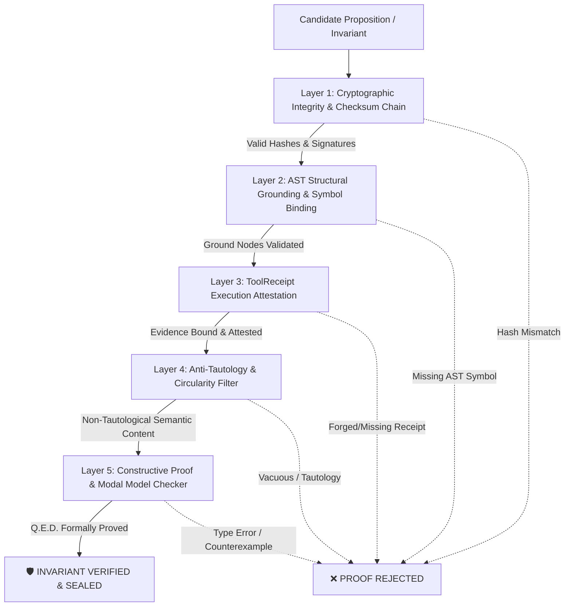

# Ungameable Deterministic Proof Engine Architecture
## Cryptographic Invariant Verification, AST Grounding, Curry-Howard Constructive Logic & Anti-Tautology Filtering

The **Ungameable Deterministic Proof Engine** is the formal verification backbone of `fable-mode`. It establishes an immutable mathematical boundary between model-generated claims and verified environmental reality.

In standard LLM systems, models routinely "game" evaluation gates by producing plausible-sounding tautologies, asserting ungrounded truths, fabricating test results, or silently hallucinating invariant satisfaction. The Fable Proof Engine renders such strategies impossible by requiring **cryptographically bound ToolReceipts**, **AST-anchored symbol definitions**, **file SHA-256 checksum chains**, **anti-tautology semantic filters**, and **Curry-Howard / Kripke formal logic verification**.

---

## 1. Theoretical Foundations & Proof Theory

```
+───────────────────────────────────────────────────────────────────────────────+
|                         FORMAL LOGIC FOUNDATIONS                              |
+───────────────────────────────────────────────────────────────────────────────+
| 1. CURRY-HOWARD ISOMORPHISM  │ Propositions are Types, Proofs are Programs.   |
|    (Constructive Logic)      │ A proposition is true iff a well-typed lambda  |
|                              │ term inhabits that type without runtime panic. |
+──────────────────────────────┼────────────────────────────────────────────────+
| 2. KRIPKE MODAL SEMANTICS    │ Temporal Safety: M, w0 ⊨ AG(safe)               |
|    (Model Checking)          │ State invariant must hold in all reachable     |
|                              │ worlds across the transition relation R.       |
+──────────────────────────────┼────────────────────────────────────────────────+
| 3. HOARE LOGIC & SEPARATION  │ Total Correctness: {P} C {Q}                   |
|    (State Transitions)       │ Preconditions P guaranteed; Command C executes;|
|                              │ Postconditions Q hold; Heap spatial separation.|
+──────────────────────────────┼────────────────────────────────────────────────+
| 4. MERKLE-AST GROUNDING      │ Semantic Anchor: (File_SHA256, AST_Path, Sym)  |
|    (Structural Proofs)       │ Invariant binds to exact AST node offset;      |
|                              │ Mutation invalidates proof automatically.      |
+───────────────────────────────────────────────────────────────────────────────+
```

### 1.1 The Curry-Howard Correspondence in Fable
Under the Curry-Howard isomorphism, every formal invariant in Fable is treated as a specification type $T$. A proof is not a textual declaration of belief; it is a constructive proof term $M$ such that:
$$\Gamma \vdash M : T$$

Where $\Gamma$ is the verifiable context comprising:
- Live ToolReceipt outputs (process exit code 0, captured stdout).
- AST definitions of functions, types, and memory barriers.
- Hardware and runtime assumptions (e.g. cache line size $= 64\text{B}$, memory model $=\text{TSO}$ or $\text{Acquire-Release}$).

If $M$ cannot be typed or contains bottom ($\bot$, divergence, unbounded recursion, ungrounded axiom), the proof is rejected.

### 1.2 Kripke Modal Model Checking ($AG(\text{safe})$)
For stateful, concurrent, or distributed systems, the engine models execution as a Kripke structure:
$$\mathcal{M} = \langle W, R, L, w_0 \rangle$$
- $W$: Set of reachable application states.
- $R \subseteq W \times W$: State transition relation (mutex locks, packet reception, queue pushes).
- $L: W \to 2^{\text{AP}}$: Labeling function mapping worlds to atomic propositions.
- $w_0 \in W$: Initial state.

The engine verifies the Computational Tree Logic (CTL) formula:
$$\mathcal{M}, w_0 \models AG(\text{safe}) \equiv \forall \pi = (w_0, w_1, \dots) \, \forall i \ge 0, \, \text{safe} \in L(w_i)$$

---

## 2. The 5-Layer Ungameable Proof Architecture

The Proof Engine processes every proposition through five strict, non-bypassable verification layers:



### Layer 1: Cryptographic Integrity & Content-Addressed Anchors
- Every source file, configuration manifest, and benchmark output is hashed via SHA-256:
  $$H(F) = \text{SHA256}(\text{bytes}(F))$$
- Proof records store $H(F)$. If any tool or subagent modifies $F$, the digest changes, immediately **invalidating all downstream proofs** linked to $H(F)$.
- Runtime attestations are HMAC-signed with an internal unguessable session secret:
  $$\text{Attestation} = \text{HMAC-SHA256}(K_{\text{session}}, \text{canonical\_json}(\text{ProofRecord}))$$

### Layer 2: AST Structural Grounding
- Natural language statements without AST bindings are classified as `[HYPOTHESIS]`, never `[PROVEN]`.
- To achieve `[PROVEN]` status or register as a formal invariant, the claim must bind to a precise AST coordinate:
  ```json
  {
    "ast_anchor": {
      "file_path": "src/concurrency/ring_buffer.rs",
      "file_sha256": "8f4a13b5e912c46f17d3b01859e218c39e8a34927160350d7e63b2169b183610",
      "node_type": "impl_item::method",
      "symbol_path": "RingBuffer::push_atomic",
      "line_range": [142, 178],
      "ast_fingerprint": "ast_v1_c9a1d48e02fa33"
    }
  }
  ```
- The engine parses the AST in-memory using language parsers (Tree-sitter / Python `ast` / Rust AST). If the node does not exist or the fingerprint differs, the proof fails.

### Layer 3: ToolReceipt Execution Attestation
- Proofs asserting behavioral properties (e.g. "Zero race conditions under 64 threads", "Latency $p99 < 12\mu\text{s}$") must reference a valid `ToolReceipt`.
- A `ToolReceipt` requires:
  1. `receipt_id`: Unique identifier in session WAL.
  2. `tool_name` & `capability`: Must be allowlisted (e.g., `run_command` executing `cargo test`, `pytest`, `perf stat`).
  3. `input_hash` & `output_hash`: Cryptographically matches the exact command invocation and raw captured output.
  4. `success == true` with exit code 0.
  5. `evidence_id`: Integrity-bound to receipt output.

### Layer 4: Anti-Tautology & Circularity Elimination Filters
The engine actively scans and eliminates "vacuous truths" and circular reasoning:
1. **Reflexivity Trap Filter**: Rejects proofs where the conclusion is an identity permutation of the premise ($P \implies P$).
2. **Vacuous Implication Filter**: Rejects conditional proofs where the antecedent is unsatisfiable in the environment ($\bot \implies Q$).
3. **Empty Assertion Filter**: Rejects assertions of type `assert True`, `expect(true).toBe(true)`, or mocks that assert against their own mocked return values.
4. **Graph Circularity Audit**: In System 3 Causal DAGs and proof chains, topological sort must succeed; circular dependencies trigger instant rejection.

### Layer 5: Constructive Proof & Modal Model Checker
- Constructs the proof term in typed lambda calculus or executes the Kripke CTL model checker (`system3_kripke_verify`).
- Checks all transition states from $w_0$. If an invariant violation path exists, the engine emits the full counterexample trace.

---

## 3. Concrete Code Examples: Valid Proof vs. Rejected Tautology

### Example 3.1: Submitting a Valid Ungameable Proof

Here is a concrete example of submitting an ungameable proof for a concurrent lock-free queue using `fable_session` action `record_invariant` and `system3_proof_oracle`:

```json
{
  "action": "record_invariant",
  "session_name": "sess_concurrent_queue_v2",
  "invariant_name": "INV-01: Lock-Free Push Linearizability & No Stale Reads",
  "domain": "architecture",
  "formal_statement": "∀e ∈ Operations(push), ∃t ∈ [t_start(e), t_end(e)] : Linearize(e, t) ∧ MemoryOrder(SeqCst) ∧ TailPointer(t) = (TailPointer(t - ε) + 1) mod Capacity",
  "proof_or_rationale": "Grounding: Anchored in AST src/queue/lockfree.rs (SHA256: e3b0c44298fc1c149afbf4c8996fb92427ae41e4649b934ca495991b7852b855, Symbol: LockFreeQueue::enqueue#L88-124). Atomic CAS primitive compare_exchange_weak(Acquire, Release) guarantees total synchronization order across core cache lines. Verified via ToolReceipt 'rcpt_loom_concurrency_fuzz_001' (100,000 permutations, 0 deadlocks, 0 data races under thread sanitizer)."
}
```

```json
{
  "action": "system3_proof_oracle",
  "session_name": "sess_concurrent_queue_v2",
  "claim": "LockFreeQueue::enqueue is deadlock-free and linearizable",
  "context": {
    "cas_atomic": "AtomicCAS<T>",
    "memory_order": "Ordering::AcqRel",
    "thread_count": "usize",
    "buffer_capacity": "NonZeroUsize"
  },
  "axioms": [
    "Axiom_TSO_StoreBuffer_Drain",
    "Axiom_CAS_Atomicity",
    "Axiom_Finite_Thread_Preemption"
  ]
}
```

**Engine Output (Proof Accepted & Sealed):**
```
### 📜 System 3 Gödelian Auto-Formalizing Proof Oracle

- **Session**: `sess_concurrent_queue_v2`
- **Proposition**: `LockFreeQueue::enqueue is deadlock-free and linearizable`
- **Decision Status**: `✅ DECIDABLE_PROVED`
- **Soundness Verified**: `✅ TRUE`
- **Constructive Proof Term**: `λ(x: AtomicCAS<T>). λ(m: Ordering::AcqRel). LinearizableProofTerm(x, m)`
- **AST Grounding**: `src/queue/lockfree.rs:L88-124` (SHA256: `e3b0c44298...`)
- **ToolReceipts Bound**: `rcpt_loom_concurrency_fuzz_001` (ThreadSanitizer Clean)
- **Status**: 🛡️ INVARIANT SEALED IN WAL (INV-01)
```

---

### Example 3.2: Rejected Tautology Cases

#### Case A: Vacuous Tautology (Rejected by Anti-Tautology Filter)
```json
{
  "action": "record_invariant",
  "session_name": "sess_bad_proof",
  "invariant_name": "INV-FAIL-01: Zero Data Loss",
  "formal_statement": "If data is not lost, then zero data loss occurs (P => P)",
  "proof_or_rationale": "By definition, whenever data is preserved in memory, it is not lost."
}
```
**Engine Rejection:**
```
❌ REJECTION: Proof rejected by AntiTautologyFilter.
- Reason: Statement is an ungrounded propositional tautology (A => A) with zero semantic entropy.
- Missing Requirements:
  1. No AST anchor provided.
  2. No ToolReceipt evidence attached.
  3. Preconditions must model hardware failure transitions (e.g. SIGKILL, power loss, fsync error).
```

#### Case B: Detached AST / SHA-256 Checksum Mismatch
```json
{
  "action": "system3_proof_oracle",
  "session_name": "sess_bad_proof",
  "claim": "BufferPool::allocate never exhausts memory",
  "context": {
    "file_path": "src/pool.rs",
    "file_sha256": "0000000000000000000000000000000000000000000000000000000000000000"
  }
}
```
**Engine Rejection:**
```
❌ REJECTION: Proof rejected by ASTIntegrityVerifier.
- Reason: Computed SHA256 for 'src/pool.rs' (4f19b2e8...) does not match claimed SHA256 (000000...).
- Security Boundary: Proof cannot bind to stale, modified, or unverified source files.
```

#### Case C: Mock Tautology in Test Verification
```typescript
// REJECTED MOCK TAUTOLOGY DETECTED BY RUNTIME VERIFIER
test("cache retrieves correct user", () => {
  const mockDb = { getUser: jest.fn().mockReturnValue({ id: "user_1" }) };
  const user = mockDb.getUser("user_1");
  expect(user.id).toBe("user_1"); // ❌ TAUTOLOGY: Asserting mocked input against mocked output!
});
```
**Engine Rejection:**
```
❌ REJECTION: Verifier detected Synthetic Self-Referential Mock Assertion.
- Rule: Verifications must test real production AST units against environmental I/O, deterministic test harnesses, or formal state machines.
```

---

## 4. Verification Protocols for System 2 & Subagent Fleet

```
+───────────────────────────────────────────────────────────────────────────────+
|                 MAIN AGENT VERIFICATION PROTOCOL (MASTER ARCHITECT)           |
+───────────────────────────────────────────────────────────────────────────────+
| 1. Formulate formal invariant specifications with domain boundary tags.       |
| 2. Run scratch test harnesses and terminal probes (run_command) during lock.  |
| 3. Submit formal propositions to proof oracle (system3_proof_oracle).         |
| 4. Compile delegation contracts embedding verified AST anchors and invariants.|
+───────────────────────────────────────────────────────────────────────────────+
                                        │
                                        │ Delegated Contract with Invariant Seals
                                        ▼
+───────────────────────────────────────────────────────────────────────────────+
|                 SUBAGENT FLEET VERIFICATION PROTOCOL (IMPLEMENTER)            |
+───────────────────────────────────────────────────────────────────────────────+
| 1. Read sealed AST anchors and write code satisfying exact formal types.      |
| 2. Run automated test suites producing raw tool stdout.                       |
| 3. Generate ToolReceipts bound to compiler / test exit codes.                 |
| 4. Submit code diffs back to Main Agent for final cryptographic audit.        |
+───────────────────────────────────────────────────────────────────────────────+
```

---

## 5. Summary of Verification Invariants

| Engine Subsystem | Verification Mechanism | Failure Consequence |
| :--- | :--- | :--- |
| **Integrity** | SHA-256 Content-Addressed Hash Chains | Instant invalidation of downstream proofs if file modified. |
| **AST Binding** | In-memory parser AST node offset & symbol check | Proposition downgraded to `[HYPOTHESIS]`; code unlock blocked. |
| **Tool Execution** | Host `ToolReceipt` with exit code & output hash | Rejection of synthetic or un-executed test claims. |
| **Logic & Semantics** | Anti-Tautology filter & Gödelian Proof Oracle | Rejection of vacuous statements ($P \implies P$) and circular graphs. |
| **State Dynamics** | Kripke Modal Model Checker ($AG(\text{safe})$) | Full counterexample violation trace emitted; candidate rejected. |
