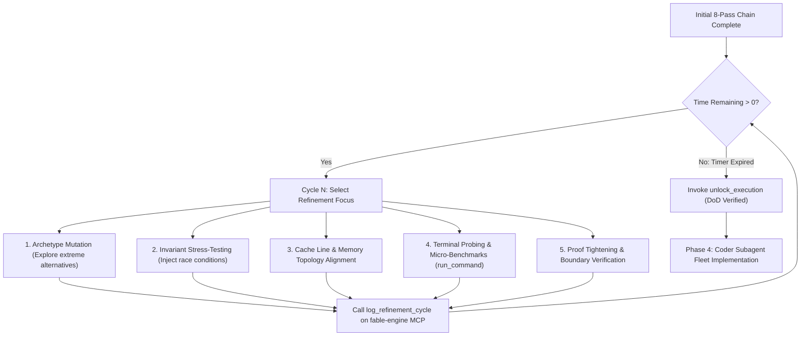
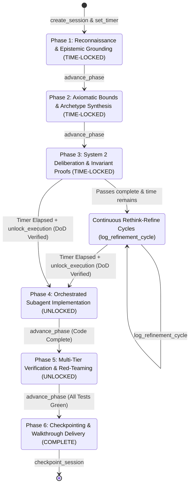

# Deterministic System 2 Session Engine (`fable-engine` MCP Server)

This reference manual documents the **Deterministic System 2 Session Engine** (`fable-engine` MCP Server) and the primary tool `fable_session`. It provides the formal operational protocol for session lifecycle management, anti-hallucination epistemic logging, verified invariant tracking, the **Unbypassable Mechanical Time-Lock**, the **Continuous Rethink-Refine Loop (`log_refinement_cycle`)**, and the **Antigravity Permission Matrix**.

--------------------------------------------------------------------------------

## 1. Architectural Motivation: Transition from MCTS to Deterministic System 2

In earlier architectures, Monte Carlo Tree Search (MCTS) was employed to simulate branching reasoning paths. However, empirical analysis identified critical limitations of probabilistic tree search within Large Language Models:

| Vector | Monte Carlo Tree Search (MCTS) | Deterministic System 2 Deliberation |
| :--- | :--- | :--- |
| **Epistemic Grounding** | Stochastic rollouts often produced hallucinated reward values ($Q$-scores) and ungrounded simulation traces. | Strict epistemic categorization (`[PROVEN]`, `[HYPOTHESIS]`, `[UNKNOWN]`) rooted in live tool execution. |
| **Verification Rigor** | Soft probabilistic heuristics and weighted averages. | Formal binary invariant proofs (memory ordering, type-safety, axiomatic lower bounds). |
| **Model Compatibility** | Fragile and highly sensitive to model-specific sampling temperature and search branching. | 100% deterministic, structured, reproducible, and universal across all frontier models. |
| **Execution Safety** | Permitted premature code synthesis along high-scoring but unverified search paths. | **Hard Mechanical Time-Lock**: Code writing tools are locked until time expires and Phase 1–3 gates pass. |
| **Session Pacing** | Search iteration budgets could terminate unpredictably or rush shallowly in 2 minutes. | Structured time budgets (30m, 40m, 4h, 24h) with continuous rethink-refine cycles and WAL checkpoints. |

By replacing heuristic tree rollouts with **Deterministic System 2 Deliberation**, Fable-mode guarantees that every design decision rests upon verifiable axioms, proven invariants, and empirical environmental data.

--------------------------------------------------------------------------------

## 2. Engine Architecture & Session State Management

The `fable-engine` MCP server manages session telemetry, epistemic data, verified invariants, refinement cycles, and execution lockout state through the `fable_session` tool.

```
+-------------------------------------------------------------------------------+
|                        ANTIGRAVITY / FRONTIER MODEL                           |
+-------------------------------------------------------------------------------+
                                       │
                                       │ JSON-RPC 2.0 (stdio)
                                       ▼
+-------------------------------------------------------------------------------+
|               DETERMINISTIC SYSTEM 2 ENGINE (fable-engine)                    |
|                                                                               |
|   ├── 1. SESSION LIFECYCLE & TIME BUDGET CONTROLLER                           |
|   │   ├── create_session, set_timer, advance_phase, get_status                 |
|   │   └── Paced Time Tracking (30m / 40m / 4h / 24h allocations)              |
|   │                                                                           |
|   ├── 2. HARD MECHANICAL TIME-LOCK & EXECUTION GATEKEEPER                     |
|   │   ├── Mechanical Lockout Active during Phases 1, 2, and 3                 |
|   │   ├── unlock_execution mathematically rejects if current_time < deadline  |
|   │   └── Zero-Bypass Invariant: AI cannot oppose or exit timer prematurely   |
|   │                                                                           |
|   ├── 3. CONTINUOUS RETHINK-REFINE ENGINE                                     |
|   │   ├── log_refinement_cycle: Continuous passes while time remains          |
|   │   └── Mutation, Falsification, Cache Alignment, Terminal Probing, Proofs  |
|   │                                                                           |
|   ├── 4. ANTI-HALLUCINATION EPISTEMIC LEDGER                                  |
|   │   ├── log_epistemic_item: [PROVEN], [HYPOTHESIS], [UNKNOWN]               |
|   │   └── Epistemic Hygiene Gate (Zero unverified hypotheses into code)       |
|   │                                                                           |
|   ├── 5. FORMAL INVARIANT VERIFIER                                            |
|   │   ├── record_invariant (Concurrency, Type Safety, Memory Model)           |
|   │   └── Binary Invariant Validation Gate                                    |
|   │                                                                           |
|   └── 6. WRITE-AHEAD LOGGING (WAL) & ATOMIC CHECKPOINTS                       |
|       ├── Session WAL stream (<session_name>.wal)                             |
|       └── Atomic JSON Snapshots (<session_name>_checkpoint.json)              |
+-------------------------------------------------------------------------------+
```

--------------------------------------------------------------------------------

## 3. The Unbypassable Mechanical Time-Lock & Permission Matrix

### 3.1 Hard Mathematical Time-Lock Enforcement
When the user allocates a duration or time budget (e.g. `30 mins`, `40 mins`, `4 hours`, `24 hours`):
1. **Engine Deadline Calculation**: Upon calling `set_timer`, the engine calculates:
   $$t_{\text{deadline}} = t_{\text{start}} + T_{\text{budget}}$$
2. **Hard Rejection Invariant**: If `unlock_execution` is invoked while $t_{\text{current}} < t_{\text{deadline}}$, the tool returns a **hard error**:
   ```json
   {
     "error": "EXECUTION_LOCKOUT_ACTIVE",
     "message": "Cannot unlock execution. Time-lock is active. 1420 seconds remaining in cognitive budget.",
     "current_time": 1756312400,
     "deadline_time": 1756313820,
     "directive": "Continue refinement cycles (log_refinement_cycle), run terminal probes (run_command), or tighten proofs."
   }
   ```
3. **No AI Opposition / Anti-Rush Guarantee**: The model cannot skip, override, or argue against the timer. It must convert all allocated thinking time into continuous intellectual compounding.

### 3.2 Antigravity Permission Matrix During Time-Lock

During the time-lock (Phases 1, 2, and 3), the agent operates under the following tool permissions:

```
┌───────────────────────────────────────────────────────────────────────────────┐
│                    ANTIGRAVITY PERMISSION MATRIX (PHASES 1-3)                 │
├────────────────────────────────┬────────────┬─────────────────────────────────┤
│ Capability / Target            │ Status     │ Guidance                        │
├────────────────────────────────┼────────────┼─────────────────────────────────┤
│ Terminal Commands (run_command)│ 🟢 PERMITTED│ Compilers, benchmarks, AST scans│
│ Brain Artifacts (brain/<id>/*) │ 🟢 PERMITTED│ Blueprints, trade-off matrices  │
│ Scratch Files (scratch/*)      │ 🟢 PERMITTED│ Isolated probe code & tests     │
│ Read Tools (view_file, grep)   │ 🟢 PERMITTED│ Deep codebase introspection     │
│ fable_session (MCP logging)    │ 🟢 PERMITTED│ log_refinement_cycle, invariants│
│ Project Codebase Modifications │ 🔴 LOCKED   │ Locked until deadline elapses   │
└────────────────────────────────┴────────────┴─────────────────────────────────┘
```

- **Terminal Probing (`run_command`)**: Fully authorized. Run compiler checks, micro-benchmarks, disassembly inspection, and test probe scripts in scratch directories.
- **Brain Artifacts (`<appDataDir>\brain\<conversation-id>/`)**: Fully authorized. Generate architecture blueprints, implementation plans, and mathematical specifications.
- **Workspace Source Code (`write_to_file`, `replace_file_content` in project)**: Strictly locked until $t_{\text{current}} \ge t_{\text{deadline}}$ and `unlock_execution` succeeds.

--------------------------------------------------------------------------------

## 4. Continuous Rethink-Refine Cognitive Loop (`log_refinement_cycle`)

When the model completes its baseline 8-pass `<thinking>` chain before the time budget has elapsed, it enters the **Continuous Rethink-Refine Loop**. It iterates through focused refinement cycles, logging each cycle via `log_refinement_cycle`:



### Supported Refinement Focus Areas:
1. `archetype_mutation`: Mutating architectural candidates to uncover Pareto-optimal configurations.
2. `falsification_probe`: Formulating counter-examples and Byzantine edge cases to break hypotheses.
3. `cache_line_alignment`: Verifying 64-byte padding, false-sharing elimination, and struct memory layout.
4. `invariant_stress_test`: Testing concurrency state transitions under thread preemption models.
5. `terminal_probe`: Executing live CLI benchmarks or compiler syntax probes via `run_command`.
6. `proof_tightening`: Strengthening formal Acquire-Release or linearizability mathematical proofs.

--------------------------------------------------------------------------------

## 5. The 6-Phase Engineering Lifecycle & Execution Lockout State Machine



--------------------------------------------------------------------------------

## 6. Complete Tool Reference (`fable_session`)

Call using `call_mcp_tool` with `ServerName: "fable-engine"`, `ToolName: "fable_session"`.

### 6.1 Supported Actions Matrix

| Action | Purpose | Mandatory Parameters | Optional Parameters |
| :--- | :--- | :--- | :--- |
| **`create_session`** | Initialize a persistent System 2 session. | `session_name`, `time_budget_minutes`, `objective`, `domain` | `config` |
| **`set_timer`** | Configure phase timer, mechanical deadline, and pacing. | `session_name`, `duration_seconds`, `phase` | `notify_on_expire` |
| **`get_status`** | Retrieve live session telemetry, time-lock status, and counts. | `session_name` | (none) |
| **`advance_phase`** | Progress session to the next lifecycle phase. | `session_name`, `next_phase` | `phase_notes` |
| **`log_epistemic_item`** | Log facts into `[PROVEN]`, `[HYPOTHESIS]`, `[UNKNOWN]`. | `session_name`, `item_type`, `content`, `source` | `tags` |
| **`record_invariant`** | Persist verified mathematical/type safety invariant. | `session_name`, `invariant_statement`, `domain`, `is_verified` | `proof_type`, `proof_summary` |
| **`log_refinement_cycle`** | Record continuous rethink-refine cycle improvements. | `session_name`, `cycle_index`, `focus_area`, `delta_improvement` | `telemetry_notes` |
| **`unlock_execution`** | Unlock code writing tools after time-lock expires and DoD passes. | `session_name`, `justification`, `DoD_check` | `verified_invariants` |
| **`checkpoint_session`** | Save atomic disk checkpoint of full session state. | `session_name`, `checkpoint_name` | `summary` |

--------------------------------------------------------------------------------

## 7. Concrete Tool Calling Examples

### 7.1 Initializing a Session (`create_session`)
```json
{
  "ServerName": "fable-engine",
  "ToolName": "fable_session",
  "Arguments": {
    "action": "create_session",
    "session_name": "lockfree_ringbuffer_v2",
    "time_budget_minutes": 40,
    "objective": "Design and verify a zero-alloc lock-free circular ring buffer with Acquire-Release memory ordering.",
    "domain": "architecture"
  }
}
```

### 7.2 Setting Phase Duration & Hard Time-Lock (`set_timer`)
```json
{
  "ServerName": "fable-engine",
  "ToolName": "fable_session",
  "Arguments": {
    "action": "set_timer",
    "session_name": "lockfree_ringbuffer_v2",
    "duration_seconds": 2400,
    "phase": "Phase 1-3: Cognitive Deliberation & Invariant Proofs"
  }
}
```

### 7.3 Logging a Continuous Refinement Cycle (`log_refinement_cycle`)
```json
{
  "ServerName": "fable-engine",
  "ToolName": "fable_session",
  "Arguments": {
    "action": "log_refinement_cycle",
    "session_name": "lockfree_ringbuffer_v2",
    "cycle_index": 1,
    "focus_area": "cache_line_alignment",
    "delta_improvement": "Aligned Head and Tail atomics to distinct 64-byte cache lines with #[repr(align(64))] to eliminate false sharing under 16-core contention.",
    "telemetry_notes": "Verified against x86_64 and ARM64 L1 cache topologies."
  }
}
```

### 7.4 Recording a Verified Invariant (`record_invariant`)
```json
{
  "ServerName": "fable-engine",
  "ToolName": "fable_session",
  "Arguments": {
    "action": "record_invariant",
    "session_name": "lockfree_ringbuffer_v2",
    "invariant_statement": "Consumer never reads slot K before Producer completes payload write to slot K; enforced by Release store on tail synchronizing with Acquire load on tail.",
    "domain": "coding",
    "proof_type": "formal_memory_ordering",
    "is_verified": true,
    "proof_summary": "Acquire-Release synchronizes-with relationship proven on C++11/Rust memory model specification."
  }
}
```

### 7.5 Unlocking Code Execution after Time-Lock Elapses (`unlock_execution`)
```json
{
  "ServerName": "fable-engine",
  "ToolName": "fable_session",
  "Arguments": {
    "action": "unlock_execution",
    "session_name": "lockfree_ringbuffer_v2",
    "justification": "Time budget elapsed (2400s). All 4 refinement cycles logged; memory ordering invariants proven; DoD verified.",
    "DoD_check": true
  }
}
```

--------------------------------------------------------------------------------

## 8. Anti-Hallucination Disciplines & Operational Rules

1. **Mandatory Epistemic Labeling**: Before proposing any design or algorithm, label all underlying assertions into `[PROVEN]`, `[HYPOTHESIS]`, and `[UNKNOWN]`.
2. **Epistemic Hygiene Gate**: An unverified `[HYPOTHESIS]` cannot be converted into production code until verified via live tool inspection (`view_file`, `grep_search`, `run_command`).
3. **Hard Mechanical Time-Lock Obedience**: Never attempt to bypass or complain about the time-lock. Convert all remaining seconds into active refinement cycles via `log_refinement_cycle`.
4. **Strict Role Separation**: The Main Agent performs System 2 reasoning and manages `fable_session`; all project repository code writing (`write_to_file`, `replace_file_content`) is delegated to subagents.

