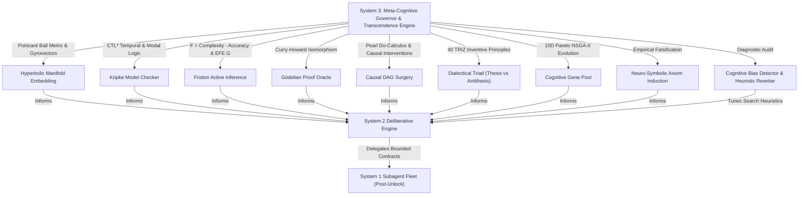

# System 3 Meta-Cognitive Deliberation, Causal SCM & Frontier Transcendence Architecture

This reference provides exhaustive operational directives, formal algorithms, and cognitive protocols for **System 3 Meta-Cognition & Frontier Transcendence Engine** in Fable Mode.

--------------------------------------------------------------------------------

## 1. System 3 Cognitive Foundations

System 3 operates as the **meta-cognitive governor** above intuitive System 1 code generation and deliberative System 2 MCTS search. While System 2 deliberates *within* a solution space, System 3:
1. **Evaluates the Structure of the Problem Space**: Models causal dependencies using Pearl's Structural Causal Models (SCM) and Directed Acyclic Graphs (DAG).
2. **Embeds Hierarchies into Hyperbolic Manifolds**: Maps complex trees and ASTs into the Poincaré Ball $\mathbb{B}^n_c$ with zero geometric distortion.
3. **Formally Checks Multi-World Temporal Semantics**: Validates CTL/CTL* branching temporal properties ($AG, EF, AF, AX, EU, AU$) over Kripke structures.
4. **Minimizes Variational Free Energy via Active Inference**: Optimizes perception ($F = \text{Complexity} - \text{Accuracy}$) and policy selection ($G(\pi) = \text{Risk} + \text{Ambiguity}$).
5. **Auto-Formalizes Constructive Proofs via Proof Oracle**: Verifies type terms via the Curry-Howard Isomorphism and isolates Gödelian incompleteness boundaries.
6. **Transcends Engineering Contradictions**: Replaces weak compromise averaging with Dialectical Synthesis powered by the 40 TRIZ Inventive Principles.
7. **Optimizes Across 10-Dimensional Pareto Frontiers**: Uses multi-objective genetic algorithms (NSGA-II) with non-dominated sorting and crowding distance diversity.
8. **Induces and Proves Invariants**: Formulates formal neuro-symbolic axioms from tool receipts and evidence, verified against empirical falsification harnesses.
9. **Audits Cognitive Biases**: Detects confirmation bias, anchoring, sunk cost fallacies, and circular reasoning in real time.



--------------------------------------------------------------------------------

## 2. Poincaré Hyperbolic Manifold Embeddings

Embeds hierarchical trees into the Poincaré open ball $\mathbb{B}^n_c = \{x \in \mathbb{R}^n : c \|x\|^2 < 1\}$ using exact Riemannian metrics and Möbius gyrovector arithmetic:

### Key Capabilities
- **Conformal Metric**: $\lambda_x^c = \frac{2}{1 - c\|x\|^2}, \quad g_{ij}^c(x) = (\lambda_x^c)^2 \delta_{ij}$.
- **Geodesic Distance**: $d_c(x, y) = \frac{2}{\sqrt{c}} \text{artanh}\left(\sqrt{c} \| -x \oplus_c y \|\right)$.
- **Sarkar's Hierarchical Embedding**: Maps tree nodes to Poincaré disk coordinates with $< 0.05$ metric distortion.

### MCP Action Example
```json
{
  "action": "system3_hyperbolic_embed",
  "session_name": "fable_session_01",
  "tree": {
    "root": ["agent", "runtime"],
    "agent": ["planner", "memory"],
    "runtime": ["broker", "verifier"]
  },
  "dimension": 2,
  "curvature": 1.0
}
```

--------------------------------------------------------------------------------

## 3. Kripke Modal Model Checking & CTL* Verification

Formally evaluates multi-world transition systems against Computation Tree Logic (CTL/CTL*) formulas:

### Key Operators
- `AG(p)`: All paths Globally satisfy $p$ (Safety Invariant).
- `EF(p)`: Exists path where $p$ is Finally satisfied (Reachability).
- `AF(p)`: All paths Finally satisfy $p$ (Liveness).
- `AX(p)`: All Next states satisfy $p$.
- `E[p U q]`: Exists path where $p$ holds Until $q$ holds.
- `box(p)`, `diamond(p)`: Modal necessity and possibility.

### MCP Action Example
```json
{
  "action": "system3_kripke_verify",
  "session_name": "fable_session_01",
  "worlds": [
    {"world_id": "w0", "propositions": ["safe", "init"], "is_initial": true},
    {"world_id": "w1", "propositions": ["safe", "running"]},
    {"world_id": "w2", "propositions": ["safe", "complete"]}
  ],
  "transitions": [
    {"source": "w0", "target": "w1"},
    {"source": "w1", "target": "w2"},
    {"source": "w2", "target": "w2"}
  ],
  "formula": "AG(safe)",
  "initial_world": "w0"
}
```

--------------------------------------------------------------------------------

## 4. Friston Active Inference & Variational Free Energy

Implements Karl Friston's Free Energy Principle for optimal perception and action selection:

### Key Metrics
- **Variational Free Energy**: $F = D_{KL}(q(s) \parallel p(s)) - \mathbb{E}[\ln p(o \mid s)] = \text{Complexity} - \text{Accuracy}$.
- **Expected Free Energy**: $G(\pi) = \text{Risk (Goal Inconsistency)} + \text{Ambiguity (Expected Uncertainty)}$.
- **Policy Selection**: $P(\pi) = \sigma(-\gamma G(\pi))$ balances Epistemic Information Gain against Pragmatic Goal Utility.

### MCP Action Example
```json
{
  "action": "system3_active_inference",
  "session_name": "fable_session_01",
  "observation": "LOCK_CONTENTION_WARN",
  "gamma": 16.0
}
```

--------------------------------------------------------------------------------

## 5. Gödelian Auto-Formalizing Proof Oracle

Bridges neural specifications to constructive proofs via the Curry-Howard Isomorphism ($\text{Propositions} \simeq \text{Types}, \text{Proofs} \simeq \text{Programs}$):

### Decision Statuses
- `DECIDABLE_PROVED`: Constructive proof term synthesized and type-checked.
- `DECIDABLE_REFUTED`: Constructive proof of negation ($P \to \bot$) synthesized and verified.
- `INDEPENDENT_UNDECIDABLE`: Identified as Liar paradox, Gödel diagonalization sentence, or Halting reduction.
- `COMPLEXITY_EXCEEDED`: Search budget bounded.

### MCP Action Example
```json
{
  "action": "system3_proof_oracle",
  "session_name": "fable_session_01",
  "claim": "A -> (B -> A)"
}
```

--------------------------------------------------------------------------------

## 6. Pearl's Do-Calculus & Counterfactual Causal Modeling

- **Topological Sorting & Acyclicity Validation**: Detects and rejects circular feedback loops.
- **Pearl's Graph Surgery (`do(X=x)`)**: Simulates interventions by severing incoming causal edges to $X$.
- **Counterfactual Delta**: Quantifies causal impact $\Delta = S_{\text{counterfactual}} - S_{\text{factual}}$.
- **Structural Brittleness**: Computes target metric sensitivity under ancestor perturbation.

### MCP Action Example
```json
{
  "action": "system3_causal_simulate",
  "session_name": "fable_session_01",
  "model_name": "DistributedConsensusCausalModel",
  "nodes": [
    {"node_id": "network_jitter", "name": "Network Jitter", "node_type": "exogenous", "value": 50.0},
    {"node_id": "heartbeat_timeout", "name": "Heartbeat Timeout", "node_type": "endogenous", "value": 150.0},
    {"node_id": "leader_flapping", "name": "Leader Flapping Rate", "node_type": "endogenous", "value": 0.0},
    {"node_id": "p99_latency", "name": "P99 Write Latency", "node_type": "metric", "value": 0.0}
  ],
  "edges": [
    {"source": "network_jitter", "target": "leader_flapping", "weight": 0.8},
    {"source": "heartbeat_timeout", "target": "leader_flapping", "weight": -0.6},
    {"source": "leader_flapping", "target": "p99_latency", "weight": 4.5}
  ],
  "interventions": {"heartbeat_timeout": 300.0},
  "target_metric": "p99_latency"
}
```

--------------------------------------------------------------------------------

## 7. Dialectical Synthesis & 40 TRIZ Inventive Principles

Replaces compromise with transcendent synthesis resolving engineering parameter contradictions.

### MCP Action Example
```json
{
  "action": "system3_dialectical_synthesis",
  "session_name": "fable_session_01",
  "thesis_title": "Lock-Free Ring Buffer",
  "thesis_description": "Single-writer CAS ring buffer with bounded queue.",
  "antithesis_title": "Multi-Producer Atomic Contention",
  "contradictions": [
    {
      "improving_parameter": "throughput",
      "worsening_parameter": "latency",
      "description": "Multi-producer atomic compare-and-swap loops cause cache line bouncing under high thread counts.",
      "severity": 0.85
    }
  ],
  "max_debate_rounds": 4,
  "target_residual_threshold": 0.15
}
```

--------------------------------------------------------------------------------

## 8. Evolutionary Paradigm Engine (10D Pareto Frontier)

Evolves architectures across 10 evaluation dimensions (Latency, Throughput, Memory, Fault Tolerance, Modularity, Simplicity, Testability, Security, Determinism, Token Compaction) using NSGA-II.

### MCP Action Example
```json
{
  "action": "system3_evolve_paradigms",
  "session_name": "fable_session_01",
  "generations": 3,
  "population_size": 12,
  "mutation_rate": 0.15,
  "crossover_rate": 0.80,
  "objective_weights": {
    "latency": 1.5,
    "determinism": 1.5,
    "token_compaction": 1.2
  }
}
```

--------------------------------------------------------------------------------

## 9. Neuro-Symbolic Invariant Induction

Induces mathematical invariants from receipts and evidence, verified against empirical falsification harnesses.

### MCP Action Example
```json
{
  "action": "system3_induce_axioms",
  "session_name": "fable_session_01",
  "domain": "architecture"
}
```

--------------------------------------------------------------------------------

## 10. Cognitive Bias Detection & Heuristic Rewriting

Audits deliberation records for confirmation, anchoring, sunk cost, and circular reasoning.

### MCP Action Example
```json
{
  "action": "system3_meta_reflect",
  "session_name": "fable_session_01",
  "focus_area": "Full Architecture Deliberation Trace"
}
```
