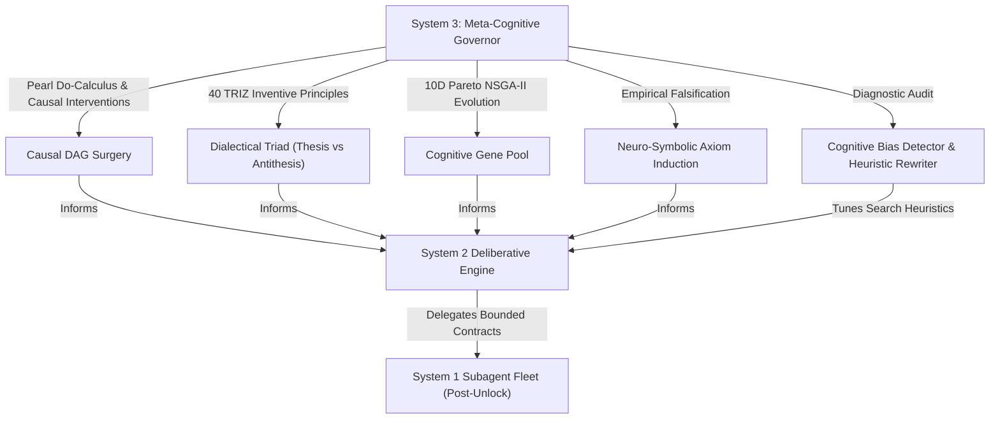

# System 3 Meta-Cognitive Deliberation, Causal SCM & Dialectical Evolutionary Architecture

This reference provides exhaustive operational directives, formal algorithms, and cognitive protocols for **System 3 Meta-Cognition** in Fable Mode.

--------------------------------------------------------------------------------

## 1. System 3 Cognitive Foundations

System 3 operates as the **meta-cognitive governor** above intuitive System 1 code generation and deliberative System 2 MCTS search. While System 2 deliberates *within* a solution space, System 3:
1. **Evaluates the Structure of the Problem Space**: Models causal dependencies using Pearl's Structural Causal Models (SCM) and Directed Acyclic Graphs (DAG).
2. **Transcends Engineering Contradictions**: Replaces weak compromise averaging with Dialectical Synthesis powered by the 40 TRIZ Inventive Principles.
3. **Optimizes Across 10-Dimensional Pareto Frontiers**: Uses multi-objective genetic algorithms (NSGA-II) with non-dominated sorting and crowding distance diversity.
4. **Induces and Proves Invariants**: Formulates formal neuro-symbolic axioms from tool receipts and evidence, verified against empirical falsification harnesses.
5. **Audits Cognitive Biases**: Detects confirmation bias, anchoring, sunk cost fallacies, and circular reasoning in real time.



--------------------------------------------------------------------------------

## 2. Pearl's Do-Calculus & Counterfactual Causal Modeling

When analyzing complex architectures, distributed systems, or performance bottlenecks, the agent must construct a `CausalDAG` using `system3_causal_simulate`:

### Key Capabilities
- **Topological Sorting & Acyclicity Validation**: Detects and rejects circular feedback loops in causal dependency graphs.
- **Pearl's Graph Surgery (`do(X=x)`)**: Simulates interventions by cutting incoming causal edges to intervened nodes, fixing their values, and propagating downstream consequences.
- **Counterfactual Delta Calculation**: Quantifies the exact causal impact $\Delta = S_{\text{counterfactual}} - S_{\text{factual}}$.
- **Structural Brittleness & Single Point of Failure (SPOF) Analysis**: Computes the sensitivity of target metrics under perturbation and identifies hyper-sensitive nodes (sensitivity $\ge 1.5$).

### MCP Action Example
```json
{
  "action": "system3_causal_simulate",
  "session_name": "fable_session_01",
  "model_name": "DistributedConsensusCausalModel",
  "nodes": [
    {"node_id": "network_jitter", "name": "Network Jitter", "node_type": "exogenous", "value": 50.0},
    {"node_id": "heartbeat_timeout", "name": "Heartbeat Timeout", "node_type": "endogenous", "value": 150.0},
    {"node_id": "leader_flapping", "name": "Leader Flapping Rate", "node_type": "endogenous", "value": 0.0},
    {"node_id": "p99_latency", "name": "P99 Write Latency", "node_type": "metric", "value": 0.0}
  ],
  "edges": [
    {"source": "network_jitter", "target": "leader_flapping", "weight": 0.8},
    {"source": "heartbeat_timeout", "target": "leader_flapping", "weight": -0.6},
    {"source": "leader_flapping", "target": "p99_latency", "weight": 4.5}
  ],
  "interventions": {"heartbeat_timeout": 300.0},
  "target_metric": "p99_latency"
}
```

--------------------------------------------------------------------------------

## 3. Dialectical Synthesis & 40 TRIZ Inventive Principles

Engineers frequently settle for compromise trade-offs (e.g. "We chose lower throughput to ensure safety"). System 3 rejects compromise:

### Dialectical Triad
1. **Thesis Candidate**: The initial proposed solution and its stated strengths.
2. **Antithesis Critique**: Red-team analysis exposing parameter contradictions and failure modes.
3. **Emergent Synthesis**: A transcended architecture that eliminates the contradiction entirely.

### TRIZ Contradiction Matrix Lookup
The engine maps conflicting parameters to optimal TRIZ principles:
- `(throughput, latency)` $\to$ Principles 1 (Segmentation), 15 (Dynamics), 10 (Prior Action), 24 (Intermediary), 21 (Hurrying).
- `(consistency, availability)` $\to$ Principles 3 (Local Quality), 4 (Asymmetry), 35 (Parameter Changes), 19 (Periodic Action).
- `(memory, speed)` $\to$ Principles 2 (Extraction to CAS), 34 (Discarding/Eviction), 35 (Parameter Changes), 1 (Segmentation).
- `(security, performance)` $\to$ Principles 4 (Asymmetry), 10 (Prior Action), 25 (Self-Service), 1 (Segmentation).

### Monotonic Contradiction Convergence
`DialecticalSynthesizer` guarantees that each debate round strictly reduces residual contradiction severity ($R_{k+1} \le R_k$).

### MCP Action Example
```json
{
  "action": "system3_dialectical_synthesis",
  "session_name": "fable_session_01",
  "thesis_title": "Lock-Free Ring Buffer",
  "thesis_description": "Single-writer CAS ring buffer with bounded queue.",
  "antithesis_title": "Multi-Producer Atomic Contention",
  "contradictions": [
    {
      "improving_parameter": "throughput",
      "worsening_parameter": "latency",
      "description": "Multi-producer atomic compare-and-swap loops cause cache line bouncing under high thread counts.",
      "severity": 0.85
    }
  ],
  "max_debate_rounds": 4,
  "target_residual_threshold": 0.15
}
```

--------------------------------------------------------------------------------

## 4. Evolutionary Paradigm Engine (10D Pareto Frontier)

System 3 evolves candidate architectures over multiple generations using NSGA-II non-dominated sorting across 10 evaluation dimensions:

1. **Latency**: Sub-millisecond execution response.
2. **Throughput**: High concurrency and throughput scaling.
3. **Memory Efficiency**: Low memory footprint and zero leak invariants.
4. **Fault Tolerance**: Self-healing OODA loop and partition tolerance.
5. **Modularity**: Decoupled clean architectural boundaries.
6. **Simplicity**: Low cognitive load and high maintainability.
7. **Testability**: Fast deterministic unit test verification.
8. **Security**: Hard process boundaries and least-privilege interfaces.
9. **Determinism**: 100% reproducible execution traces.
10. **Token Compaction**: Compaction efficiency ($\le 0.003$ tokens/char).

### MCP Action Example
```json
{
  "action": "system3_evolve_paradigms",
  "session_name": "fable_session_01",
  "generations": 3,
  "population_size": 12,
  "mutation_rate": 0.15,
  "crossover_rate": 0.80,
  "objective_weights": {
    "latency": 1.5,
    "determinism": 1.5,
    "token_compaction": 1.2
  }
}
```

--------------------------------------------------------------------------------

## 5. Neuro-Symbolic Invariant Induction

System 3 bridges neural pattern discovery with formal symbolic proofs. `MetaProofInducer` analyzes `ToolReceipt`s and `Evidence` to induce mathematical invariants, verify them against empirical test cases, and compile formal proof sketches.

### Axiom Lifecycle
`HYPOTHESIZED` $\to$ `INDUCED` $\to$ `PROVEN` (or `FALSIFIED`)

### MCP Action Example
```json
{
  "action": "system3_induce_axioms",
  "session_name": "fable_session_01",
  "domain": "architecture"
}
```

--------------------------------------------------------------------------------

## 6. Cognitive Bias Detection & Heuristic Rewriting

`CognitiveBiasDetector` constantly protects against reasoning traps:

| Bias | Detection Signature | Automated Mitigation |
|---|---|---|
| **Confirmation Bias** | $>3$ hypotheses logged with 0 `[UNKNOWN]` probed | Run adversarial red-teaming with terminal benchmark probes |
| **Anchoring Bias** | Phase 3+ reached with 0 refinement cycles | Enforce Multi-Archetype Exploration (3-5 candidates across 10D) |
| **Sunk Cost Fallacy** | Same focus area repeated $>3$ times without progress | Apply TRIZ Inversion (Principle 13) or Mechanics Substitution |
| **Circular Reasoning** | Invariant proof tautologically restates formal statement | Anchor proof to concrete ToolReceipt hash or inductive proof |

### MCP Action Example
```json
{
  "action": "system3_meta_reflect",
  "session_name": "fable_session_01",
  "focus_area": "Full Architecture Deliberation Trace"
}
```
