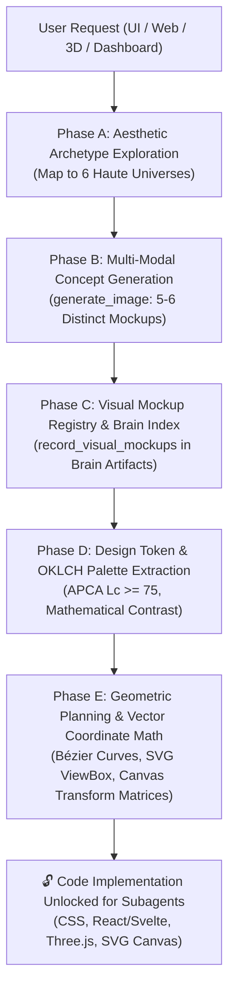

# Visual Imagination Engine: The 'Visualize Before You Build' Protocol
## Multi-Modal Archetype Generation, OKLCH Color Space Math, Fluid Golden Typography & Geometric Vector Planning

The **Visual Imagination Engine** is the visual cognitive gear of `fable-mode` (`domain: "design"`). It enforces the non-negotiable **"Visualize Before You Build"** protocol for all frontend engineering, generative UI, creative web design, 3D WebGL scenes, and digital art direction.

In standard LLM workflows, models jump directly into generating raw CSS/HTML code without a concrete visual mental model, resulting in generic, derivative, and bland interfaces ("AI slop"). The Visual Imagination Engine eliminates this by mandating the generation and evaluation of **5–6 distinct visual concept mockups** using multi-modal image synthesis (`generate_image`) before a single line of frontend code is written.

---

## 1. The "Visualize Before You Build" Protocol Architecture



### The 5 Core Tenets
1. **Zero Blind Coding**: No component code or CSS stylesheets may be generated until visual mockups are generated and registered in the session.
2. **5–6 Distinct Aesthetic Universes**: Never settle on the first aesthetic idea. The engine explores 5 to 6 radically divergent archetypes across the Haute spectrum.
3. **Multi-Modal Grounding**: The agent inspects and validates generated image artifacts to anchor typography, spatial density, lighting, and negative space.
4. **Mathematical Color & Contrast**: All color palettes are defined in cylindrical **OKLCH color space** ($\text{Lightness } L, \text{Chroma } C, \text{Hue } H$) calibrated for perceptual uniformity and APCA $L_c \ge 75$ accessibility.
5. **Exact Coordinate & Geometry Pre-Planning**: SVG paths, Canvas coordinates, and 3D bounding volumes must be calculated mathematically before code emission.

---

## 2. Generating 5–6 Distinct Aesthetic Concept Mockups

When a visual design task begins, the Main Agent synthesizes prompts for `generate_image` representing 5–6 contrasting aesthetic universes:

```
+──────────────────────────────────────────────────────────────────────────────────────────+
|                               THE 6 HAUTE AESTHETIC UNIVERSES                            |
+──────────────────────────────────────────────────────────────────────────────────────────+
| 1. CYBER-OBSIDIAN MONOLITH   │ Deep chromatic void (oklch(0.08 0.02 270)), hairline 0.5px|
|    (Teenage Eng. / Avionics)  │ borders, luminescent cyan/lime spectral telemetry, HUD.  |
+──────────────────────────────┼──────────────────────────────────────────────────────────+
| 2. HAUTE EDITORIAL MODERNISM │ Asymmetric 1.618:1 negative space, warm bone substrate,   |
|    (Stripe Press / Vogue)    │ PP Editorial New serif display, grotesque micro-labels.  |
+──────────────────────────────┼──────────────────────────────────────────────────────────+
| 3. SWISS PRECISION & VIGNELLI│ Pure mathematical grid, extreme scale contrast, neutral  |
|    (Braun / Leica / Massimo) │ monochrome with single International Signal Orange accent.|
+──────────────────────────────┼──────────────────────────────────────────────────────────+
| 4. KINETIC SPATIAL HUD       │ Containerless telemetry ribbons, live scanline grids,    |
|    (Cyber Terminal / Sci-Fi) │ sub-pixel badge pills, Geist Mono typography, radar rings.|
+──────────────────────────────┼──────────────────────────────────────────────────────────+
| 5. NEO-NORDIC FLUIDITY       │ Deep pine, warm sand, rounded-3xl pebble silhouettes,     |
|    (Bang & Olufsen / Aalto)  │ diffused organic lighting, tactile ceramic materials.    |
+──────────────────────────────┼──────────────────────────────────────────────────────────+
| 6. COLD CHROMATIC BRUTALISM  │ Exposed coordinate indices ([01] // INDEX), high-contrast|
|    (Balenciaga / 032c)       │ raw manifestos, Druk Wide display, industrial wireframes.|
+──────────────────────────────────────────────────────────────────────────────────────────+
```

### Multi-Modal Generation Workflow (`generate_image`)
The agent invokes `generate_image` for each archetype using calibrated prompts and appropriate aspect ratios:

```json
{
  "ImageName": "mockup_cyber_obsidian",
  "AspectRatio": "16:9",
  "Prompt": "Ultra-minimalist modern web application user interface for a real-time quantum telemetry dashboard. Cyber-Obsidian Monolith aesthetic, deep obsidian background oklch(0.08 0.02 270), hairline 0.5px glowing cyan borders, micro-grain texture, tabular monospace numerals, asymmetric data visualization cards, high precision industrial avionics design, zero device frames, pure UI viewport, 8k resolution, photorealistic studio lighting."
}
```

```json
{
  "ImageName": "mockup_haute_editorial",
  "AspectRatio": "16:9",
  "Prompt": "Luxury editorial web design interface for high-finance architecture journal. Haute Editorial Modernism aesthetic, warm bone paper background oklch(0.97 0.005 90), large elegant serif typography, asymmetric golden ratio layout, rich deep ink black text, fine 0.5px hairline divider rules, generous negative space, sophisticated minimalist layout, pure UI viewport without laptop frame."
}
```

```json
{
  "ImageName": "mockup_swiss_precision",
  "AspectRatio": "16:9",
  "Prompt": "Swiss style modernist digital design system interface, Vignelli and Dieter Rams inspired. Mathematical 12-column grid, stark monochrome black and white palette with a single vibrant International Signal Orange accent button, Akzidenz-Grotesk bold typography, clean geometric data gauges, pure digital interface, pristine studio composition."
}
```

```json
{
  "ImageName": "mockup_kinetic_hud",
  "AspectRatio": "16:9",
  "Prompt": "Futuristic aerospace mission control spatial HUD interface. Containerless glowing data streams, circular orbital telemetry radar, sub-pixel badge pills, deep dark navy void background, neon lime and amber indicators, Geist Mono tabular metrics, dense high-entropy information design, pure screen UI layout."
}
```

```json
{
  "ImageName": "mockup_neo_nordic",
  "AspectRatio": "16:9",
  "Prompt": "High-end Scandinavian smart home audio control web interface. Neo-Nordic Fluidity aesthetic, deep muted forest pine and warm sand background, smooth pebble rounded-3xl cards, subtle frosted glassmorphic blur, warm amber backlighting, tactile tactile sliders, organic modern minimalism, pure UI view."
}
```

---

## 3. Visual Mockup Registry & Brain Artifact Indexing

After generating the mockups, the Main Agent records and indexes them in the conversation brain artifact (`<appDataDir>\brain\<conversation-id>/visual_archetypes.md`):

```markdown
# Visual Concept Mockup Evaluation Ledger

## 1. Generated Concept Archetypes

````carousel

<!-- slide -->

<!-- slide -->

<!-- slide -->

<!-- slide -->

````

### 2. Multi-Criteria Evaluation Matrix
| Archetype | Optical Depth (1-10) | Hierarchy (1-10) | Brand Resonance (1-10) | Performance Budget | Selected |
| :--- | :---: | :---: | :---: | :---: | :---: |
| **Cyber-Obsidian** | 9.8 | 9.5 | 9.7 | 60 FPS (CSS Compositor) | 🏆 **WINNER** |
| **Haute Editorial** | 8.2 | 9.2 | 8.8 | 60 FPS (DOM Standard) | Alternate |
| **Swiss Precision** | 8.0 | 9.6 | 8.5 | 60 FPS (DOM Standard) | Alternate |
| **Kinetic HUD** | 9.5 | 8.7 | 9.1 | 60 FPS (WebGL / Canvas) | Alternate |
| **Neo-Nordic** | 8.9 | 8.9 | 9.0 | 60 FPS (Backdrop Filter)| Alternate |
```

---

## 4. OKLCH Color Space Mathematics & Token Systems

### 4.1 Why OKLCH Over sRGB / HSL
Standard `rgb()` and `hsl()` color spaces suffer from severe **non-uniform perceptual lightness** (e.g. pure yellow `#ffff00` has perceived lightness ~0.93, while pure blue `#0000ff` has ~0.25). 

In contrast, **OKLCH** separates:
- $L \in [0.0, 1.0]$: Perceptual Lightness (guaranteed constant perceived brightness across all hues).
- $C \in [0.0, 0.4]$: Chroma / Saturation purity.
- $H \in [0^\circ, 360^\circ]$: Hue angle in degrees.

$$\text{Color} = \text{oklch}(L \;\; C \;\; H \;\; [\;/\; \alpha\;])$$

### 4.2 Mathematical APCA Luminance Calibration ($L_c \ge 75$)
To ensure WCAG AAA accessibility, text and background pairs are calibrated using the Advanced Perceptual Contrast Algorithm (APCA):
$$L_c = f(L_{\text{text}}, L_{\text{bg}}) \ge 75$$

### 4.3 Production OKLCH Design Token System

```css
:root {
  /* ==========================================================================
     Cyber-Obsidian Monolith Palette (Perceptually Uniform OKLCH)
     ========================================================================== */
  
  /* Layer 0: Void Bases */
  --color-void-deep:       oklch(0.08 0.02 270);        /* Deep Obsidian */
  --color-void-surface:    oklch(0.12 0.02 270 / 0.85); /* Frosted Substrate */
  --color-void-elevated:   oklch(0.16 0.03 270 / 0.90); /* Raised Card */

  /* Layer 4: Hairline Specular Rims */
  --border-specular-rim:   oklch(1.00 0.00 0 / 0.12);   /* Top Bevel Highlight */
  --border-subtle:         oklch(0.28 0.02 270 / 0.50); /* Structural Border */

  /* Layer 5: Typography (APCA Calibrated) */
  --text-primary:          oklch(0.96 0.01 270);        /* High-Contrast Read */
  --text-secondary:        oklch(0.72 0.02 270);        /* Sub-headings */
  --text-muted:            oklch(0.52 0.03 270);        /* Metadata & Labels */
  --text-telemetry-dim:    oklch(0.40 0.02 270);        /* Grid indices */

  /* High-Voltage Spectral Accents */
  --accent-cyan-laser:     oklch(0.78 0.19 210);        /* Active telemetry */
  --accent-cyan-glow:      oklch(0.78 0.19 210 / 0.15); /* Radial bloom */
  --accent-lime-pulse:     oklch(0.84 0.22 135);        /* Heartbeat status */
  --accent-amber-alert:    oklch(0.75 0.18 55);         /* Threshold warning */
}
```

---

## 5. Golden-Ratio Fluid Typography Engine

Fluid typography smoothly interpolates font size across viewport widths using CSS `clamp()`:

$$\text{FontSize}(V) = \text{clamp}\left(S_{\min},\; S_{\min} + (S_{\max} - S_{\min}) \cdot \left(\frac{V - V_{\min}}{V_{\max} - V_{\min}}\right),\; S_{\max}\right)$$

For $V_{\min} = 375\text{px}$ ($23.4375\text{rem}$) and $V_{\max} = 1440\text{px}$ ($90\text{rem}$):
$$\text{Slope } m = \frac{S_{\max} - S_{\min}}{90 - 23.4375}, \qquad \text{Intercept } b = S_{\min} - (m \cdot 23.4375)$$

```css
/* Golden-Ratio Fluid Typography Declarations */
--font-hero:      clamp(2.75rem, 1.43rem + 5.63vw, 6.50rem); /* Tracking: -0.04em */
--font-h1:        clamp(2.00rem, 1.21rem + 3.38vw, 4.25rem); /* Tracking: -0.03em */
--font-h2:        clamp(1.50rem, 1.06rem + 1.88vw, 2.75rem); /* Tracking: -0.025em */
--font-h3:        clamp(1.25rem, 1.03rem + 0.94vw, 1.875rem);/* Tracking: -0.015em */
--font-body:      clamp(0.9375rem, 0.89rem + 0.19vw, 1.0625rem); /* Leading: 1.6 */
--font-telemetry: clamp(0.6875rem, 0.64rem + 0.19vw, 0.8125rem); /* Tracking: +0.16em */
```

---

## 6. Vector Coordinate Calculation & Geometric Planning for SVG and Canvas

Before writing complex SVGs, data charts, or Canvas animations, pre-calculate all vector geometry, Bézier control points, and matrix transforms.

### 6.1 Cubic Bézier Curve Mathematics
A cubic Bézier curve connecting start point $P_0$ to end point $P_3$ with control points $P_1, P_2$ is parameterized by $t \in [0, 1]$:
$$B(t) = (1-t)^3 P_0 + 3(1-t)^2 t P_1 + 3(1-t) t^2 P_2 + t^3 P_3$$

#### Smooth Waveform SVG Generator Formula
For a smooth responsive SVG curve through points $(x_0, y_0), (x_1, y_1), \dots, (x_n, y_n)$:
- Pre-compute tangential control vectors: $C_{1x} = x_i + \frac{x_{i+1} - x_{i-1}}{6} \cdot k$, $C_{1y} = y_i + \frac{y_{i+1} - y_{i-1}}{6} \cdot k$.

```xml
<!-- Pre-Calculated Precision SVG Telemetry Waveform -->
<svg viewBox="0 0 800 240" fill="none" xmlns="http://www.w3.org/2000/svg" class="w-full h-auto">
  <defs>
    <linearGradient id="waveGlow" x1="0" y1="0" x2="0" y2="240" gradientUnits="userSpaceOnUse">
      <stop offset="0%" stop-color="oklch(0.78 0.19 210 / 0.35)" />
      <stop offset="100%" stop-color="oklch(0.78 0.19 210 / 0.00)" />
    </linearGradient>
    <filter id="laserBlur" x="-20%" y="-20%" width="140%" height="140%">
      <feGaussianBlur stdDeviation="3" result="blur" />
      <feMerge>
        <feMergeNode in="blur" />
        <feMergeNode in="SourceGraphic" />
      </feMerge>
    </filter>
  </defs>

  <!-- Area Fill under Curve -->
  <path d="M 0 160 C 120 120, 180 200, 300 140 C 420 80, 500 180, 620 100 C 720 40, 760 80, 800 60 L 800 240 L 0 240 Z"
        fill="url(#waveGlow)" />

  <!-- Laser Core Stroke -->
  <path d="M 0 160 C 120 120, 180 200, 300 140 C 420 80, 500 180, 620 100 C 720 40, 760 80, 800 60"
        stroke="oklch(0.78 0.19 210)"
        stroke-width="1.5"
        filter="url(#laserBlur)" />
</svg>
```

---

### 6.2 High-DPI Canvas 2D Transformation Matrix & Precision Particle Ring

To eliminate blurriness on Retina / 4K displays, initialize Canvas 2D with the device pixel ratio ($DPR$):

```typescript
export function initPrecisionCanvas(
  canvas: HTMLCanvasElement, 
  width: number, 
  height: number
): CanvasRenderingContext2D {
  const dpr = window.devicePixelRatio || 1;
  canvas.width = width * dpr;
  canvas.height = height * dpr;
  canvas.style.width = `${width}px`;
  canvas.style.height = `${height}px`;

  const ctx = canvas.getContext("2d", { alpha: true })!;
  ctx.scale(dpr, dpr);
  return ctx;
}

// Polar to Cartesian Coordinate Mapping for Particle Radar Ring
export function drawRadarRing(
  ctx: CanvasRenderingContext2D,
  centerX: number,
  centerY: number,
  radius: number,
  particleCount: number,
  time: number
) {
  ctx.save();
  ctx.translate(centerX, centerY);

  for (let i = 0; i < particleCount; i++) {
    const theta = (i / particleCount) * 2 * Math.PI + time * 0.2;
    const r = radius + Math.sin(theta * 8 + time) * 4;
    const x = r * Math.cos(theta);
    const y = r * Math.sin(theta);
    const alpha = 0.3 + 0.7 * Math.sin(theta * 3 + time);

    ctx.beginPath();
    ctx.arc(x, y, 1.2, 0, 2 * Math.PI);
    ctx.fillStyle = `oklch(0.78 0.19 210 / ${alpha})`;
    ctx.fill();
  }
  ctx.restore();
}
```

---

## 7. Definition of Done for Visual Engineering

Before delegating code generation to subagents, the Main Agent must verify:
- [x] **5–6 Concept Mockups Generated**: Multi-modal mockups created via `generate_image`.
- [x] **Archetype Selected & Evaluated**: Documented in Brain Artifact with rationale.
- [x] **OKLCH Design Tokens Specified**: Colors defined with APCA $L_c \ge 75$ contrast math.
- [x] **Golden Fluid Typography Clamped**: Scale mapped with exact clamp values.
- [x] **Vector Geometry Pre-Calculated**: SVG paths and Canvas transformation matrices explicitly mapped.
